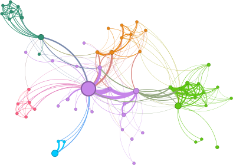
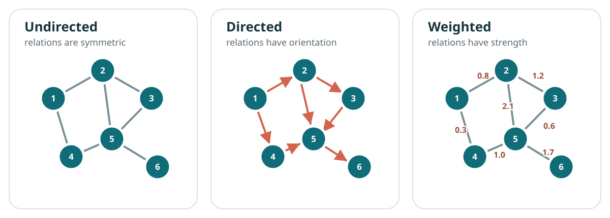
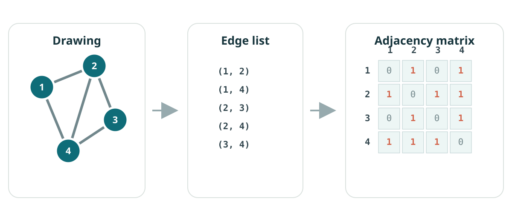
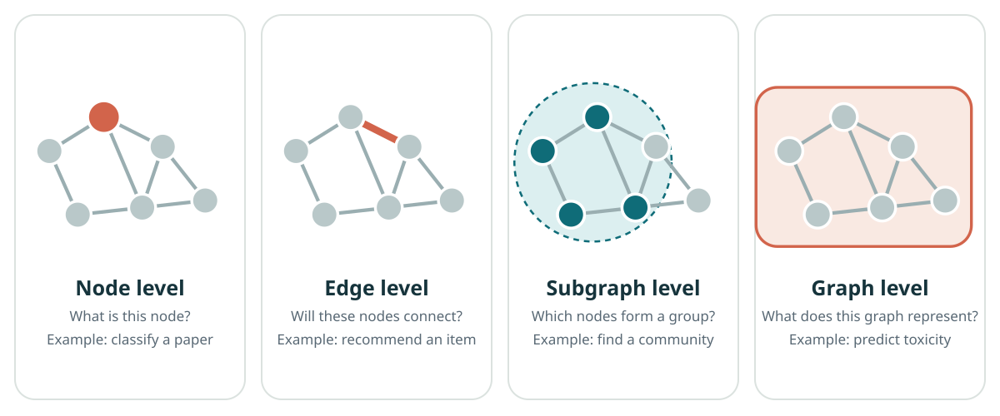
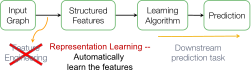
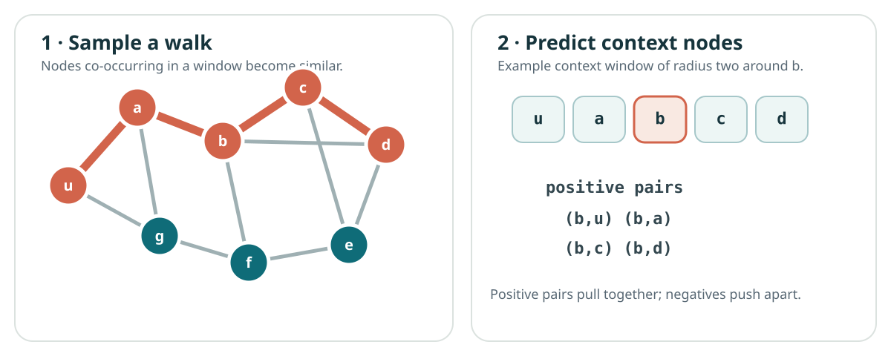
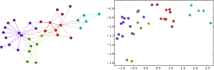
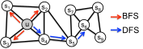
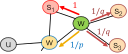

```{=html}
<header class="lecture-header">
  <div class="eyebrow">APM 5DS30 TP · Machine Learning with Graphs</div>
  <h1>Introduction to machine learning on graphs</h1>
  <p>Lecture 1 · Jhony H. Giraldo · Télécom Paris, Institut Polytechnique de Paris</p>
  <div class="lecture-meta"><span>Original lecture: 3 October 2025</span><span>Web note revised: 5 September 2026</span><span>Mathematics rendered with MathJax</span></div>
  <div class="button-row">
    <a class="button-link primary" href="/assets/pdf/Lecture-01-Introduction-to-Machine-Learning-on-Graphs.pdf">Download the original slides</a>
    <a class="button-link secondary" href="/teaching/machine-learning-with-graphs/index.qmd">Back to the course</a>
  </div>
</header>
```

This note turns the first lecture into a self-contained reading. It normalizes the notation, expands several derivations, and adds short checks that are difficult to fit on slides. The aim is to understand the **problem formulation** before introducing graph neural networks in Lecture 2.

## Learning objectives

After studying this note, you should be able to:

```{=html}
<ol class="learning-objectives">
  <li>define directed, undirected, weighted, and bipartite graphs using precise notation;</li>
  <li>move between a graph drawing, an edge list, and an adjacency matrix;</li>
  <li>distinguish node-, edge-, subgraph-, and graph-level prediction tasks;</li>
  <li>compute and interpret several classical structural node features;</li>
  <li>formulate shallow node representation learning as an encoder–decoder problem;</li>
  <li>explain how DeepWalk and node2vec learn from random-walk co-occurrences.</li>
</ol>
```

## Why graphs?

Many standard machine-learning datasets present observations as isolated rows of a matrix. That representation is suitable when the samples can reasonably be treated as independent. In many systems, however, **relations are part of the data**:

- people communicate in social networks;
- routers exchange packets over physical links;
- atoms interact through chemical bonds;
- sensors measure a physical field at related locations;
- objects and agents influence one another in a scene;
- papers cite other papers, and users interact with items.

A graph separates the **entities** from the **relations** between them. This simple abstraction is expressive enough to describe logical, physical, biological, and engineered systems [@battaglia2018relational].

::: {.figure-panel}
{#fig-structured-data fig-alt="Colored groups of isolated points connected to form a network"}
:::

### Applications

Graph-based learning is now used in physical simulation [@sanchez2020learning], decentralized control [@tolstaya2020learning], protein modeling [@jumper2021highly], and weather prediction [@lam2023graphcast], among many other settings.

The modeling question always comes first:

> What are the entities, what do the relations mean, and what should remain unchanged if we rename or reorder the entities?

## Basic graph language

::: {.definition}
**Definition 1 — Graph**

A graph is a pair

$$
\mathcal{G}=(\mathcal{V},\mathcal{E}),
$$

where $\mathcal{V}=\{v_1,\ldots,v_N\}$ is a set of **nodes** (or vertices) and $\mathcal{E}\subseteq\mathcal{V}\times\mathcal{V}$ is a set of **edges**. An edge $(u,v)\in\mathcal{E}$ records a relation from $u$ to $v$.
:::

We write $N=|\mathcal{V}|$ and $M=|\mathcal{E}|$. A node can carry a feature vector $\mathbf{x}_v\in\mathbb{R}^F$; an edge can carry a scalar or vector attribute, such as distance, capacity, time, or bond type.

### Undirected, directed, and weighted graphs

In an **undirected graph**, $(u,v)$ and $(v,u)$ represent the same edge. In a **directed graph**, their meanings differ. A **weighted graph** associates a value $w_{uv}$ with every edge.

::: {.figure-panel}
{#fig-graph-types fig-alt="Three six-node graphs showing undirected edges, directed arrows, and numerical edge weights"}
:::

For an unweighted graph, the adjacency matrix $\mathbf{A}\in\{0,1\}^{N\times N}$ is

$$
A_{ij}=
\begin{cases}
1, & (v_i,v_j)\in\mathcal{E},\\
0, & \text{otherwise}.
\end{cases}
$$

For a weighted graph, replace $1$ with $w_{ij}$. An undirected graph produces a symmetric matrix, $\mathbf{A}=\mathbf{A}^{\top}$; a directed graph need not.

### Bipartite graphs

A graph is **bipartite** when its nodes can be split into disjoint sets $\mathcal{U}$ and $\mathcal{W}$, with edges only between the sets:

$$
\mathcal{G}=(\mathcal{U},\mathcal{W},\mathcal{E}),
\qquad
\mathcal{E}\subseteq\mathcal{U}\times\mathcal{W}.
$$

User–item recommendation, author–paper networks, and patient–treatment records are natural examples.

## Representing a graph

The same abstract graph admits several computational representations.

::: {.figure-panel}
{#fig-representations fig-alt="Four-node graph translated into five edge pairs and a four by four symmetric adjacency matrix"}
:::

### Adjacency matrix

An adjacency matrix supports algebraic operations and dense linear algebra. Its storage cost is $O(N^2)$, even when only a small fraction of node pairs are connected.

### Edge list and adjacency list

An **edge list** stores pairs $(u,v)$ and needs $O(M)$ space. An **adjacency list** stores a neighborhood

$$
\mathcal{N}(u)=\{v:(u,v)\in\mathcal{E}\}
$$

for each node $u$. Both are effective for sparse graphs, where $M\ll N^2$.

::: {.worked-example}
**Worked example — Reading the adjacency matrix**

For @fig-representations,

$$
\mathbf{A}=
\begin{bmatrix}
0&1&0&1\\
1&0&1&1\\
0&1&0&1\\
1&1&1&0
\end{bmatrix}.
$$

The node-degree vector is $\mathbf{d}=\mathbf{A}\mathbf{1}=[2,3,2,3]^\top$. Moreover, $(\mathbf{A}^2)_{13}=2$: there are two length-two walks from node 1 to node 3, through nodes 2 and 4.
:::

### Features and labels

If every node has $F$ features, collect them row-wise in

$$
\mathbf{X}=
\begin{bmatrix}
\mathbf{x}_{v_1}^{\top}\\[-2pt]
\vdots\\[-2pt]
\mathbf{x}_{v_N}^{\top}
\end{bmatrix}
\in\mathbb{R}^{N\times F}.
$$

Labels may exist at any task level: one label per node, edge, subgraph, or entire graph.

## Prediction tasks on graphs

The **level of the target** determines the learning problem.

::: {.figure-panel}
{#fig-task-levels fig-alt="Four graph panels highlighting one node, one edge, a community, and the whole graph"}
:::

### Node-level tasks

Predict $y_v$ for a node $v$: document topic, user role, protein function, or whether an account is anomalous. Semi-supervised node classification is common: labels are known for only a subset $\mathcal{V}_{\mathrm{train}}\subset\mathcal{V}$.

### Edge-level tasks

Predict $y_{uv}$ for a node pair: whether a link will appear, whether two drugs interact, or which product a user may choose. A negative example is usually an unobserved pair, but “unobserved” does not always mean “truly negative.”

### Subgraph-level tasks

Predict or discover a subset of nodes and edges: communities, functional motifs, fraudulent transaction rings, or interaction patterns.

### Graph-level tasks

Predict one output for an entire graph: molecular toxicity, program behavior, material property, or whether two graph-structured objects belong to the same class.

::: {.checkpoint}
**Check 1**

A citation network contains papers as nodes and citations as directed edges. Classifying each paper by field is a node-level task. Predicting a future citation is an edge-level task. Classifying the complete citation network by scientific domain is a graph-level task.

<details><summary>Why does the direction matter?</summary>A citation from paper A to paper B does not imply that B cites A. Replacing the directed graph with an undirected one discards this asymmetry.</details>
:::

## Why graph machine learning is different

Graph learning has several structural complications.

1. **Variable size.** Different graphs—and different neighborhoods—contain different numbers of nodes and edges.
2. **No canonical ordering.** Node identifiers are arbitrary. Relabeling nodes should not change a graph-level prediction.
3. **Dependence.** Connected observations cannot generally be treated as independent samples.
4. **Sparsity and scale.** Real graphs may have billions of possible pairs but comparatively few observed edges.
5. **Heterogeneity and dynamics.** Nodes and edges may have different types and may change with time.

Let $\mathbf{P}$ be a permutation matrix that reorders the nodes. Then

$$
\mathbf{A}'=\mathbf{P}\mathbf{A}\mathbf{P}^{\top},
\qquad
\mathbf{X}'=\mathbf{P}\mathbf{X}.
$$

A node-level model $f$ should usually be **permutation equivariant**:

$$
f(\mathbf{P}\mathbf{A}\mathbf{P}^{\top},\mathbf{P}\mathbf{X})
=\mathbf{P}f(\mathbf{A},\mathbf{X}),
$$

while a graph-level model $g$ should be **permutation invariant**:

$$
g(\mathbf{P}\mathbf{A}\mathbf{P}^{\top},\mathbf{P}\mathbf{X})
=g(\mathbf{A},\mathbf{X}).
$$

These conditions will become central when we introduce graph neural networks.

## Classical structural features

Before representation learning, graph machine learning relied heavily on **feature engineering**. These features remain useful baselines and diagnostic tools.

### Degree centrality

For an unweighted undirected graph,

$$
d_i=\sum_{j=1}^{N}A_{ij},
\qquad
C_D(i)=\frac{d_i}{N-1}.
$$

Degree measures immediate connectivity. In directed graphs, in-degree and out-degree should be distinguished.

### Eigenvector centrality

Degree treats every neighbor equally. Eigenvector centrality assigns greater importance to connections with already-important nodes. It solves

$$
\mathbf{A}\mathbf{c}=\lambda_{\max}\mathbf{c}.
$$

For a connected nonnegative undirected graph, the Perron–Frobenius theorem supports a nonnegative leading eigenvector. The scale is arbitrary; common choices are $\|\mathbf{c}\|_2=1$ or $\max_i c_i=1$.

The power iteration

$$
\mathbf{x}^{(t+1)}=\frac{\mathbf{A}\mathbf{x}^{(t)}}{\|\mathbf{A}\mathbf{x}^{(t)}\|_2}
$$

often converges toward this dominant direction when the standard spectral conditions hold.

### Closeness centrality

Let $d(i,j)$ be shortest-path distance. For a connected graph,

$$
C_C(i)=\frac{N-1}{\sum_{j\neq i}d(i,j)}.
$$

A high value means that the node can reach the rest of the network in relatively few steps. For disconnected graphs, harmonic variants avoid infinite-distance problems.

### Betweenness centrality

Let $\sigma_{st}$ be the number of shortest paths from $s$ to $t$, and $\sigma_{st}(i)$ the number of those paths passing through $i$. Then

$$
C_B(i)=\sum_{\substack{s\neq i\neq t\\s\neq t}}
\frac{\sigma_{st}(i)}{\sigma_{st}}.
$$

Betweenness identifies potential bridges and bottlenecks rather than merely well-connected nodes.

### Clustering coefficient and graphlets

Let $T_i$ be the number of edges among the neighbors of node $i$. For a simple undirected graph with $d_i\geq 2$,

$$
C_i=\frac{2T_i}{d_i(d_i-1)}.
$$

The coefficient counts the fraction of possible neighbor–neighbor edges that exist. **Graphlets** generalize this idea by counting small rooted subgraph patterns. A graphlet-degree vector can describe the structural role of a node, but its dimension and computational cost grow as larger patterns are included [@leskovec2020mmds].

::: {.checkpoint}
**Check 2 — Importance is not one concept**

A high-degree node has many immediate contacts. A high-closeness node reaches other nodes quickly. A high-betweenness node mediates many shortest routes. A high-eigenvector-centrality node connects to influential neighbors. The rankings need not agree.
:::

## From feature engineering to representation learning

A classical pipeline constructs structural features $\phi(v)$ and sends them to a downstream learner. The feature definition must be reconsidered for each task. **Graph representation learning** attempts to learn useful features from the graph itself [@hamilton2020graph].

::: {.two-figures}
::: {.figure-panel}
{fig-alt="Pipeline from input graph to automatically learned representation and prediction"}
:::
::: {.figure-panel}
{fig-alt="A graph node mapped by a function into a numerical embedding vector"}
:::
:::

For shallow node embeddings, learn a function

$$
f:\mathcal{V}\rightarrow\mathbb{R}^{d},
\qquad
f(u)=\mathbf{z}_u,
$$

and collect the vectors in $\mathbf{Z}\in\mathbb{R}^{d\times N}$. “Shallow” means that the encoder is an embedding lookup:

$$
\operatorname{ENC}(u)=\mathbf{z}_u=\mathbf{Z}\mathbf{e}_u,
$$

where $\mathbf{e}_u$ is the one-hot vector identifying $u$.

The decoder converts two embeddings into a similarity score. A common choice is the dot product

$$
\operatorname{DEC}(u,v)=\mathbf{z}_u^{\top}\mathbf{z}_v.
$$

The missing ingredient is the training signal: **which nodes should be similar in the original graph?**

## Random walks as a similarity model

A random walk begins at a node, repeatedly selects a neighbor, and moves to it. In an unweighted graph, the one-step transition matrix is

$$
P_{uv}=
\begin{cases}
\dfrac{1}{d_u}, & v\in\mathcal{N}(u),\\
0, & \text{otherwise}.
\end{cases}
$$

After $k$ steps, $(\mathbf{P}^k)_{uv}$ gives the probability of being at $v$ when the walk began at $u$.

::: {.figure-panel}
{#fig-random-walk fig-alt="Highlighted path through a graph followed by a node sequence and positive context pairs"}
:::

Random walks are useful because they provide:

- **expressivity:** a stochastic notion of similarity containing local and higher-order neighborhood information;
- **efficiency:** training uses sampled co-occurrences rather than every one of the $N^2$ node pairs.

Let $N_R(u)$ be the multiset of context nodes produced by a walk strategy $R$ around $u$. A maximum-likelihood objective is

$$
\max_{\mathbf{Z}}
\sum_{u\in\mathcal{V}}
\sum_{v\in N_R(u)}
\log P(v\mid\mathbf{z}_u).
$$

With a softmax decoder,

$$
P(v\mid\mathbf{z}_u)
=
\frac{\exp(\mathbf{z}_u^{\top}\mathbf{z}_v)}
{\sum_{n\in\mathcal{V}}\exp(\mathbf{z}_u^{\top}\mathbf{z}_n)}.
$$

The denominator costs $O(N)$ for each positive pair. **Negative sampling** replaces the full normalization with $K$ sampled negative nodes $n_1,\ldots,n_K$:

$$
\mathcal{L}_{u,v}
=
-\log\sigma(\mathbf{z}_u^{\top}\mathbf{z}_v)
-\sum_{k=1}^{K}
\log\sigma(-\mathbf{z}_u^{\top}\mathbf{z}_{n_k}),
$$

where $\sigma(a)=1/(1+e^{-a})$. The first term attracts an observed center–context pair; the second repels sampled negatives.

## DeepWalk

DeepWalk applies the word2vec skip-gram idea to random-walk sequences [@perozzi2014deepwalk].

1. Start several short unbiased random walks from every node.
2. Treat each walk as a sentence and each node as a token.
3. Within a context window, form center–context pairs.
4. Optimize the embeddings with stochastic gradient descent and negative sampling.

::: {.figure-panel}
{#fig-deepwalk fig-alt="Network communities on the left and their separated two-dimensional embedding clusters on the right"}
:::

The embeddings are **transductive**: $\mathbf{Z}$ contains one learned vector per training node. A new node has no column in $\mathbf{Z}$ and therefore no embedding unless the model is retrained or extended. Graph neural networks will replace this lookup table with a feature- and neighborhood-dependent encoder.

## node2vec: controlling the walk

Unbiased walks have a fixed exploration behavior. node2vec introduces two parameters to interpolate between local, breadth-first-like exploration and outward, depth-first-like exploration [@grover2016node2vec].

Suppose the walk arrived at $v$ from $t$ and considers a neighbor $x\in\mathcal{N}(v)$. Define

$$
\pi_{vx}=\alpha_{pq}(t,x)w_{vx},
$$

with

$$
\alpha_{pq}(t,x)=
\begin{cases}
1/p, & d(t,x)=0,\\
1,   & d(t,x)=1,\\
1/q, & d(t,x)=2.
\end{cases}
$$

The normalized transition probability is

$$
P(c_{i+1}=x\mid c_i=v,c_{i-1}=t)
=\frac{\pi_{vx}}{\sum_{y\in\mathcal{N}(v)}\pi_{vy}}.
$$

The **return parameter** $p$ controls immediate backtracking. A larger $p$ makes returning to $t$ less likely. The **in–out parameter** $q$ controls outward exploration: $q>1$ suppresses distance-two moves and tends to remain local, whereas $q<1$ encourages outward exploration.

::: {.two-figures}
::: {.figure-panel}
{fig-alt="A network with red local BFS arrows and blue outward DFS arrows"}
:::
::: {.figure-panel}
{fig-alt="Current and previous nodes with candidate transitions labeled one over p, one, and one over q"}
:::
:::

The complete algorithm is therefore:

1. precompute or efficiently evaluate the biased transition probabilities;
2. simulate $r$ walks of length $\ell$ from each node;
3. extract context pairs using a window of width $c$;
4. optimize the negative-sampling objective.

::: {.worked-example}
**Worked example — Interpreting $p$ and $q$**

If $p=4$ and $q=0.5$, an immediate return receives factor $1/4$, a neighbor of the previous node receives factor $1$, and an outward distance-two move receives factor $2$. Before accounting for edge weights and normalization, outward exploration is eight times as likely as immediate return.
:::

## What these embeddings preserve—and what they do not

The context strategy defines the notion of similarity. Short local walks tend to emphasize **homophily** and community structure. More exploratory walks can capture broader structural roles, but neither method guarantees that every useful task signal will be preserved.

Important limitations include:

- embeddings are tied to the nodes observed during training;
- proximity in the embedding inherits biases from the graph and sampling process;
- missing or spurious edges alter the training distribution;
- degree-skewed sampling can overrepresent hubs;
- evaluating only on random edge splits may leak temporal or structural information.

Treat the graph construction, train/test split, negative sampling, and evaluation metric as modeling decisions—not implementation details.

## Exercises

### Exercise 1 — Representation

For the graph in @fig-representations, compute $\mathbf{A}^2$. Interpret its diagonal and the entry $(\mathbf{A}^2)_{13}$.

### Exercise 2 — Centrality

Construct a graph where the highest-degree node does not have the highest betweenness centrality. Explain the structural reason.

### Exercise 3 — Permutations

Choose a permutation matrix $\mathbf{P}$ that swaps nodes 1 and 4 in @fig-representations. Compute $\mathbf{PAP}^{\top}$ and verify that the degree multiset is unchanged.

### Exercise 4 — Negative sampling

Differentiate

$$
-\log\sigma(\mathbf{z}_u^{\top}\mathbf{z}_v)
-\log\sigma(-\mathbf{z}_u^{\top}\mathbf{z}_n)
$$

with respect to $\mathbf{z}_u$. Describe how one gradient step changes its relation to the positive and negative embeddings.

### Exercise 5 — node2vec

For a candidate set with distances $d(t,x)\in\{0,1,2,2\}$, unit edge weights, $p=2$, and $q=0.5$, calculate the normalized next-step probabilities.

## Main takeaways

1. Graphs model entities **and** relations; constructing the graph is part of the learning problem.
2. Drawings, edge lists, adjacency lists, and matrices are different representations of the same abstract object.
3. The target may live at the node, edge, subgraph, or graph level.
4. Classical centrality and motif features remain meaningful baselines, but require manual design.
5. Representation learning replaces repeated feature engineering with learned vectors.
6. DeepWalk learns from unbiased random-walk contexts; node2vec controls the context distribution with $p$ and $q$.
7. The next step is to replace the per-node lookup table with a permutation-aware encoder that can use features and neighborhoods: a graph neural network.

## References and provenance {.unnumbered}

This web note is adapted from the supplied Lecture 1 slides by Jhony H. Giraldo. The mathematical notation was normalized, explanatory derivations were added, and several diagrams were redrawn as accessible SVGs for the web. Retained course vectors are identified in their captions.

::: {#refs .references-small}
:::
