```{=html}
<header class="lecture-header">
  <div class="eyebrow">APM 5DS30 TP · Machine Learning with Graphs</div>
  <h1>Graph neural networks</h1>
  <p>Lecture 2 · Jhony H. Giraldo · Télécom Paris, Institut Polytechnique de Paris</p>
  <div class="lecture-meta"><span>Original lecture: 21 January 2025</span><span>Web note revised: 5 September 2026</span><span>Mathematics rendered with MathJax</span></div>
  <div class="button-row">
    <a class="button-link primary" href="/assets/pdf/Lecture-02-Graph-Neural-Networks.pdf">Download the original slides</a>
    <a class="button-link secondary" href="/teaching/machine-learning-with-graphs/index.qmd">Back to the course</a>
  </div>
</header>
```

Lecture 1 ended with a limitation. Shallow node embeddings such as DeepWalk and node2vec learn one vector per node, so they cannot use node features, cannot generalize to unseen nodes, and must be retrained whenever the graph changes. This note replaces that lookup table with a **learned encoder**: a neural network whose linear maps are *graph convolutions*.

The route taken here is the signal-processing one. We first ask what a convolution *is*, observe that convolutions in time and space are polynomials in a shift operator, define the same object for an arbitrary graph, and only then compose graph filters with pointwise nonlinearities to obtain a graph neural network. The two most widely used architectures, GCN and GAT, then appear as principled approximations rather than as arbitrary formulas.

## Learning objectives

After studying this note, you should be able to:

```{=html}
<ol class="learning-objectives">
  <li>explain why multilayer perceptrons do not scale to graph-structured data and why convolutional models do;</li>
  <li>write a convolution in time, in space, and on a graph as a polynomial in a shift operator;</li>
  <li>derive the GCN propagation rule as an approximation of a graph convolutional filter;</li>
  <li>express GCN and GAT inside the message-passing framework and state what distinguishes them;</li>
  <li>compute the shapes of every matrix in a two-layer GCN and count its parameters;</li>
  <li>diagnose homophily, over-smoothing, and over-squashing, and name a remedy for each;</li>
  <li>implement a GCN and a GAT in PyTorch Geometric.</li>
</ol>
```

## Where Lecture 1 stopped

Recall the shallow encoder from Lecture 1: $\operatorname{ENC}(u) = \mathbf{z}_u = \mathbf{Z}\mathbf{e}_u$, an embedding lookup trained on random-walk co-occurrences.

::: {.figure-panel}
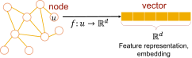{#fig-node-embedding fig-alt="A node of a graph mapped by a function f into a low-dimensional embedding vector"}
:::

Three problems follow directly from that definition.

1. **Parameter count.** $\mathbf{Z}\in\mathbb{R}^{d\times N}$ has $dN$ parameters. The model grows with the graph.
2. **Transductivity.** A node that was absent at training time has no column in $\mathbf{Z}$, so it has no embedding.
3. **Features are ignored.** If node $v$ carries a feature vector $\mathbf{x}_v\in\mathbb{R}^{F}$, the lookup table has no way to use it.

We want an encoder that is **local**, has a **fixed number of parameters** independent of $N$, reads **node features**, and can be applied to a graph it has never seen. That is exactly the specification a convolutional architecture satisfies in Euclidean domains.

## Why convolutions, and why they are hard on graphs

Fully connected neural networks do not scale. A single dense layer mapping $\mathbb{R}^{N}\to\mathbb{R}^{N}$ has $N^2$ parameters; for a graph with a million nodes that is $10^{12}$ weights for one layer. Convolutional neural networks avoid this by reusing a small filter everywhere in the domain, which makes the parameter count independent of the input size and makes the layer local and translation equivariant.

::: {.figure-panel}
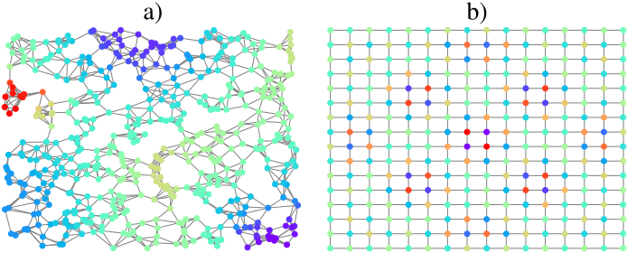{#fig-domains fig-alt="Left, a signal on an irregular network of hundreds of nodes; right, the same kind of signal on a regular square grid"}
:::

The obstacle is that the definition of convolution used in signal processing relies on *shifting* a filter across the domain, and an arbitrary graph has no notion of translation. The resolution is to notice that shifting is itself a linear operator, and that this operator is precisely the adjacency matrix of the domain.

## Time and space are graphs

::: {.figure-panel}
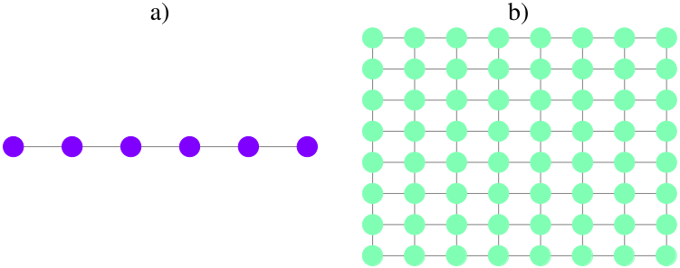{#fig-time-space fig-alt="A six-node directed line graph beside an eight-by-eight grid graph"}
:::

A discrete-time signal $\mathbf{x}\in\mathbb{R}^{N}$ lives on a **directed line graph**: sample $i$ is connected to sample $i+1$. An image lives on a **grid graph**: pixel $(i,j)$ is connected to its four neighbors. For the line graph the adjacency matrix implements the elementary shift exactly:

$$
\mathbf{S}=
\begin{bmatrix}
0&0&\cdots&0\\
1&0&\cdots&0\\
\vdots&\ddots&\ddots&\vdots\\
0&\cdots&1&0
\end{bmatrix},
\qquad
(\mathbf{S}\mathbf{x})_i=x_{i-1}.
$$

Multiplying by $\mathbf{S}$ delays the signal by one sample; multiplying by $\mathbf{S}^{k}$ delays it by $k$. The 1-D case is therefore an exact correspondence: polynomials in this $\mathbf{S}$ are precisely the causal FIR filters.

::: {.checkpoint}
**Check 0 — The grid is an analogy, not an identity**

The 2-D case is weaker, and it is worth being honest about it now rather than later. The grid adjacency is **isotropic**: it treats all four neighbors alike. A polynomial in it therefore cannot represent a directional filter — a horizontal derivative distinguishes left from right, and $\mathbf{S}$ has no way to. Ordinary CNN kernels have one weight *per offset*; a polynomial has one weight *per hop*.

So read the grid as motivation for the shape of the construction, and the directed line as the case where the correspondence is exact. Graph polynomial filters are a structured generalization of convolution, not a superset of it.
:::

::: {.figure-panel}
{#fig-convolution-time-space fig-alt="A line graph with the first six nodes highlighted and a grid graph with a diamond-shaped highlighted region"}
:::

Now write the familiar convolution of a signal $\mathbf{x}$ with a filter $\mathbf{h}=\{h_k\}$:

$$
\mathbf{z}
= h_0\mathbf{S}^{0}\mathbf{x}
+ h_1\mathbf{S}^{1}\mathbf{x}
+ h_2\mathbf{S}^{2}\mathbf{x}
+ \cdots
= \sum_{k=0}^{\infty} h_k\mathbf{S}^{k}\mathbf{x}.
$$

This is the ordinary discrete convolution. Nothing in the expression, however, requires $\mathbf{S}$ to be the line-graph adjacency matrix.

::: {.checkpoint}
**Check 1 — The key observation**

A convolution is a **polynomial in the shift operator**. The filter contributes the coefficients $h_k$; the domain contributes the operator $\mathbf{S}$. Replace $\mathbf{S}$ by the adjacency matrix of an arbitrary graph and the same formula defines a convolution on that graph.
:::

## Graph language and shift operators

We recall the notation from Lecture 1 and fix the operators used throughout.

::: {.definition}
**Definition 1 — Graph shift operator**

Let $\mathcal{G}=(\mathcal{V},\mathcal{E})$ with $N=|\mathcal{V}|$, adjacency matrix $\mathbf{A}\in\mathbb{R}^{N\times N}$ and degree matrix $\mathbf{D}=\operatorname{diag}(\mathbf{A}\mathbf{1})$. A **graph shift operator** $\mathbf{S}\in\mathbb{R}^{N\times N}$ is any matrix satisfying $S_{ij}=0$ whenever $i\neq j$ and $(v_j,v_i)\notin\mathcal{E}$.

Common choices are

$$
\mathbf{A},
\qquad
\mathbf{L}=\mathbf{D}-\mathbf{A},
\qquad
\hat{\mathbf{A}}=\mathbf{D}^{-1/2}\mathbf{A}\mathbf{D}^{-1/2},
\qquad
\hat{\mathbf{L}}=\mathbf{D}^{-1/2}\mathbf{L}\mathbf{D}^{-1/2}.
$$
:::

The sparsity condition is what matters: $\mathbf{S}$ may only mix a node with its neighbors. Which operator you pick is not a detail — it fixes the scaling of the diffusion and therefore the conditioning of the whole network, as @sec-gcn shows.

::: {.two-figures}
::: {.figure-panel}
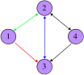{#fig-adjacency-example fig-alt="Four nodes arranged in a diamond with colored directed arrows between them"}
:::
::: {.figure-panel}
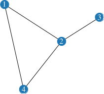{#fig-edge-list fig-alt="Four nodes connected by four undirected edges"}
:::
:::

::: {.worked-example}
**Worked example — Reading @fig-adjacency-example**

The adjacency matrix of the graph is

$$
\mathbf{A}=
\begin{bmatrix}
0&1&1&0\\
1&0&1&1\\
0&1&0&0\\
0&1&1&0
\end{bmatrix}.
$$

Since $A_{13}=1$ but $A_{31}=0$, the matrix is not symmetric: the graph is **directed**. Every nonzero entry equals one, so it is **unweighted**.
:::

### Why the adjacency matrix is a bad data structure

Real graphs are sparse: a node has far fewer neighbors than $N$. Storing all $N^2$ entries is therefore wasteful, and quickly impossible.

::: {.worked-example}
**Worked example — A social network with $N = 25\,000\,000$ users**

A double-precision float occupies $64/8 = 8$ bytes, so a dense adjacency matrix needs

$$
8\,N^{2}
= 8\times(2.5\times10^{7})^{2}
= 5\times10^{15}\ \text{bytes}
= 5\ \text{petabytes}.
$$

No machine holds that in RAM. Now suppose every user has $300$ connections on average. An edge list stores two node indices per edge:

$$
8\times N\times 300\times 2
= 1.2\times10^{11}\ \text{bytes}
= 120\ \text{gigabytes},
$$

a reduction by more than four orders of magnitude. This is why PyTorch Geometric represents a graph as an `edge_index` tensor of shape $2\times|\mathcal{E}|$ rather than as a matrix.
:::

For @fig-edge-list, the edge list in the format PyTorch Geometric expects is

$$
\texttt{edge\_index}=
\begin{bmatrix}
1&1&2&2&2&3&4&4\\
2&4&1&3&4&2&1&2
\end{bmatrix},
$$

with each undirected edge stored in both directions. The adjacency matrix remains the right tool for *analysis*; the edge list is the right tool for *computation*.

## Graph signals

::: {.definition}
**Definition 2 — Graph signal**

A graph signal is a map $x:\mathcal{V}\to\mathbb{R}^{m}$ from the node set into a vector space. For $m=1$ we collect the values into a vector $\mathbf{x}\in\mathbb{R}^{N}$; for $m=F$ features we collect them row-wise into $\mathbf{X}\in\mathbb{R}^{N\times F}$.
:::

::: {.two-figures}
::: {.figure-panel}
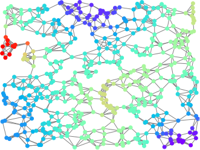{#fig-graph-signal fig-alt="A large irregular network whose nodes are colored on a blue-to-red scale"}
:::
::: {.figure-panel}
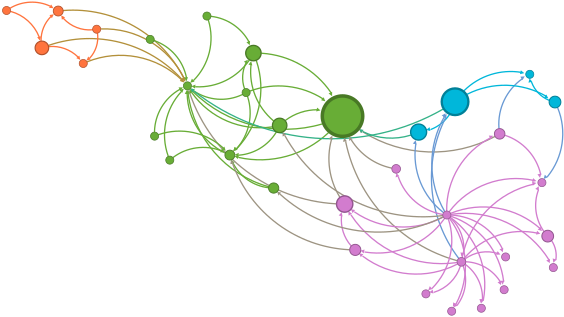{fig-alt="The Zachary karate club network drawn with colored nodes"}
:::
:::

The important shift in perspective is that the graph and the signal are **separate objects**. The graph is the domain; the signal is the data on it. In a molecule, nodes are atoms, the signal is the atom type; in a particle simulation, nodes are particles, the signal is their state; in a citation network, nodes are papers and the signal is a bag-of-words vector.

## Diffusion: what the shift operator does

Applying $\mathbf{S}$ to a signal mixes each node with its neighbors:

$$
\mathbf{y}=\mathbf{A}\mathbf{x},
\qquad
y_i=\sum_{j=1}^{N}a_{ij}x_j=\sum_{j\in\mathcal{N}_i}a_{ij}x_j .
$$

Only neighbors contribute, and in a weighted graph stronger edges contribute more. This single operation is the entire local mechanism behind every model in this note.

::: {.two-figures}
::: {.figure-panel}
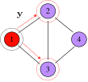{#fig-diffusion-1 fig-alt="A four-node graph with node 1 in red and nodes 2 and 3 circled in red"}
:::
::: {.figure-panel}
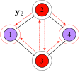{#fig-diffusion-2 fig-alt="The same four-node graph with the signal now present on all nodes"}
:::
:::

::: {.worked-example}
**Worked example — Two diffusion steps**

For the graph of @fig-diffusion-1 with $\mathbf{x}=[1,0,0,0]^{\top}$,

$$
\mathbf{y}=
\begin{bmatrix}
0&1&1&0\\
1&0&1&1\\
1&1&0&1\\
0&1&1&0
\end{bmatrix}
\begin{bmatrix}1\\0\\0\\0\end{bmatrix}
=
\begin{bmatrix}0\\1\\1\\0\end{bmatrix},
\qquad
\mathbf{y}_2=\mathbf{A}\mathbf{y}=
\begin{bmatrix}2\\1\\1\\2\end{bmatrix}.
$$

After one step the signal occupies the one-hop neighborhood of node 1; after two steps it has reached every node, and the entry $2$ at node 1 counts the two length-two walks returning to it.

If the graph is weighted with $a_{12}=0.5$, the same computation gives $\mathbf{y}=[0,0.5,1,0]^{\top}$ and $\mathbf{y}_2=[1.25,1,0.5,1.5]^{\top}$: the weaker edge transports less.
:::

### The diffusion sequence

Composing the operation defines the **diffusion sequence**

$$
\mathbf{x}^{(k+1)}=\mathbf{S}\mathbf{x}^{(k)},
\qquad
\mathbf{x}^{(0)}=\mathbf{x},
$$

which unrolls into the power sequence $\mathbf{x}^{(k)}=\mathbf{S}^{k}\mathbf{x}$.

::: {.figure-panel}
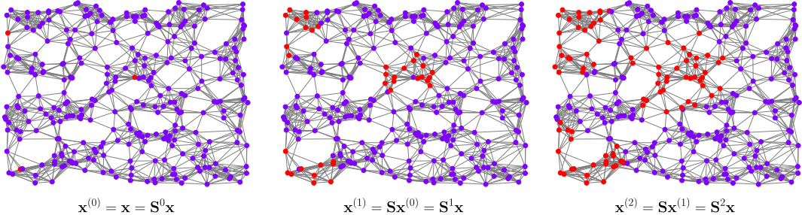{#fig-diffusion-sequence fig-alt="Three copies of a large sensor network showing an impulse spreading outward over successive steps"}
:::

::: {.checkpoint}
**Check 2 — Always implement the recursion**

The two expressions $\mathbf{x}^{(k+1)}=\mathbf{S}\mathbf{x}^{(k)}$ and $\mathbf{x}^{(k)}=\mathbf{S}^{k}\mathbf{x}$ are mathematically identical and computationally very different.

Each recursive step is one sparse matrix–vector product, costing $O(|\mathcal{E}|)$; $K$ steps cost $O(K|\mathcal{E}|)$ and never build a matrix. Forming $\mathbf{S}^{k}$ explicitly costs a dense matrix product *and* destroys sparsity: powers of a sparse matrix fill in rapidly, so $\mathbf{S}^{k}$ soon needs $O(N^{2})$ memory. Use the recursion; use the powers only for analysis.
:::

## Graph convolutional filters

::: {.definition}
**Definition 3 — Graph filter and graph convolution**

A **graph filter** is a polynomial in the shift operator,

$$
\mathbf{H}(\mathbf{S})=\sum_{k=0}^{K-1}h_k\mathbf{S}^{k}.
$$

Applying it to a graph signal produces the **graph convolution**

$$
\mathbf{y}=\mathbf{H}(\mathbf{S})\mathbf{x}=\sum_{k=0}^{K-1}h_k\mathbf{S}^{k}\mathbf{x} .
$$ {#eq-graph-convolution}

The sum is **finite**: a $K$-tap filter of order $K-1$. An infinite series $\sum_{k\ge0}h_k\mathbf{S}^k$ is a useful formal object but needs convergence conditions on $\{h_k\}$ and on the spectral radius of $\mathbf{S}$, so we take the finite polynomial as the definition and treat the infinite form as shorthand.
:::

Three properties make @eq-graph-convolution the right generalization of the classical convolution.

- **Locality.** The $k$-th term reads only the $k$-hop neighborhood, so a $K$-tap filter is supported on $K-1$ hops.
- **Fixed parameter count.** The filter has $K$ coefficients whatever the size of the graph. This is the property that shallow embeddings lacked.
- **Permutation equivariance.** If $\mathbf{P}$ is a permutation matrix, then $\mathbf{H}(\mathbf{P}\mathbf{S}\mathbf{P}^{\top})\mathbf{P}\mathbf{x}=\mathbf{P}\mathbf{H}(\mathbf{S})\mathbf{x}$, because $(\mathbf{P}\mathbf{S}\mathbf{P}^{\top})^{k}=\mathbf{P}\mathbf{S}^{k}\mathbf{P}^{\top}$ and $\mathbf{P}^{\top}\mathbf{P}=\mathbf{I}$. Relabelling the nodes relabels the output and changes nothing else — exactly the invariance Lecture 1 demanded of a graph model.

Aggregation grows from local to global as $k$ increases: the filter reads the node itself ($k=0$), then its neighbors ($k=1$), then their neighbors ($k=2$), and the coefficients $h_k$ decide how much each scale contributes.

## From filters to graph neural networks

A neural network is a composition of layers, each a linear map followed by a pointwise nonlinearity. The three architectures below differ only in *which* linear map they use.

::: {.figure-panel}
{#fig-nn-layers fig-alt="A block diagram of two layers, each a matrix multiplication followed by a pointwise nonlinearity"}
:::

::: {.figure-panel}
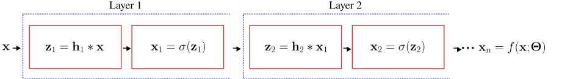{#fig-cnn-layers fig-alt="A block diagram of two layers, each a convolution followed by a pointwise nonlinearity"}
:::

::: {.figure-panel}
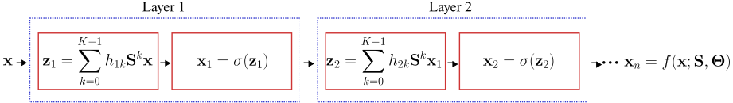{#fig-gnn-layers fig-alt="A block diagram of two graph filtering layers, each followed by a pointwise nonlinearity"}
:::

Formally, with $\mathbf{x}_0=\mathbf{x}$,

$$
\mathbf{z}_{\ell}=\sum_{k=0}^{K-1}h_{\ell k}\mathbf{S}^{k}\mathbf{x}_{\ell-1},
\qquad
\mathbf{x}_{\ell}=\sigma(\mathbf{z}_{\ell}),
\qquad
\ell=1,\dots,L,
$$

and the network computes $\mathbf{x}_{L}=f(\mathbf{x};\mathbf{S},\boldsymbol{\Theta})$ with $\boldsymbol{\Theta}=\{h_{\ell k}\}$. Because $\sigma$ acts pointwise, it commutes with node permutations, so the whole network inherits the permutation equivariance of its filters.

::: {.checkpoint}
**Check 3 — What we want from a GNN**

Before choosing an architecture, fix the requirements:

1. **cost** proportional to $O(|\mathcal{E}|)$ in time and memory;
2. a **fixed number of parameters**, independent of $N$;
3. **locality**, so that each output depends on a bounded neighborhood;
4. applicability to **inductive** problems, that is, to graphs unseen during training.

A $K$-tap filter evaluated by the recursion of Check 2 satisfies all four, and its arithmetic **is** linear in the edge count: $K$ sparse products cost $O(K|\mathcal{E}|)$, which is $O(|\mathcal{E}|)$ for fixed $K$. With $F_{\text{in}}$ input and $F_{\text{out}}$ output channels the honest count is $O(N F_{\text{in}} F_{\text{out}} + K |\mathcal{E}| F_{\text{out}})$ — the node-wise dense maps are usually the larger term on a sparse graph, so "cost $O(|\mathcal{E}|)$" is shorthand, not the whole story.

What high order actually costs is different, and worth separating from the arithmetic:

- **Depth of the dependency chain.** $\mathbf{x}^{(k)}$ needs $\mathbf{x}^{(k-1)}$, so the $K$ products run in sequence. The work is linear in $K$; the *latency* is too, and cannot be reduced by adding hardware.
- **A larger constant.** Every extra tap is another full pass over the edges, and another $K$-hop neighborhood to fetch — which is what Lecture 3 will find expensive at scale.
- **The tempting shortcut is the real trap.** Precomputing $\mathbf{S}^{k}$ to parallelize the sum destroys sparsity: powers of a sparse matrix fill in, and the $O(N^2)$ memory returns.

Architectures built on high-order filters, such as ChebNet [@defferrard2016convolutional], pay the second and third of these. GCN's answer is to make $K$ as small as possible.
:::

## Graph convolutional networks {#sec-gcn}

The graph convolutional network of Kipf and Welling [@kipf2016semi] is the most widely used GNN — over 40 000 citations by the time of this lecture in January 2025 — and its success comes entirely from being the cheapest possible approximation of @eq-graph-convolution.

### Deriving the propagation rule

Start from a first-order filter on the normalized Laplacian, keeping only $k=0$ and $k=1$:

$$
\mathbf{y}\approx\theta_0'\mathbf{x}+\theta_1'\hat{\mathbf{L}}\mathbf{x}.
$$

Now substitute $\hat{\mathbf{L}}=\mathbf{I}-\hat{\mathbf{A}}$ and collect terms. Note that this changes the constant coefficient — it does **not** leave $\theta_0'$ untouched:

$$
\theta_0'\mathbf{x}+\theta_1'(\mathbf{I}-\hat{\mathbf{A}})\mathbf{x}
=\underbrace{(\theta_0'+\theta_1')}_{\textstyle \theta_0}\mathbf{x}
\;\underbrace{-\;\theta_1'}_{\textstyle \theta_1}\hat{\mathbf{A}}\mathbf{x}
=\theta_0\mathbf{x}+\theta_1\hat{\mathbf{A}}\mathbf{x}.
$$

So a first-order filter has two free parameters whichever basis we write it in. Tying them with $\theta=\theta_0=\theta_1$ leaves a **single** parameter per filter:

$$
\mathbf{y}\approx\theta\left(\mathbf{I}+\mathbf{D}^{-1/2}\mathbf{A}\mathbf{D}^{-1/2}\right)\mathbf{x}.
$$

The operator $\mathbf{I}+\hat{\mathbf{A}}$ has eigenvalues in $[0,2]$, so repeatedly applying it in a deep network amplifies or attenuates the signal and leads to exploding or vanishing gradients. The **renormalization trick** replaces it by the same operator computed on the graph with self-loops added:

$$
\mathbf{I}+\mathbf{D}^{-1/2}\mathbf{A}\mathbf{D}^{-1/2}
\;\longrightarrow\;
\tilde{\mathbf{D}}^{-1/2}\tilde{\mathbf{A}}\tilde{\mathbf{D}}^{-1/2},
\qquad
\tilde{\mathbf{A}}=\mathbf{A}+\mathbf{I},
\quad
\tilde{\mathbf{D}}=\operatorname{diag}(\tilde{\mathbf{A}}\mathbf{1}).
$$

The resulting matrix has spectrum contained in $(-1,1]$, which keeps the diffusion stable. In the shorthand used in the lecture: GCN is the graph filter with $h_1=1$, $h_i=0$ for $i\neq1$, $\mathbf{S}=\hat{\mathbf{A}}$, plus the self-loop trick.

::: {.definition}
**Definition 4 — GCN propagation rule**

$$
\mathbf{H}^{(\ell+1)}
=\sigma\!\left(
\tilde{\mathbf{D}}^{-1/2}\tilde{\mathbf{A}}\tilde{\mathbf{D}}^{-1/2}\,
\mathbf{H}^{(\ell)}\mathbf{W}^{(\ell)}
\right),
\qquad
\mathbf{H}^{(0)}=\mathbf{X},
$$ {#eq-gcn}

where $\mathbf{H}^{(\ell)}$ collects the activations of layer $\ell$, $\mathbf{W}^{(\ell)}$ is a trainable weight matrix, and $\sigma(\cdot)$ is an activation function.
:::

Two readings of @eq-gcn are worth keeping in mind. Reading it left to right, $\tilde{\mathbf{D}}^{-1/2}\tilde{\mathbf{A}}\tilde{\mathbf{D}}^{-1/2}$ mixes each node with its neighbors and $\mathbf{W}^{(\ell)}$ mixes the feature channels. Reading it as a degenerate case, if the propagation matrix were $\mathbf{I}$ — no graph structure at all — the layer would reduce to an ordinary fully connected layer $\sigma(\mathbf{H}^{(\ell)}\mathbf{W}^{(\ell)})$. **The graph is the only thing a GCN adds to an MLP.**

### Shapes and parameters

::: {.worked-example}
**Worked example — A two-layer GCN, dimension by dimension**

Let $N$ be the number of nodes, $F$ the input feature dimension, $H_0$ the width of the hidden layer and $C$ the number of classes. In the first layer,

$$
\underbrace{\tilde{\mathbf{D}}^{-1/2}\tilde{\mathbf{A}}\tilde{\mathbf{D}}^{-1/2}}_{N\times N}
\;
\underbrace{\mathbf{X}}_{N\times F}
\;
\underbrace{\mathbf{W}^{(0)}}_{F\times H_0}
\;\Longrightarrow\;
\mathbf{H}^{(1)}\in\mathbb{R}^{N\times H_0}.
$$

The second layer uses $\mathbf{W}^{(1)}\in\mathbb{R}^{H_0\times C}$ and yields $\mathbf{H}^{(2)}\in\mathbb{R}^{N\times C}$. The vanilla two-layer GCN for node classification is therefore

$$
\begin{aligned}
\bar{\mathbf{Y}}
=f(\mathbf{X};\mathbf{A},\boldsymbol{\Theta})
&=\operatorname{softmax}\!\left(
\hat{\mathbf{A}}_{\mathrm{sl}}\,
\operatorname{ReLU}\!\left(\hat{\mathbf{A}}_{\mathrm{sl}}\mathbf{X}\mathbf{W}^{(0)}\right)
\mathbf{W}^{(1)}
\right),\\[4pt]
\hat{\mathbf{A}}_{\mathrm{sl}}&=\tilde{\mathbf{D}}^{-1/2}\tilde{\mathbf{A}}\tilde{\mathbf{D}}^{-1/2}.
\end{aligned}
$$

Its parameter count is $FH_0+H_0C$ — it does **not** contain $N$. For Cora ($N=2708$, $F=1433$, $C=7$) with $H_0=16$, that is $1433\times16+16\times7=23\,040$ parameters, whereas a shallow embedding of the same width would need $16\times2708=43\,328$ parameters and would still be unable to classify a new node.
:::

::: {.figure-panel}
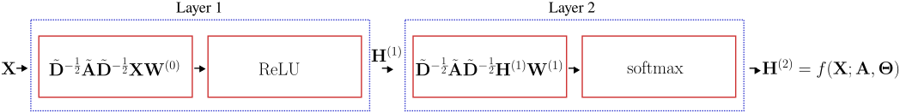{#fig-gcn-block fig-alt="Two layers, each containing a normalized adjacency times features times weights block followed by ReLU or softmax"}
:::

### Loss function

For semi-supervised node classification, let $\mathcal{S}\subset\mathcal{V}$ be the indices of the labelled training nodes, $C$ the number of classes and $\mathbf{Y}\in\{0,1\}^{N\times C}$ the one-hot label matrix. The cross-entropy loss is

$$
\mathcal{L}
=-\frac{1}{|\mathcal{S}|}
\sum_{i\in\mathcal{S}}
\sum_{j=1}^{C}
Y_{ij}\ln\bar{Y}_{ij}.
$$

Only the labelled rows enter the loss, but the forward pass uses the whole graph — that is what makes the method semi-supervised. Optimize with SGD or Adam.

### GCN is inductive

::: {.figure-panel}
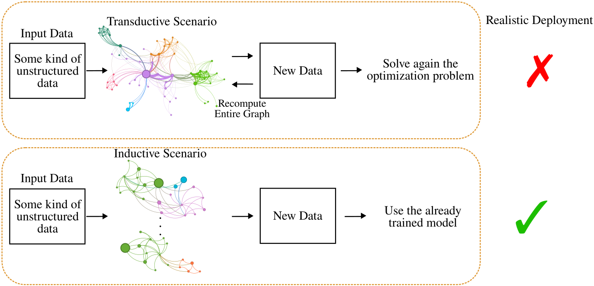{#fig-inductive fig-alt="Top row, a transductive pipeline that recomputes the entire graph; bottom row, an inductive pipeline that reuses the trained model"}
:::

This is the decisive practical advantage over DeepWalk. The trained object is $\{\mathbf{W}^{(\ell)}\}$, a set of matrices whose shapes depend on feature dimensions only, so the architecture *can* be applied to a graph it never saw.

Two distinctions are worth keeping straight. First, being applicable inductively is a property of the **architecture**; whether a given experiment is inductive or transductive is a property of the **protocol** you evaluate under. A GCN trained and tested on one fixed graph with a node mask is a transductive experiment using an inductive architecture. Second, a matching feature dimension makes the forward pass *defined*, not *useful*: transfer to a new graph also needs the features to mean the same thing and the degree and homophily structure to be comparable.

### What the outputs are used for

::: {.figure-panel}
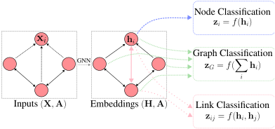{#fig-gnn-tasks fig-alt="A graph and its embeddings feeding three heads: node classification, graph classification, and link classification"}
:::

$$
\mathbf{z}_i=f(\mathbf{h}_i)
\quad\text{(node)},
\qquad
\mathbf{z}_{\mathcal{G}}=f\!\left(\textstyle\sum_{i}\mathbf{h}_i\right)
\quad\text{(graph)},
\qquad
\mathbf{z}_{ij}=f(\mathbf{h}_i,\mathbf{h}_j)
\quad\text{(link)}.
$$

The graph-level readout must be permutation invariant — a sum, mean, or max over nodes — otherwise relabelling the nodes would change the prediction.

## The message-passing framework

GCN is one point in a much larger design space. The message-passing neural network framework [@gilmer2017neural] describes that space.

::: {.definition}
**Definition 5 — Message-passing layer**

With $\mathbf{H}^{(\ell)}\in\mathbb{R}^{N\times F_\ell}$ and $\mathbf{H}^{(0)}=\mathbf{X}$,

$$
\mathbf{h}_i^{(\ell+1)}
=\phi_\ell\!\left(
\mathbf{h}_i^{(\ell)},
\sum_{j\in\mathcal{N}_i} S_{ij}\,
\psi_\ell\!\left(\mathbf{h}_i^{(\ell)},\mathbf{h}_j^{(\ell)}\right)
\right),
$$ {#eq-mpnn}

where $\psi_\ell:\mathbb{R}^{F_\ell}\times\mathbb{R}^{F_\ell}\to\mathbb{R}^{F'_\ell}$ is a **message function** and $\phi_\ell:\mathbb{R}^{F_\ell}\times\mathbb{R}^{F'_\ell}\to\mathbb{R}^{F_{\ell+1}}$ is an **update function**.
:::

::: {.figure-panel}
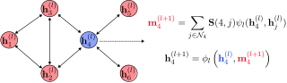{#fig-message-passing fig-alt="A six-node graph with node 4 highlighted, beside the message and update equations"}
:::

The aggregation must be permutation invariant — a sum here, but mean, max, or attention-weighted sums are equally valid — because a node's neighbors carry no canonical order. The cost of one layer is $O(|\mathcal{E}|)$ messages, which is requirement 1 of Check 3.

### GCN as a message-passing layer

Expanding @eq-gcn row by row gives

$$
\mathbf{h}_i^{(\ell+1)}
=\sigma\!\left(
\mathbf{W}^{\top}
\sum_{j\in\mathcal{N}_i\cup\{i\}}
\frac{\tilde{a}_{ij}}{\sqrt{(d_i+1)(d_j+1)}}\,
\mathbf{h}_j^{(\ell)}
\right),
$$ {#eq-gcn-mpnn}

where $d_i$ is the degree of node $i$ in $\mathbf{A}$ and $\tilde{a}_{ij}$ is an entry of the **self-loop-augmented** $\tilde{\mathbf{A}}=\mathbf{A}+\mathbf{I}$, so that $\tilde{a}_{ii}=1$. Writing $a_{ij}$ here would be a mistake: the examples in this course use a simple graph, whose adjacency has a zero diagonal, and the $j=i$ term would silently vanish — dropping exactly the self-message the renormalization trick was introduced to add.

Reading @eq-gcn-mpnn against @eq-mpnn: the message function is the identity on the neighbor's state, the aggregation is a weighted sum over the closed neighborhood $\mathcal{N}_i\cup\{i\}$, and the update is a linear map followed by an activation.

::: {.checkpoint}
**Check 4 — Where the GCN coefficients come from**

In @eq-gcn-mpnn the weight of neighbor $j$ is $\tilde{a}_{ij}/\sqrt{(d_i+1)(d_j+1)}$. It depends only on the **degrees** and the **prescribed edge weights**. Nothing in it is learned, and nothing in it depends on what the nodes contain. Two consequences follow: a high-degree neighbor is systematically down-weighted regardless of how informative it is, and edge features cannot be used at all.

Note also what these coefficients do **not** do: they do not sum to one over the closed neighborhood. Symmetric normalization is not a row-stochastic operation — that is $\mathbf{D}^{-1}\mathbf{A}$, a different operator.
:::

## Graph attention networks

GAT [@velickovic2018graph] keeps the message-passing skeleton and replaces the fixed coefficient by a learned one, $\alpha_{ij}=f(\mathbf{h}_i,\mathbf{h}_j)$.

::: {.definition}
**Definition 6 — Graph attention layer**

Let $\vec{h}_i\in\mathbb{R}^{F}$ be the input features and $\mathbf{W}\in\mathbb{R}^{F'\times F}$ a shared linear map. With an attention vector $\vec{\mathbf{a}}\in\mathbb{R}^{2F'}$ and concatenation $[\cdot,\cdot]$, the attention coefficients are

$$
\alpha_{ij}
=\frac{
\exp\!\left(\operatorname{LeakyReLU}\!\left(\vec{\mathbf{a}}^{\top}[\mathbf{W}\vec{h}_i,\mathbf{W}\vec{h}_j]\right)\right)
}{
\sum_{k\in\mathcal{N}_i}
\exp\!\left(\operatorname{LeakyReLU}\!\left(\vec{\mathbf{a}}^{\top}[\mathbf{W}\vec{h}_i,\mathbf{W}\vec{h}_k]\right)\right)
},
$$ {#eq-gat-alpha}

and the layer output is

$$
\vec{h}'_i=\sigma\!\left(\sum_{j\in\mathcal{N}_i}\alpha_{ij}\mathbf{W}\vec{h}_j\right).
$$
:::

Three points about @eq-gat-alpha. The softmax runs over the neighborhood only, so the coefficients are computed on $|\mathcal{E}|$ pairs rather than $N^2$ — attention here is sparse by construction, which is what keeps the layer affordable. The neighborhood is understood to include $i$ itself, so a node can attend to its own state. And the coefficients are generally asymmetric: $\alpha_{ij}\neq\alpha_{ji}$, because each is normalized over a different neighborhood.

::: {.figure-panel}
![The same neighborhood weighted two ways. The GCN coefficients (teal) are fixed by the degrees and damp the three high-degree neighbors to $0.08$ against $0.26$ for the low-degree one; the attention coefficients (coral) are computed from the node states and can concentrate on $j=2$ instead. Note the sums: the GAT coefficients are a softmax and sum to $1$, while the symmetrically normalized GCN coefficients sum to $0.70$ here — symmetric normalization is not row-stochastic. The GAT values come from one **untrained** head with a random attention vector on random features; they illustrate what attention can express, not what a trained model learns.](../../assets/figures/gcn-vs-gat-weights.svg){#fig-gcn-vs-gat fig-alt="Left, a five-node neighborhood with node degrees; right, a grouped bar chart comparing GCN and GAT coefficients"}
:::

### Multi-head attention

A single attention head is unstable to train. GAT runs $K$ independent heads and combines them. In hidden layers the heads are concatenated,

$$
\vec{h}'_i=\Big\Vert_{k=1}^{K}
\sigma\!\left(\sum_{j\in\mathcal{N}_i}\alpha_{ij}^{k}\mathbf{W}^{k}\vec{h}_j\right)
\;\in\mathbb{R}^{KF'},
$$

whereas the final layer averages them so that the output dimension stays equal to the number of classes:

$$
\vec{h}'_i=\sigma\!\left(\frac{1}{K}\sum_{k=1}^{K}\sum_{j\in\mathcal{N}_i}\alpha_{ij}^{k}\mathbf{W}^{k}\vec{h}_j\right).
$$

::: {.checkpoint}
**Check 5 — GCN or GAT?**

**GCN** aggregates with **fixed** weights read off the adjacency matrix. It is cheap, has few parameters, and is a strong default on homophilous graphs and at scale.

**GAT** aggregates with **implicit** weights produced by an attention mechanism. It has more capacity, can down-weight unhelpful neighbors, and accepts edge features, at the cost of more parameters and more computation per edge. It is the sensible middle ground between a GCN and a full graph transformer.

Test GCN first. It is fast enough to tell you within minutes whether the graph is helping at all.
:::

## Limitations of message-passing models

Every architecture above is an approximation of the graph filter of @eq-graph-convolution, and the approximation has consequences.

### Homophily and heterophily

::: {.definition}
**Definition 7 — Node homophily index**

$$
H(\mathcal{G})=\frac{1}{|\mathcal{V}|}\sum_{i\in\mathcal{V}}\frac{|\mathcal{N}_i^{s}|}{|\mathcal{N}_i|},
$$

where $\mathcal{N}_i^{s}$ is the set of neighbors of $i$ carrying the same label as $i$. If every neighbor of every node shares its label then $H(\mathcal{G})=1$; $H(\mathcal{G})\to0$ indicates strong heterophily.
:::

::: {.figure-panel}
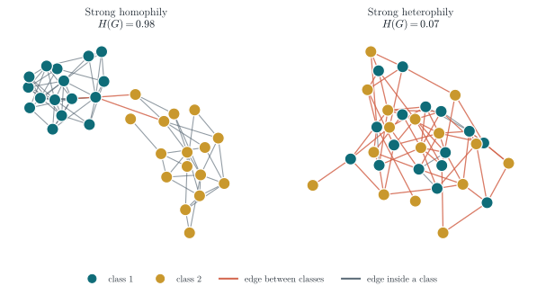{#fig-homophily fig-alt="Two node-link diagrams, one with edges mostly inside classes and one with edges mostly between classes"}
:::

The intuition is immediate: message passing averages a node with its neighbors, which helps precisely when neighbors share the node's label.

There is a spectral statement behind it, but it has to be scoped carefully. Consider **repeated fixed linear propagation** — apply $\hat{\mathbf{A}}_{\mathrm{sl}}$ $L$ times with no weights and no nonlinearity. Its eigenvalues $\mu$ lie in $(-1,1]$, so $L$ applications scale each spectral component by $\mu^{L}$, and since $|\mu|<1$ away from the top of the spectrum every component except the smoothest is suppressed. **Repeated propagation alone is a low-pass filter.**

Three caveats, because it is easy to over-claim here:

- A trained GCN is **not** multiplication by $\mu^{L}$. The weights $\mathbf{W}^{(\ell)}$ mix channels and the nonlinearities are not diagonal in this basis, so the composition is not a spectral filter at all.
- Message passing in general is **not** low-pass. Nothing stops a layer from computing $\mathbf{h}_i-\text{mean}_j\mathbf{h}_j$, which is high-pass; architectures for heterophily do exactly that.
- Low homophily does **not** by itself make a task hard. On the complete bipartite $K_{4,4}$ with one-hot class features and self-loops, propagation sends one class to $[0.2,0.8]$ and the other to $[0.8,0.2]$ — perfectly separable by a linear readout, at $H(\mathcal{G})=0$.

What survives is the useful practical statement: the *specific* aggregation GCN and GAT use is a smoothing one, so they carry a homophily prior, and low homophily is a reason to check the architecture rather than a proof that it will fail.

::: {.figure-panel}
{#fig-spectral fig-alt="Left, curves of mu to the power L for L equal to 1, 2, 8, and 32; right, a histogram of eigenvalues between -0.5 and 1"}
:::

A heterophilous label field is a *high-frequency* signal on the graph: it alternates between neighbors. A low-pass model cannot represent it. If your GNN underperforms a plain MLP on the same features, measure $H(\mathcal{G})$ before changing the architecture — low homophily is a common explanation.

### Over-smoothing

Depth usually helps in deep learning. In GNNs it often does not, and one reason is **over-smoothing**: as layers are stacked, node embeddings converge to values that no longer distinguish the nodes.

::: {.figure-panel}
{#fig-over-smoothing fig-alt="A log-scale decay curve beside three scatter panels in which two colored clusters shrink toward a single point"}
:::

The same spectral argument explains it. Repeated application of $\hat{\mathbf{A}}_{\mathrm{sl}}$ drives every signal toward the leading eigenvector, which is the same for all nodes up to a degree-dependent scale. Equivalently, treat the graph as a Markov chain: the number of layers is the number of steps, and beyond the **mixing time** the chain has forgotten where it started. The discriminative information disappears with it.

### Over-squashing

A second failure mode appears when the task needs information from far away. A $k$-layer model reads a $k$-hop neighborhood, and that neighborhood grows fast.

::: {.figure-panel}
{#fig-receptive-field fig-alt="Three curves on a logarithmic axis showing neighborhood size against hop distance"}
:::

::: {.figure-panel}
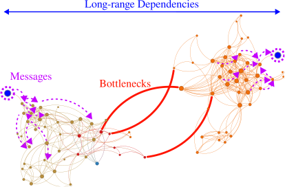{#fig-over-squashing fig-alt="Two dense communities joined by a small number of highlighted red edges labelled bottlenecks"}
:::

So deep GNNs face a pincer: shallow models cannot see far enough, and deep models both over-smooth and over-squash. Whether we genuinely need deep GNNs remains an open research question; the current evidence is that we need them when the task has genuine long-range interactions.

### Practical remedies

**PairNorm** [@zhao2019pairnorm] attacks over-smoothing directly by forbidding the embeddings to collapse to a point. It centers and rescales the representations between layers:

$$
\mathbf{x}_i^{c}=\mathbf{x}_i-\frac{1}{N}\sum_{j\in\mathcal{V}}\mathbf{x}_j
\quad\text{(centering)},
\qquad
\mathbf{x}'_i=s\,\frac{\mathbf{x}_i^{c}}{\sqrt{\frac{1}{N}\sum_{j\in\mathcal{V}}\Vert\mathbf{x}_j^{c}\Vert_2^{2}}}
\quad\text{(scaling)},
$$

with $s$ a scale hyperparameter. What this holds constant is the **total pairwise squared distance** of the representations — equivalently their total variance — so the cloud cannot contract to a point. That is not the same quantity as the normalized Dirichlet energy plotted below, which also depends on how the remaining variation is distributed over the graph.

**DropEdge** [@rong2020dropedge] removes a random fraction of edges at every training step. It slows the mixing of the underlying chain, and as a side benefit reduces the cost of a layer, since the complexity is proportional to $O(|\mathcal{E}|)$.

::: {.figure-panel}
![The same propagation experiment as @fig-over-smoothing, repeated with PairNorm and with DropEdge at rate $0.5$. Plain propagation decays geometrically; DropEdge slows the decay; PairNorm falls from $0.420$ to $0.200$ over the first step and then plateaus near $0.076$. Note that the plateau is an **observation in this experiment**, not a guarantee: PairNorm fixes the total pairwise distance, not this normalized Dirichlet energy, and the energy does drop by a factor of about $5.6$ before levelling off.](../../assets/figures/over-smoothing-remedies.svg){#fig-remedies fig-alt="Three curves on a logarithmic axis: plain propagation decaying steeply, DropEdge decaying slowly, PairNorm falling then flattening"}
:::

**Rewiring** attacks over-squashing instead. Topping et al. [@topping2022understanding] relate over-squashing to the Ricci curvature of the graph: negatively curved edges are the bottlenecks, and if curvature is positive everywhere the receptive field grows polynomially rather than exponentially in the hop distance. One can therefore add edges around the most negatively curved regions.

::: {.figure-panel}
![SJLR [@giraldo2023trade] scores candidate edges by the average curvature improvement they produce, then stochastically adds and removes edges during training — trading over-smoothing against over-squashing rather than treating either in isolation.](../../assets/figures/sjlr-rewiring.svg){#fig-sjlr fig-alt="Three panels showing candidate edges to add, a curvature improvement score, and stochastic addition and dropping during training"}
:::

## Implementation with PyTorch Geometric

PyTorch Geometric (PyG) is built on PyTorch, so everything you know about `nn.Module`, autograd and optimizers carries over. A graph is a `Data` object holding `x` (the $N\times F$ feature matrix), `edge_index` (the $2\times|\mathcal{E}|$ edge list from the worked example above), and optionally `edge_attr` and `y`.

### A GCN

```python
import torch
import torch.nn.functional as functional

from torch_geometric.nn import GCNConv


class GCN(torch.nn.Module):
    def __init__(self, in_dim, out_dim, hidden, layers):
        super().__init__()
        self.convs = torch.nn.ModuleList()

        if layers == 1:
            self.convs.append(GCNConv(in_dim, out_dim))
        else:
            self.convs.append(GCNConv(in_dim, hidden))
            for _ in range(layers - 2):
                self.convs.append(GCNConv(hidden, hidden))
            self.convs.append(GCNConv(hidden, out_dim))

    def forward(self, data):
        x, edges, weights = data.x, data.edge_index, data.edge_attr
        for conv in self.convs[:-1]:
            x = conv(x, edges, edge_weight=weights)
            x = functional.relu(x)
        return self.convs[-1](x, edges, edge_weight=weights)
```

`GCNConv` implements exactly @eq-gcn: it adds the self-loops, computes $\tilde{\mathbf{D}}^{-1/2}\tilde{\mathbf{A}}\tilde{\mathbf{D}}^{-1/2}$ from `edge_index`, and applies $\mathbf{W}^{(\ell)}$. It never materializes an $N\times N$ matrix.

::: {.checkpoint}
**Check 6 — Logits, not probabilities**

The `forward` above returns **unnormalized scores**. `torch.nn.CrossEntropyLoss` applies `log_softmax` internally, so it expects exactly that. Returning `x.softmax(dim=-1)` and then calling `CrossEntropyLoss` applies the softmax twice, which flattens the gradients and slows training badly.

Pick one convention and hold it: return logits and use `CrossEntropyLoss`, or return `log_softmax(x, dim=-1)` and use `NLLLoss`.
:::

A training step on a node-classification dataset then looks like:

```python
model = GCN(
    in_dim=dataset.num_features,
    out_dim=dataset.num_classes,
    hidden=16,
    layers=2,
)
optimizer = torch.optim.Adam(
    model.parameters(), lr=0.01, weight_decay=5e-4
)
criterion = torch.nn.CrossEntropyLoss()

model.train()
for epoch in range(200):
    optimizer.zero_grad()
    # One forward pass over the whole graph ...
    scores = model(data)
    # ... but the loss reads the labelled nodes only.
    mask = data.train_mask
    loss = criterion(scores[mask], data.y[mask])
    loss.backward()
    optimizer.step()
```

### A GAT

```python
import torch
import torch.nn.functional as functional

from torch_geometric.nn import GATConv


class GAT(torch.nn.Module):
    def __init__(self, in_dim, out_dim, hidden, layers, heads=2):
        super().__init__()
        self.convs = torch.nn.ModuleList()
        wide = hidden * heads  # width after concatenating the heads

        if layers == 1:
            self.convs.append(
                GATConv(in_dim, out_dim, heads=heads, concat=False)
            )
        else:
            # Hidden layers concatenate the heads; the output layer
            # averages them, so the last dimension is the class count.
            self.convs.append(
                GATConv(in_dim, hidden, heads=heads, concat=True)
            )
            for _ in range(layers - 2):
                self.convs.append(
                    GATConv(wide, hidden, heads=heads, concat=True)
                )
            self.convs.append(
                GATConv(wide, out_dim, heads=heads, concat=False)
            )

    def forward(self, data):
        x, edges = data.x, data.edge_index
        for conv in self.convs[:-1]:
            x = functional.elu(conv(x, edges))
        return self.convs[-1](x, edges)
```

Note the interface difference: `GCNConv` takes scalar edge weights through `edge_weight`, whereas `GATConv` takes vector-valued edge features through `edge_attr` and requires `edge_dim` to be set at construction. The original GAT paper uses ELU rather than ReLU in the hidden layers.

## Exercises

### Exercise 1 — Convolution as a polynomial

Take the directed line graph on five nodes with $\mathbf{S}$ as defined above. Compute $\mathbf{S}^{2}$ and $\mathbf{S}^{3}$, and verify that $\mathbf{z}=\sum_{k=0}^{2}h_k\mathbf{S}^{k}\mathbf{x}$ reproduces the finite impulse response filter $z_i=h_0x_i+h_1x_{i-1}+h_2x_{i-2}$.

### Exercise 2 — Permutation equivariance

Prove that $\mathbf{H}(\mathbf{P}\mathbf{S}\mathbf{P}^{\top})\mathbf{P}\mathbf{x}=\mathbf{P}\mathbf{H}(\mathbf{S})\mathbf{x}$ for any permutation matrix $\mathbf{P}$ and any polynomial filter $\mathbf{H}$. Where is $\mathbf{P}^{\top}\mathbf{P}=\mathbf{I}$ used?

### Exercise 3 — The renormalization trick

Show that the eigenvalues of $\mathbf{I}+\mathbf{D}^{-1/2}\mathbf{A}\mathbf{D}^{-1/2}$ lie in $[0,2]$ for a connected undirected graph, and explain in one sentence why repeatedly applying an operator with spectral radius $2$ is a problem in a deep network.

### Exercise 4 — Counting parameters

A three-layer GCN is applied to a graph with $N=10^{6}$ nodes, $F=500$ input features, hidden width $H=64$ and $C=10$ classes. How many trainable parameters does it have? How many would a shallow embedding of width $64$ require? Which quantity depends on $N$?

### Exercise 5 — GCN coefficients

For the neighborhood in @fig-gcn-vs-gat, verify the GCN coefficients $a_{ij}/\sqrt{(d_i+1)(d_j+1)}$ by hand using the degrees printed in the figure, and confirm that the reported values are these coefficients after normalization. Then state what would change if node $3$ gained fifty new neighbors elsewhere in the graph — under GCN, and under GAT.

### Exercise 6 — Homophily (investigation)

Take the complete bipartite graph $K_{4,4}$ with the two sides as the two classes, so $H(\mathcal{G})=0$, and one-hot class features. Add self-loops and compute the output of one propagation step $\hat{\mathbf{A}}_{\mathrm{sl}}\mathbf{X}$ by hand.

You should find $[0.2,0.8]$ for one class and $[0.8,0.2]$ for the other. Is this output linearly separable? Now answer the real question: **does zero homophily always destroy the signal?** Construct a second eight-node graph, also with $H(\mathcal{G})=0$, on which one propagation step *does* make the classes inseparable, and identify what differs between the two cases. What does this tell you about using $H(\mathcal{G})$ alone to predict whether a GNN will work?

### Exercise 7 — Over-smoothing in practice

Reproduce @fig-over-smoothing with the script in `scripts/figures/lecture_02_figures.py`. Replace the propagation operator $\tilde{\mathbf{D}}^{-1/2}\tilde{\mathbf{A}}\tilde{\mathbf{D}}^{-1/2}$ by the unnormalized $\mathbf{A}$ and explain the change in the Dirichlet energy curve using the spectral radius of $\mathbf{A}$.

## Main takeaways

1. A convolution is a **polynomial in a shift operator**; time and space are just special graphs, so the definition transfers to any graph unchanged.
2. Graph filters are **local**, have a **fixed number of parameters**, and are **permutation equivariant** — the three properties that shallow embeddings could not deliver.
3. A GNN composes graph filters with pointwise nonlinearities; with a directed line graph it reduces exactly to a CNN.
4. A $K$-tap filter costs $O(K|\mathcal{E}|)$ — linear in the edge count for fixed $K$. What high order really costs is a longer sequential dependency chain and a bigger neighborhood to fetch; forming $\mathbf{S}^{k}$ to avoid that destroys sparsity. Practical architectures keep $K$ small.
5. **GCN** is the cheapest such approximation: one hop, one shared weight matrix, self-loops for stability. It is inductive, costs $O(|\mathcal{E}|)$, and should be your first baseline.
6. **Message passing** is the general framework; **GAT** stays inside it and replaces the degree-based coefficients by learned attention.
7. The aggregation GCN and GAT use is a **smoothing** one, so they carry a homophily prior, **over-smooth** with depth, and **over-squash** long-range information. This is a property of these architectures, not of message passing in general. PairNorm, DropEdge, and curvature-based rewiring mitigate the symptoms; none of them solves the problem completely.
8. Plenty of open problems remain — which is good news if you are looking for a research topic.

## References and provenance {.unnumbered}

This web note is adapted from the Lecture 2 slides by Jhony H. Giraldo. Notation was normalized against Lecture 1 ($\mathbf{H}^{(0)}=\mathbf{X}$ throughout), the GCN propagation rule was derived rather than stated, and several derivations, dimension counts, and code notes were added.

The diagrams reproduce the original course vectors. @fig-spectral, @fig-homophily, @fig-over-smoothing, @fig-remedies, @fig-receptive-field, and @fig-gcn-vs-gat are new and were computed with `numpy` and `networkx`; the script that produces them is `scripts/figures/lecture_02_figures.py` in this repository, so every number in those panels can be reproduced and modified.

::: {#refs .references-small}
:::
