```{=html}
<header class="lecture-header">
  <div class="eyebrow">APM 5DS30 TP · Machine Learning with Graphs</div>
  <h1>Scaling up graph neural networks</h1>
  <p>Lecture 3 · Jhony H. Giraldo · Télécom Paris, Institut Polytechnique de Paris</p>
  <div class="lecture-meta"><span>Original lecture: 4 February 2025</span><span>Web note revised: 6 September 2026</span><span>Mathematics rendered with MathJax</span></div>
  <div class="button-row">
    <a class="button-link primary" href="/assets/pdf/Lecture-03-Scaling-Up-Graph-Neural-Networks.pdf">Download the original slides</a>
    <a class="button-link secondary" href="/teaching/machine-learning-with-graphs/index.qmd">Back to the course</a>
  </div>
</header>
```

Lecture 2 built GCN and GAT and observed that one message-passing layer costs $O(|\mathcal{E}|)$. On a graph with a few thousand nodes that is the end of the story. On the graphs that motivate the field — a social network, a recommender system, an academic citation graph — it is the beginning of one.

This note is about a single obstacle. **The trick that makes deep learning scale, mini-batch stochastic gradient descent, does not transfer to graphs.** We will see precisely why it fails, and then study the three standard repairs: sample the neighborhood (GraphSAGE), sample sub-graphs (Cluster-GCN), or remove the nonlinearity so that the graph work can be done once, in advance (SGC).

## Learning objectives

After studying this note, you should be able to:

```{=html}
<ol class="learning-objectives">
  <li>explain why a uniformly sampled mini-batch of nodes destroys the graph structure;</li>
  <li>construct the computational graph of a node and state how its size grows with depth;</li>
  <li>describe GraphSAGE neighbor sampling and the trade-off controlled by the fan-out $H$;</li>
  <li>describe Cluster-GCN, and identify the bias it introduces by discarding between-cluster edges;</li>
  <li>derive SGC by removing the nonlinearities from a GCN, and explain why it is so cheap;</li>
  <li>choose between these methods for a given graph, task, and memory budget.</li>
</ol>
```

## Graphs in modern applications

The methods in this note exist because of a specific class of application.

::: {.two-figures}
::: {.figure-panel}
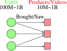{#fig-app-recsys fig-alt="A bipartite graph of users connected to items"}
:::
::: {.figure-panel}
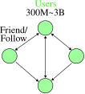{#fig-app-social fig-alt="A social network drawn as a large node-link diagram"}
:::
:::

::: {.figure-panel}
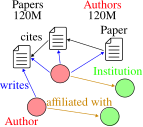{#fig-app-academic fig-alt="A heterogeneous academic graph linking papers, authors, and venues"}
:::

::: {.checkpoint}
**Check 1 — What these have in common**

- **Scale.** Between $10^{7}$ and $10^{10}$ nodes, and between $10^{8}$ and $10^{11}$ edges.
- **Task level.** Node level (classify a user, item, or paper) and link level (recommend).

Lecture 2's architectures apply unchanged. What does not apply is the training procedure.
:::

## Why the usual training recipe fails

Recall how a deep model is trained on a large dataset — a CNN on ImageNet, say. The objective is an average over $N$ samples,

$$
\mathcal{L}(\boldsymbol{\Theta})=\frac{1}{N}\sum_{i=0}^{N-1}\mathcal{L}_i(\boldsymbol{\Theta}),
$$

and stochastic gradient descent replaces it with an estimate from a mini-batch: sample $M\ll N$ points, compute the loss on those $M$, take a gradient step. This works because $\mathcal{L}_i$ depends on sample $i$ **and nothing else**.

On a graph, that assumption is exactly what fails.

::: {.figure-panel}
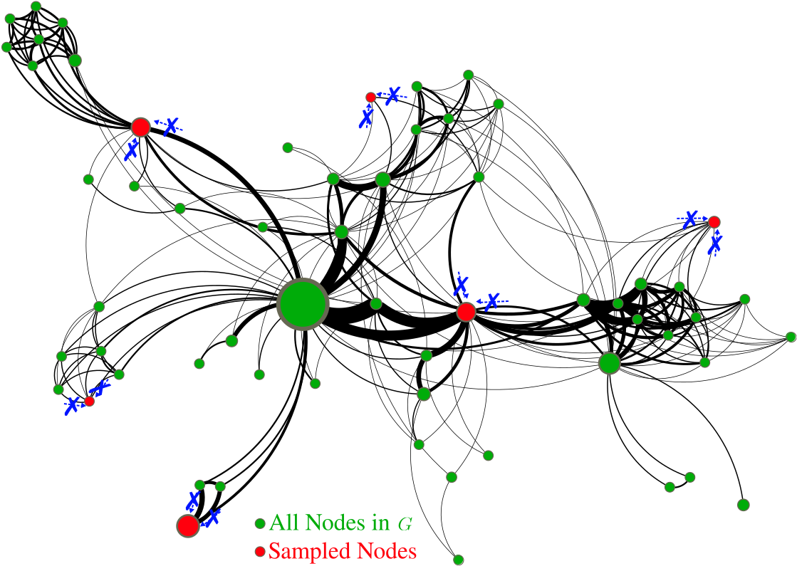{#fig-naive-minibatch fig-alt="A large network with a small number of widely scattered sampled nodes highlighted in red"}
:::

A GNN computes $\mathbf{h}_i$ by aggregating over $\mathcal{N}_i$. If none of node $i$'s neighbors is in the batch, there is nothing to aggregate, and the layer degenerates into a per-node linear map. The graph — the entire reason for using a GNN — has been sampled away.

This is not a qualitative worry; it is arithmetic. A uniform sample of $M$ out of $N$ nodes retains an edge only when **both** of its endpoints are drawn, which happens with probability roughly $(M/N)^2$.

::: {.figure-panel}
{#fig-minibatch-loss fig-alt="Two plots: fraction of retained edges falling quadratically with batch size, and percentage of isolated nodes falling from 95% to 0"}
:::

### Why not just use the whole graph?

Full-batch training is the obvious alternative, and Lecture 2 showed that a GCN layer is cheap. The problem is memory, not arithmetic.

::: {.worked-example}
**Worked example — The memory wall**

Lecture 2 computed that a graph with $N=25\,000\,000$ nodes and $300$ neighbors per node needs about $120$ GB as an edge list. A server CPU can hold that.

Training needs a **GPU**. Current top-end accelerators carry $40$–$80$ GB, and the model, activations, and optimizer state must fit alongside the graph. A single GPU cannot hold the graph, let alone a full-batch forward and backward pass over it.

And $25$ million nodes is modest: a European customer graph at Amazon scale is larger.
:::

So: uniform mini-batches destroy the structure, and full batches do not fit. Everything below is a way out of that squeeze.

## The computational graph of a node

The way out starts with a change of perspective. Instead of asking *which nodes are in the batch*, ask **what a single node's embedding actually depends on**.

::: {.figure-panel}
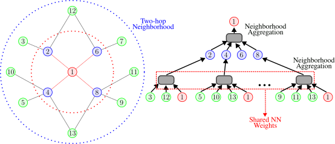{#fig-computational-graph fig-alt="A graph with one-hop and two-hop neighborhoods circled, beside the corresponding two-level aggregation tree"}
:::

::: {.definition}
**Definition 1 — Computational graph**

The computational graph of node $v$ for a $K$-layer message-passing model is the tree obtained by unrolling the recursion: the root is $v$, its children are $\mathcal{N}_v$, their children are their neighbors, and so on to depth $K$. The same trainable weights are shared at every node of every level.
:::

::: {.figure-panel}
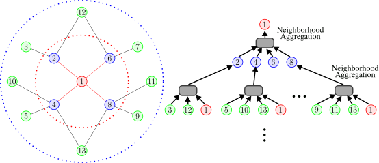{#fig-comp-graph-khop fig-alt="A graph with nested one-hop and two-hop neighborhoods and the matching aggregation tree"}
:::

This is a genuine escape route. A node's embedding needs its $K$-hop neighborhood, **not** the whole graph. So we can build one computational graph per node in the batch and evaluate them in parallel on a GPU.

::: {.figure-panel}
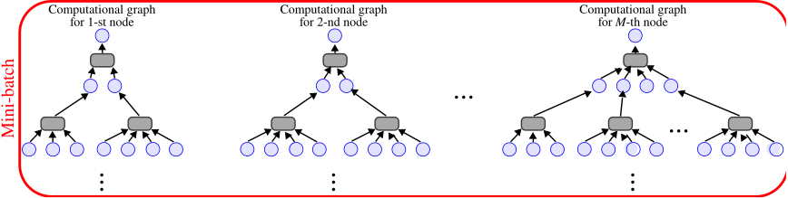{#fig-minibatch-comp fig-alt="Three separate aggregation trees, one per sampled node, drawn side by side"}
:::

The stochastic training loop becomes:

1. sample $M\ll N$ nodes;
2. for each sampled node, extract its $K$-hop neighborhood and build the computational graph;
3. run message passing on those graphs to obtain the $M$ embeddings;
4. average the loss over the $M$ nodes and take a gradient step.

### The catch

::: {.two-figures}
::: {.figure-panel}
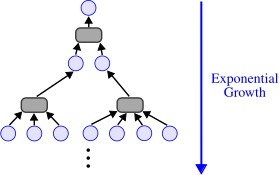{#fig-exponential fig-alt="An aggregation tree whose width doubles at each level, annotated exponential growth"}
:::
::: {.figure-panel}
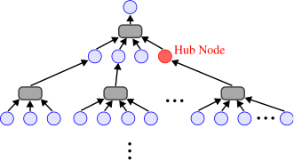{#fig-hub fig-alt="An aggregation tree with one very high-degree node marked in red"}
:::
:::

Aggregating a large fraction of the graph to produce a single node's embedding defeats the purpose. Both problems have the same cure: **do not use the whole neighborhood**.

## GraphSAGE neighbor sampling

::: {.definition}
**Definition 2 — Neighbor sampling**

Construct the computational graph by sampling **at most $H$ neighbors** at each hop, rather than all of them. $H$ is the *fan-out*.
:::

::: {.figure-panel}
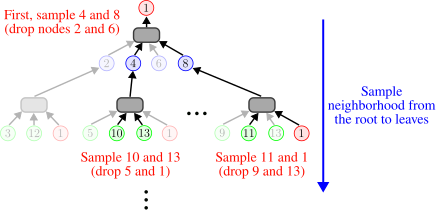{#fig-neighbor-sampling fig-alt="An aggregation tree in which two of the available neighbors are kept at each level and the rest are greyed out"}
:::

Four remarks matter in practice.

::: {.checkpoint}
**Check 2 — Reading the fan-out**

1. **Size bound.** A $K$-layer GNN touches at most $H^{K}$ leaves, and $\sum_{k=0}^{K}H^{k}$ nodes in total. The hub problem is gone: $H$ caps the fan-out no matter how large a degree the sampler encounters.
2. **Variance trade-off.** A small $H$ is cheap but makes the neighborhood aggregate noisy, which destabilizes training. A large $H$ is stable and expensive. $H$ is the knob.
3. **Still exponential.** $H^{K}$ is bounded but it is bounded by an exponential. Adding one layer multiplies the cost by $H$.
4. **Sampling uniformly is not optimal.** Uniform sampling is fast but often picks uninformative neighbors. Sampling proportionally to the random-walk matrix $\mathbf{D}^{-1}\mathbf{A}$ — the transition matrix from Lecture 1 — concentrates on structurally relevant neighbors and works better in practice.
:::

::: {.figure-panel}
{#fig-comp-growth fig-alt="Log-scale plot of computational graph size against number of layers, with the measured curve saturating at N and three straight sampling bounds"}
:::

::: {.checkpoint}
**Check 3 — Neighbor sampling in one paragraph**

Build one computational graph per node in the mini-batch; prune it by keeping at most $H$ neighbors per hop; run message passing on the pruned tree. The batch now contains structure, the hub problem is capped, and the cost per node is bounded by $\sum_k H^k$ — which is still exponential in the depth. Whether we need deep GNNs at all remains, as Lecture 2 noted, an open question.
:::

## Cluster-GCN

Neighbor sampling has a second weakness, and it is a subtle one: **it recomputes the same thing over and over**.

::: {.figure-panel}
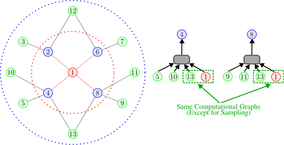{#fig-redundant fig-alt="A graph and two nearly identical aggregation trees, with the shared portion boxed in green"}
:::

Compare this with full-batch training, which has the opposite profile.

::: {.figure-panel}
{#fig-full-batch fig-alt="A small graph with red arrows along every edge in both directions, showing simultaneous layer-wise updates"}
:::

::: {.checkpoint}
**Check 4 — The tension**

**Neighbor sampling** fits in memory but recomputes shared neighborhoods once per target node. **Full-batch** has no redundancy but does not fit in memory.

Cluster-GCN takes the layer-wise update from full-batch training and applies it to a piece of the graph small enough to fit.
:::

### Which sub-graphs?

::: {.figure-panel}
{#fig-subgraph fig-alt="A large community-structured network with one community extracted as a sub-graph"}
:::

Not every sub-graph will do. A GNN passes messages along edges, so a sub-graph is useful to the extent that it **retains the edges of the original graph**. The closer the retained connectivity, the closer the embeddings computed on the sub-graph are to the embeddings computed on the whole graph.

::: {.figure-panel}
{#fig-good-subgraph fig-alt="A large network beside two four-node candidate sub-graphs, one sparse and disconnected, one densely connected"}
:::

The observation that makes this practical is that real graphs are not homogeneous: social networks, recommender systems, and citation graphs all have **community structure**.

::: {.figure-panel}
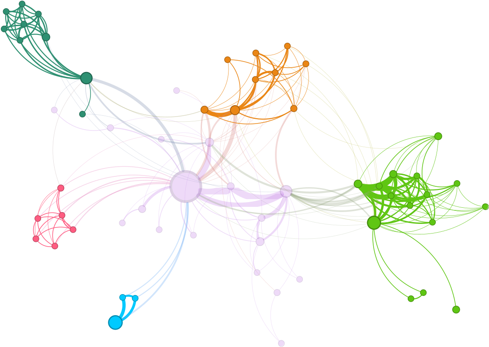{#fig-community fig-alt="A network drawn with five clearly separated colored communities"}
:::

::: {.definition}
**Definition 3 — Cluster-GCN**

**Pre-processing.** Partition $\mathcal{V}$ into $C$ groups $\mathcal{V}_1,\dots,\mathcal{V}_C$ with $\bigcup_{i}\mathcal{V}_i=\mathcal{V}$, chosen to respect community structure. Each $\mathcal{V}_i$ induces a sub-graph $\mathcal{G}_i=(\mathcal{V}_i,\mathcal{E}_i)$.

**Training.** Treat each $\mathcal{G}_i$ as a mini-batch: run the ordinary layer-wise update inside it, compute the loss on its nodes, and take a gradient step.

Note that in general $\bigcup_i\mathcal{E}_i\neq\mathcal{E}$, because **between-group edges belong to no sub-graph** [@chiang2019cluster].
:::

::: {.figure-panel}
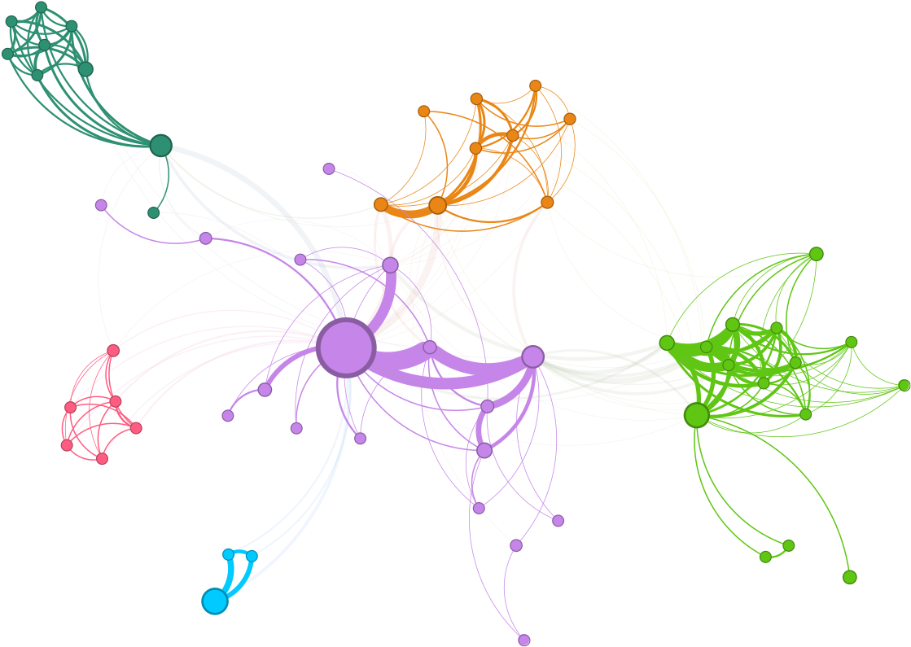{#fig-cluster-partition fig-alt="A community-structured network with its communities separated into distinct colored groups"}
:::

### What Cluster-GCN loses

::: {.figure-panel}
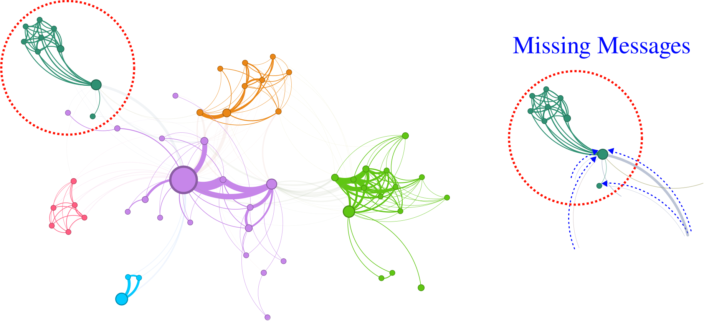{#fig-cluster-issues fig-alt="Two views of a partitioned network, the right one highlighting messages that fail to cross between communities"}
:::

::: {.figure-panel}
{#fig-cluster-loss fig-alt="Percentage of edges kept against number of partitions, with a community curve well above a random-partition curve"}
:::

There is a second, less visible cost. The nodes in one cluster are similar to each other by construction, so a cluster is **not a representative sample** of the graph. The gradient computed on it points in a systematically particular direction; from batch to batch the gradient fluctuates widely, and this high variance slows SGD's convergence.

::: {.checkpoint}
**Check 5 — Cluster-GCN in one paragraph**

Partition the nodes into community-aligned groups, treat each induced sub-graph as a mini-batch, and run ordinary layer-wise message passing inside it. This removes the redundancy of neighbor sampling and is markedly more efficient for deep models. The price is a **systematically biased gradient**: cross-community edges are never traversed, and each batch sees an unrepresentative slice of the graph.
:::

## Simplifying the architecture: SGC

The two methods above keep the model and change the training. The third approach does the opposite: **change the model so the expensive part can be done once, in advance**.

### Unrolling a GCN

Write the GCN propagation rule from Lecture 2 with $\hat{\mathbf{A}}$ standing for the normalized adjacency with self-loops:

$$
\mathbf{H}^{(\ell+1)}=\sigma\!\left(\hat{\mathbf{A}}\mathbf{H}^{(\ell)}\mathbf{W}^{(\ell)}\right).
$$

Unrolling $\ell$ layers gives a nest of alternating propagations and nonlinearities:

$$
\mathbf{H}^{(\ell+1)}
=\sigma\!\Big(\hat{\mathbf{A}}\,\sigma\big(\hat{\mathbf{A}}\,\sigma(\hat{\mathbf{A}}\cdots\mathbf{X}\mathbf{W}^{(0)}\cdots)\mathbf{W}^{(\ell-1)}\big)\mathbf{W}^{(\ell)}\Big).
$$

Now **delete every intermediate $\sigma$** [@wu2019simplifying]. The expression collapses:

$$
\mathbf{H}^{(\ell+1)}
=\hat{\mathbf{A}}\big(\hat{\mathbf{A}}(\hat{\mathbf{A}}\cdots\mathbf{X}\mathbf{W}^{(0)}\cdots)\mathbf{W}^{(\ell-1)}\big)\mathbf{W}^{(\ell)}
=\hat{\mathbf{A}}^{\ell}\,\mathbf{X}\,\underbrace{\mathbf{W}^{(0)}\cdots\mathbf{W}^{(\ell)}}_{\textstyle =\ \mathbf{W}}.
$$

A product of linear maps is a linear map, so the whole stack of weight matrices collapses into a single $\mathbf{W}$. Keeping only the final activation gives the **Simple Graph Convolution**:

::: {.definition}
**Definition 4 — SGC**

$$
\bar{\mathbf{Y}}=f(\mathbf{X};\mathbf{A},\boldsymbol{\Theta})
=\operatorname{softmax}\!\left(\hat{\mathbf{A}}^{\ell}\mathbf{X}\mathbf{W}\right),
\qquad
\hat{\mathbf{A}}=\tilde{\mathbf{D}}^{-1/2}\tilde{\mathbf{A}}\tilde{\mathbf{D}}^{-1/2},
\quad
\tilde{\mathbf{A}}=\mathbf{A}+\mathbf{I}.
$$ {#eq-sgc}
:::

### Why this is so cheap

The term $\hat{\mathbf{A}}^{\ell}\mathbf{X}$ is the **diffusion sequence** from Lecture 2, evaluated on the input features.

::: {.figure-panel}
{#fig-sgc-diffusion fig-alt="A sensor network with an impulse spreading over successive diffusion steps"}
:::

Compute it exactly as Lecture 2 insisted: recursively, never by forming a matrix power.

$$
\mathbf{X}\leftarrow\hat{\mathbf{A}}\mathbf{X},
\qquad
\text{repeated } \ell \text{ times.}
$$

Each step is one sparse matrix product costing $O(|\mathcal{E}|F)$. And here is the decisive point: **$\mathbf{X}$ is data, not a parameter.** Nothing in $\hat{\mathbf{A}}^{\ell}\mathbf{X}$ depends on $\mathbf{W}$, so it does not change during training. It is computed **once**, as pre-processing, and it can be computed on a CPU.

::: {.checkpoint}
**Check 6 — What is left after pre-processing**

Let $\tilde{\mathbf{X}}=\hat{\mathbf{A}}^{\ell}\mathbf{X}$, with row $i$ the pre-processed feature vector of node $i$. Then @eq-sgc reads

$$
\bar{\mathbf{Y}}=\operatorname{softmax}(\tilde{\mathbf{X}}\mathbf{W}),
$$

which is **ordinary multiclass classification on the rows of a feature matrix**. The graph has left the model entirely; it survives only inside $\tilde{\mathbf{X}}$.

Three things follow. Any scalable classifier can be used — linear model, MLP, gradient boosting. Ordinary mini-batch SGD applies, because the rows really are independent now. And retrieving a node's representation is a **row lookup in constant time**: no computational graph, no sampling.
:::

### The price, and why it is often small

SGC has no nonlinearity between propagations, so it is strictly less expressive than a GCN. Yet on standard node-classification benchmarks it performs comparably. Why?

The answer is **homophily**, from Lecture 2. The pre-processing $\mathbf{X}\leftarrow\hat{\mathbf{A}}\mathbf{X}$ repeatedly averages each node with its neighbors, so adjacent nodes end up with similar rows of $\tilde{\mathbf{X}}$, so a linear classifier on $\tilde{\mathbf{X}}$ tends to give adjacent nodes the same label. That is a strong prior — and on a homophilous graph it is the *correct* prior. Citation networks (a paper shares its citations' category) and social recommendation (friends like the same films) satisfy it well.

::: {.figure-panel}
![The mechanism, measured. Four graphs of identical size and density but different homophily; the vertical axis is how separable the two classes are in $\hat{\mathbf{A}}^{\ell}\mathbf{X}$ (between-class distance over within-class spread), which is essentially how easy a linear classifier's job is. At $H(\mathcal{G})\approx0.95$ diffusion improves separability by a factor of about 18 before over-smoothing sets in. Below $H(\mathcal{G})\approx0.5$ it never helps at all — diffusion mixes the classes together instead of separating them.](../../assets/figures/sgc-homophily.svg){#fig-sgc-homophily fig-alt="Four curves of class separability against diffusion steps; one rises steeply then falls, three stay flat near zero"}
:::

Note the two failure modes in that figure. Too many diffusion steps over-smooth even a homophilous graph — the same collapse Lecture 2 measured. And on a heterophilous graph the pre-processing is not merely unhelpful; it actively destroys the signal, which is why $\ell$ must be tuned and why $H(\mathcal{G})$ is worth measuring first.

::: {.checkpoint}
**Check 7 — SGC in one paragraph**

Remove the nonlinearities from a GCN and it collapses to a fixed feature transformation $\tilde{\mathbf{X}}=\hat{\mathbf{A}}^{\ell}\mathbf{X}$ followed by a linear classifier. The graph work becomes a one-off pre-processing step, and everything after it is standard machine learning. It works well when the graph is homophilous, and it is the natural first thing to try on a graph too large for anything else. The same idea, under the name LightGCN, is used at scale in industrial recommender systems [@he2020lightgcn].
:::

## Choosing among the three

::: {.checkpoint}
**Check 8 — A decision rule**

| | keeps structure | memory | redundancy | gradient | depth cost |
|---|---|---|---|---|---|
| **Neighbor sampling** | pruned neighborhood | $O(H^{K})$ per node | high | unbiased-ish, higher variance for small $H$ | $\times H$ per layer |
| **Cluster-GCN** | within-cluster only | one sub-graph | none | **biased** (missing cross edges) | linear |
| **SGC** | all of it, once | trivial after pre-processing | none | exact | one extra sparse product |

Start with **SGC**: it is a few lines, it runs on a CPU, and it tells you within minutes whether the graph carries usable signal. Reach for **neighbor sampling** when you need a genuinely nonlinear model and inductive behavior on unseen nodes. Reach for **Cluster-GCN** when the model is deep, the graph has strong community structure, and neighbor sampling's redundancy has become the bottleneck.
:::

## Exercises

### Exercise 1 — The $(M/N)^2$ law

Derive the probability that a given edge survives a uniform sample of $M$ nodes from $N$, without replacement, and show it is $\frac{M(M-1)}{N(N-1)}$. Compare with @fig-minibatch-loss and explain why the approximation $(M/N)^2$ is adequate.

### Exercise 2 — Computational graph size

A graph has average degree $\bar{d}=25$. Estimate the number of nodes in a 3-layer computational graph without sampling, and with $H=5$. What fan-out would you need for a 4-layer model to stay under 2000 nodes?

### Exercise 3 — The variance trade-off

Let a node have $d$ neighbors with feature values $x_1,\dots,x_d$. The exact mean aggregate is $\bar{x}$. Compute the variance of the aggregate estimated from $H$ uniformly sampled neighbors, and use it to justify Remark 2 in Check 2.

### Exercise 4 — Cluster-GCN's bias

Take a graph with two communities joined by a single edge, and a node incident to that edge. Write the embedding this node receives under full-batch message passing and under Cluster-GCN with the two communities as clusters. Explain in one sentence why the difference is a *bias* and not merely *noise*.

### Exercise 5 — Unrolling

Verify the SGC collapse explicitly for $\ell=2$: expand $\mathbf{H}^{(2)}$ with and without the intermediate $\sigma$, and identify precisely which step fails when $\sigma$ is present.

### Exercise 6 — SGC parameter count

For a graph with $N=10^{6}$, $F=500$ features, $C=10$ classes and $\ell=2$, count the parameters of SGC and of a two-layer GCN with hidden width $64$. Then count the *floating-point operations per training epoch* for each, and explain where SGC's advantage actually comes from — it is not the parameter count.

### Exercise 7 — When SGC fails

Reproduce @fig-sgc-homophily with `scripts/figures/lecture_03_figures.py`. Add a curve at $H(\mathcal{G})=0.05$ (strong heterophily) and explain, using Lecture 2's spectral argument, why the separability does not recover for any $\ell$.

## Main takeaways

1. The graphs that motivate graph ML are large enough that **training**, not the architecture, is the binding constraint.
2. Uniform mini-batching fails on graphs: retained edges scale as $(M/N)^2$, so an ordinary batch is a set of isolated nodes.
3. A $K$-layer GNN needs only a node's **$K$-hop neighborhood**. Unrolling that into a per-node computational graph makes stochastic training possible.
4. Computational graphs grow exponentially in $K$ and explode at hub nodes. **Neighbor sampling** caps the fan-out at $H$, trading variance for cost.
5. Neighbor sampling recomputes shared neighborhoods. **Cluster-GCN** recovers full-batch efficiency inside community-aligned sub-graphs, at the cost of discarding cross-community edges and biasing the gradient.
6. **SGC** removes the nonlinearities, collapsing the GCN into a one-off diffusion of the features followed by a linear classifier. It is extremely cheap and surprisingly strong.
7. SGC's accuracy rests on the **homophily assumption**. Measure $H(\mathcal{G})$ before relying on it.

## References and provenance {.unnumbered}

This web note is adapted from the Lecture 3 slides by Jhony H. Giraldo. The SGC collapse is derived step by step, the memory and complexity arguments are made explicit, and the qualitative claims about mini-batching, computational-graph growth, clustering, and homophily are replaced by measurements.

The diagrams reproduce the original course vectors. @fig-minibatch-loss, @fig-comp-growth, @fig-cluster-loss, and @fig-sgc-homophily are new and were computed with `numpy` and `networkx`; the script that produces them is `scripts/figures/lecture_03_figures.py` in this repository.

::: {#refs .references-small}
:::
