```{=html}
<header class="lecture-header">
  <div class="eyebrow">APM 5DS30 TP · Machine Learning with Graphs</div>
  <h1>Spatiotemporal analysis with graphs</h1>
  <p>Lecture 4 · Jhony H. Giraldo · Télécom Paris, Institut Polytechnique de Paris</p>
  <div class="lecture-meta"><span>Original lecture: 18 February 2025</span><span>Web note revised: 6 September 2026</span><span>Mathematics rendered with MathJax</span></div>
  <div class="button-row">
    <a class="button-link primary" href="/assets/pdf/Lecture-04-Spatiotemporal-Analysis-with-Graphs.pdf">Download the original slides</a>
    <a class="button-link secondary" href="/teaching/machine-learning-with-graphs/index.qmd">Back to the course</a>
  </div>
</header>
```

So far the data has been static: one signal on one graph. This note adds **time**. A sensor network reports a temperature every ten minutes, a road network reports a speed every five, a global monitoring system reports a case count every day. The graph describes *where*; the time series describes *when*; and the two are not independent.

Two problems organize the note. **Reconstruction**: values are missing, and we want them back. **Forecasting**: we have the past, and we want the future. Both are solved twice — once by writing an optimization problem, once by training a network — and comparing the two is the point of the lecture. Along the way we need one tool we have so far avoided: the **spectral** view of a graph.

## Learning objectives

After studying this note, you should be able to:

```{=html}
<ol class="learning-objectives">
  <li>define a time-varying graph signal and the temporal difference operator;</li>
  <li>define the graph Fourier transform and interpret its coefficients as graph frequencies;</li>
  <li>express a graph filter in the spectral domain and state the cost of doing so;</li>
  <li>write the ChebConv recursion and explain why it avoids the eigendecomposition;</li>
  <li>formulate reconstruction as a smoothness-regularized optimization problem and solve it by gradient descent;</li>
  <li>formulate forecasting as auto-regressive modeling on a graph, and extend it to multiple horizons.</li>
</ol>
```

## Time-varying graph signals

::: {.checkpoint}
**Notation in this lecture**

$M$ here is the **number of time samples**, not the edge count as in Lecture 1 or the mini-batch size as in Lecture 3; edge count is written $|\mathcal{E}|$. $N$ is the number of nodes, so $\mathbf{X}\in\mathbb{R}^{N\times M}$ is nodes-by-time. Graphs are undirected with nonnegative weights, and $\mathbf{L}$ is the symmetric Laplacian unless stated otherwise. $k$ counts polynomial *terms*, whose degree is $k-1$.
:::

::: {.definition}
**Definition 1 — Time-varying graph signal**

Let $\mathcal{G}$ have $N$ nodes. A **time-varying graph signal** is

$$
\mathbf{X}=[\mathbf{x}_1,\mathbf{x}_2,\ldots,\mathbf{x}_M]\in\mathbb{R}^{N\times M},
$$

where $\mathbf{x}_s\in\mathbb{R}^{N}$ is a graph signal on $\mathcal{G}$ at time $s$. Row $i$ is the time series observed at node $i$; column $s$ is a snapshot of the whole network.
:::

::: {.definition}
**Definition 2 — Temporal difference operator**

$\mathbf{D}_{h}\in\mathbb{R}^{M\times(M-1)}$ is the first-difference operator,

$$
\mathbf{D}_h=
\begin{bmatrix}
-1 & & &\\
1 & -1 & &\\
 & 1 & \ddots &\\
 & & \ddots & -1\\
 & & & 1
\end{bmatrix},
\qquad
\mathbf{X}\mathbf{D}_h=[\mathbf{x}_2-\mathbf{x}_1,\ \mathbf{x}_3-\mathbf{x}_2,\ \ldots,\ \mathbf{x}_M-\mathbf{x}_{M-1}].
$$
:::

::: {.figure-panel}
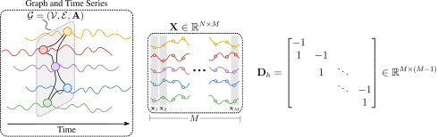{#fig-time-varying fig-alt="A graph with a time series attached to each node, the matrix X, and the difference operator matrix"}
:::

$\mathbf{X}\mathbf{D}_h$ looks like a technicality. It is not: it is the single modeling assumption that makes reconstruction work, and @sec-reconstruction measures why.

### The two problems

::: {.figure-panel}
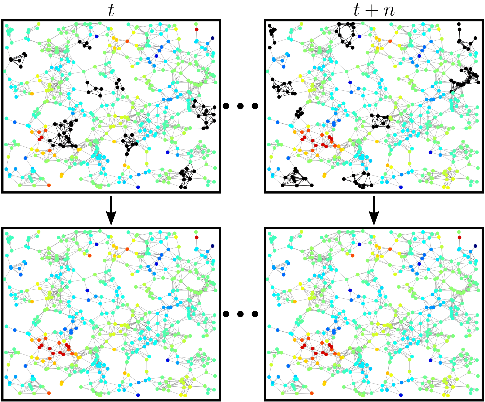{#fig-problem-reconstruction fig-alt="Two rows of network snapshots; the top row has black patches of missing sensors, the bottom row is fully colored"}
:::

::: {.figure-panel}
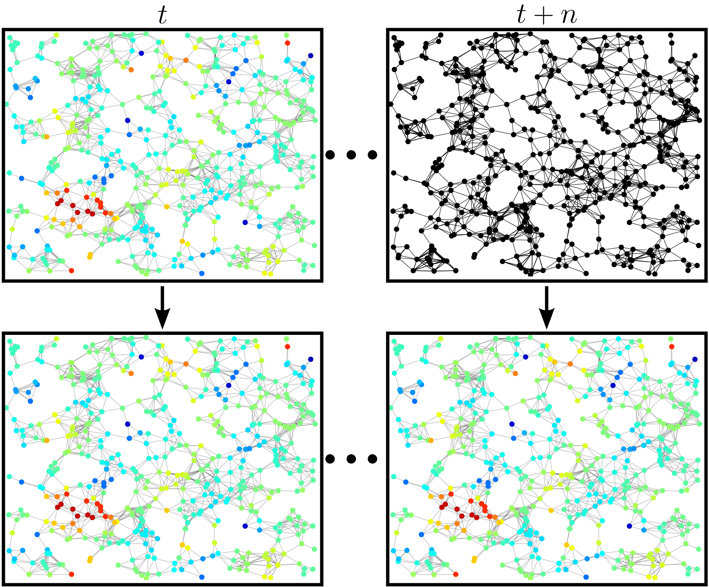{#fig-problem-forecasting fig-alt="Two rows of network snapshots; the top-right snapshot is entirely black, the bottom row is fully colored"}
:::

::: {.checkpoint}
**Check 1 — Which is which?**

Both problems produce missing values, and it is worth being precise about the difference. In **reconstruction** the missing entries are *interior*: we know values before and after them, at the same node and at neighboring nodes, and we interpolate. In **forecasting** the missing entries are at the *boundary*: everything we know lies in the past, and we extrapolate.

Interpolation can lean on smoothness in both directions. Extrapolation cannot, which is why the two get different machinery.
:::

## Spectral GNNs {#sec-spectral}

Lecture 2 defined a graph filter as a polynomial in the shift operator, $\mathbf{z}=\sum_{k}h_k\mathbf{S}^{k}\mathbf{x}$, and worked entirely in the *vertex* domain. There is a second description, and for spatiotemporal problems it earns its keep: in practice spectral GNNs often outperform plain message passing on these tasks.

### From Fourier to graph Fourier

The classical Fourier transform decomposes a signal into sinusoids of increasing frequency, and the inverse transform reassembles it.

::: {.figure-panel}
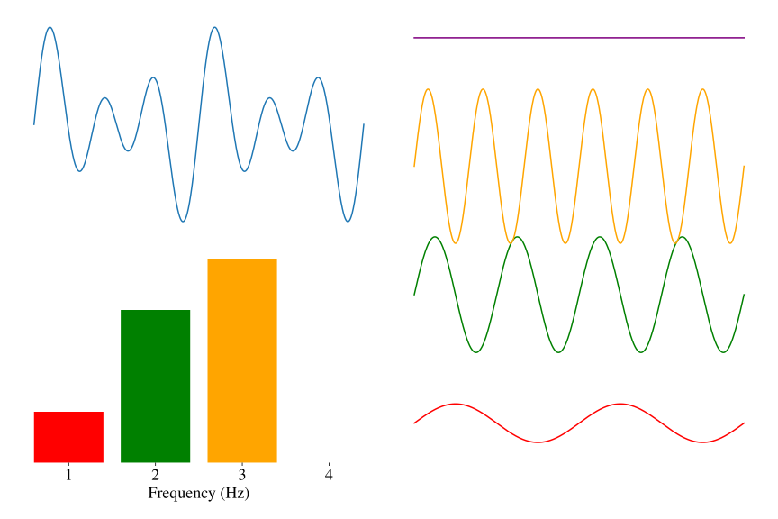{#fig-fourier fig-alt="A waveform, a bar chart of three frequency components, and the three sinusoids that sum to it"}
:::

The graph Fourier transform is the same idea with the sinusoids replaced by the eigenvectors of the shift operator.

::: {.definition}
**Definition 3 — Graph Fourier transform**

Throughout this section, take $\mathcal{G}$ **undirected with nonnegative weights** and $\mathbf{S}$ its symmetric Laplacian $\mathbf{L}$ (or $\hat{\mathbf{L}}$). Symmetry is what guarantees a real spectrum and a real orthonormal eigenbasis; a general diagonalizable shift operator can have complex eigenvalues and eigenvectors, and choosing an undirected graph does not by itself force every shift operator on it to be symmetric.

With that fixed, write $\mathbf{S}=\mathbf{U}\boldsymbol{\Lambda}\mathbf{U}^{-1}$. The eigenvectors $\mathbf{u}_i$ form a basis of $\mathbb{R}^{N}$, so any graph signal can be written as

$$
\mathbf{x}=\mathbf{U}\hat{\mathbf{x}},
\qquad
\hat{\mathbf{x}}=\mathbf{U}^{-1}\mathbf{x},
$$

where $\hat{\mathbf{x}}$ is the **graph Fourier transform (GFT)** of $\mathbf{x}$.

For an undirected graph $\mathbf{S}$ is symmetric, so $\mathbf{U}$ is orthogonal, $\mathbf{U}^{\top}\mathbf{U}=\mathbf{U}\mathbf{U}^{\top}=\mathbf{I}$, and the pair simplifies to $\mathbf{x}=\mathbf{U}\hat{\mathbf{x}}$, $\hat{\mathbf{x}}=\mathbf{U}^{\top}\mathbf{x}$.
:::

::: {.figure-panel}
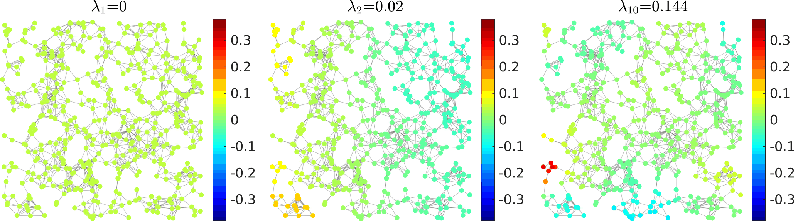{#fig-eigenvectors fig-alt="Three copies of a sensor network colored by the first, second, and tenth Laplacian eigenvector, with increasing spatial oscillation"}
:::

Because $\mathbf{U}$ is orthogonal, $\hat{x}(i)=\langle\mathbf{u}_i,\mathbf{x}\rangle$: **the $i$-th GFT coefficient measures how similar $\mathbf{x}$ is to the $i$-th eigenvector.** A signal whose energy sits in the first few coefficients is *smooth* — it barely changes across edges. A signal spread across the spectrum is rough.

::: {.figure-panel}
{#fig-gft fig-alt="Left, spiky noise coefficients against a smooth signal concentrated at low frequency; right, a cumulative energy curve rising almost immediately to 100% versus a diagonal line"}
:::

### Filters in the frequency domain

::: {.definition}
**Definition 4 — Graph filters in the spectral domain**

Any graph filter defined as a polynomial in $\mathbf{S}$ can be written

$$
\mathbf{H}=h(\mathbf{S})=\sum_{i=0}^{k}h_i\mathbf{S}^{i}=\mathbf{U}\,h(\boldsymbol{\Lambda})\,\mathbf{U}^{-1},
$$

where $h(\boldsymbol{\Lambda})$ is diagonal with entries $h(\lambda_j)=\sum_{i=0}^{k}h_i\lambda_j^{i}$ [@ortega2022introduction].
:::

The proof is one line: $\mathbf{S}^{i}=\mathbf{U}\boldsymbol{\Lambda}^{i}\mathbf{U}^{-1}$ because the inner $\mathbf{U}^{-1}\mathbf{U}$ factors cancel; summing over $i$ gives the result.

So filtering can be done in three steps: transform, multiply, transform back.

$$
\hat{\mathbf{x}}=\mathbf{U}^{-1}\mathbf{x},
\qquad
\hat{\mathbf{y}}=h(\boldsymbol{\Lambda})\hat{\mathbf{x}},
\qquad
\mathbf{y}=\mathbf{U}\hat{\mathbf{y}}.
$$

This is appealing: no matrix powers, no sequential recursion, and complete freedom over the response $h(\lambda)$ — it need not be a low-pass filter, which is exactly the limitation Lecture 2 identified in GCN.

::: {.checkpoint}
**Check 2 — The trade-off between spectral and spatial**

The catch is $\mathbf{U}$. Obtaining it requires an **eigendecomposition, costing $O(N^{3})$**, and $\mathbf{U}$ is dense even when $\mathbf{S}$ is sparse. Compare with the vertex domain, where a $K$-tap filter costs $O(K|\mathcal{E}|)$ and touches only $K$-hop neighborhoods.

So the spectral view is a modeling tool for small and medium graphs, and an analysis tool for large ones. Transfer is also limited, though the reason is specific: $\mathbf{U}$ and the eigenvalue *indices* belong to one graph, so a model whose parameters are attached to them — one free coefficient per index, as in the earliest spectral GNNs — cannot move to another graph. A model that learns a **function of $\lambda$**, such as a polynomial, has no such problem: ChebConv's coefficients transfer perfectly well. Non-inductivity is a property of the parameterization, not of the spectral viewpoint.
:::

### Chebyshev graph convolutions

The way to keep the spectral expressiveness without paying $O(N^{3})$ is to approximate the response $h(\lambda)$ by a polynomial — which returns us to the vertex domain, where polynomials in $\mathbf{S}$ are sparse products. ChebConv [@defferrard2016convolutional] does this with the Chebyshev basis, and it is the direct predecessor of GCN.

::: {.definition}
**Definition 5 — ChebConv layer**

$$
\mathbf{H}^{(\ell+1)}=\sum_{i=1}^{k}\mathbf{Z}_i\mathbf{W}_i,
$$

with

$$
\mathbf{Z}_1=\mathbf{H}^{(\ell)},
\qquad
\mathbf{Z}_2=\tilde{\mathbf{L}}\mathbf{H}^{(\ell)},
\qquad
\mathbf{Z}_i=2\tilde{\mathbf{L}}\mathbf{Z}_{i-1}-\mathbf{Z}_{i-2},
$$

and the rescaled Laplacian $\tilde{\mathbf{L}}=\dfrac{2\mathbf{L}}{\lambda_N}-\mathbf{I}$.
:::

Two details explain the design. The rescaling maps the spectrum of $\mathbf{L}$ from $[0,\lambda_N]$ onto $[-1,1]$, which is where the Chebyshev polynomials are defined and where they are numerically well behaved. And the three-term recursion $T_m(x)=2xT_{m-1}(x)-T_{m-2}(x)$ is exactly the recursion satisfied by the $\mathbf{Z}_i$.

Mind the offset, because it is easy to be one out. With $\mathbf{Z}_1=\mathbf{H}^{(\ell)}$ the indexing is

$$
\mathbf{Z}_i=T_{i-1}(\tilde{\mathbf{L}})\,\mathbf{H}^{(\ell)},
$$

so a sum over $i=1,\dots,k$ has $k$ **terms** but degree $k-1$, and costs $k-1$ sparse products. Throughout this note $k$ counts terms; when a paper says "order $K$" it usually means the degree, one less.

::: {.figure-panel}
![Left: the Chebyshev polynomials $T_0,\ldots,T_5$ on $[-1,1]$. Right: two responses built as learned combinations of them. Unlike a stack of GCN layers, which can only realize $\mu^{L}$, a ChebConv layer can place its pass-band anywhere — including away from $\lambda=0$.](../../assets/figures/chebyshev-polynomials.svg){#fig-chebyshev fig-alt="Left, six oscillating polynomial curves on the interval minus one to one; right, a decreasing low-pass curve and a peaked band-pass curve"}
:::

Swapping the polynomial family gives other models: Gegenbauer polynomials yield GegenConv [@castro2024gegenbauer], Jacobi polynomials yield JacobiConv [@wang2022powerful].

::: {.checkpoint}
**Check 3 — Spectral GNNs in one paragraph**

The GFT diagonalizes graph filters, turning convolution into pointwise multiplication by $h(\lambda)$ and making "graph frequency" precise. Working on the spectrum directly costs an $O(N^{3})$ eigendecomposition. ChebConv recovers an arbitrary polynomial response using only sparse products, through the Chebyshev recursion — and GCN is the two-term case with tied coefficients, i.e. degree one.
:::

## Reconstruction of time-varying graph signals {#sec-reconstruction}

::: {.definition}
**Definition 6 — Reconstruction problem**

Given $\mathcal{G}$ and a time-varying signal $\mathbf{X}\in\mathbb{R}^{N\times M}$ in which the entries indexed by a **known** set $\mathcal{S}=\{(i,j)\}$ are missing, and writing $\mathcal{T}=(\mathcal{V}\times\mathcal{M})\setminus\mathcal{S}$ for the observed entries, recover the values on $\mathcal{S}$.
:::

That $\mathcal{S}$ is known matters. We are not detecting outliers; we know exactly which sensors failed and when.

### Measuring smoothness on a graph

::: {.definition}
**Definition 7 — Laplacian quadratic form**

$$
\Delta_{\mathbf{L}}(\mathbf{x})=\mathbf{x}^{\top}\mathbf{L}\mathbf{x}=\sum_{i\sim j}a_{ij}(x_i-x_j)^{2},
$$

summing over edges. Each edge contributes in proportion to its weight $a_{ij}$ and to the squared difference of the signal at its endpoints.
:::

::: {.figure-panel}
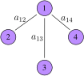{#fig-quadratic-form fig-alt="Node 1 at the centre connected to nodes 2, 3, and 4 with labelled edge weights"}
:::

::: {.worked-example}
**Worked example — Computing $\mathbf{x}^{\top}\mathbf{L}\mathbf{x}$**

For @fig-quadratic-form the only edges are $(1,2)$, $(1,3)$ and $(1,4)$, so

$$
\mathbf{x}^{\top}\mathbf{L}\mathbf{x}
=a_{12}(x_1-x_2)^{2}+a_{13}(x_1-x_3)^{2}+a_{14}(x_1-x_4)^{2}.
$$

Note what is **absent**: no *direct* term in $(x_3-x_4)$. Variation is measured along edges, not between arbitrary pairs. That does not make nodes 3 and 4 free of one another — both are tied to the centre, so pushing them apart still costs through $x_1$. What it means is that the penalty is a sum over edges, so a difference between two non-adjacent nodes is only ever penalized indirectly, through the paths joining them.

**Minimum.** Take $x_1=x_2=x_3=x_4=1$. Every difference vanishes, so $\mathbf{x}^{\top}\mathbf{L}\mathbf{x}=0$. Since $a_{ij}\geq0$ makes every term nonnegative, this is the global minimum — and it is the constant eigenvector $\mathbf{u}_1$ with $\lambda_1=0$ from @fig-eigenvectors.

**Maximum — but only under a constraint.** There is no unconstrained maximum: replacing $\mathbf{x}$ by $c\mathbf{x}$ multiplies the form by $c^{2}$, so it grows without bound. The question has to be posed on a bounded set, and the answer depends which one:

- Under $\Vert\mathbf{x}\Vert_2=1$, the maximum is $\lambda_{\max}(\mathbf{L})$, attained at the top eigenvector. This is the Rayleigh-quotient statement and the one to remember.
- Under $x_i\in[-1,1]$, maximizing the sign changes across edges works: $x_1=1$, $x_2=x_3=x_4=-1$ makes every difference $2$, giving

$$
\mathbf{x}^{\top}\mathbf{L}\mathbf{x}=4(a_{12}+a_{13}+a_{14}).
$$
:::

### From static to time-varying smoothness

The obvious extension sums the quadratic form over time:

$$
E(\mathbf{X})=\sum_{s=1}^{M}\mathbf{x}_s^{\top}\mathbf{L}\mathbf{x}_s=\operatorname{tr}(\mathbf{X}^{\top}\mathbf{L}\mathbf{X}).
$$

Qiu et al. [@qiu2017time] observed that on real data this is the *wrong quantity*. What is smooth on the graph is not the signal but its **temporal difference**:

$$
E(\mathbf{X}\mathbf{D}_h)=\sum_{s=2}^{M}(\mathbf{x}_s-\mathbf{x}_{s-1})^{\top}\mathbf{L}(\mathbf{x}_s-\mathbf{x}_{s-1}).
$$

The intuition is physical. A temperature field can have large spatial gradients — a valley is genuinely colder than a ridge — so $\mathbf{x}_s$ need not be smooth. But when the sampling rate is high, *how much things changed since the last reading* is small and varies gently across the network, because neighboring sensors experience the same weather.

::: {.figure-panel}
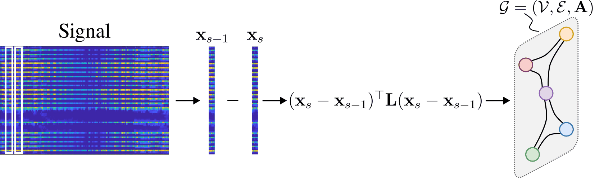{#fig-sobolev-intuition fig-alt="A signal matrix, two consecutive columns being subtracted, and the difference evaluated on a small graph"}
:::

::: {.figure-panel}
![The assumption, checked — and only half confirmed. On a 220-node sensor graph with a slowly evolving synthetic field: **left**, the per-step quadratic form of the temporal difference sits well below that of the signal; **middle**, its total is $3.8\times$ smaller, which is what the regularizer of @eq-tgsr actually penalizes; **right**, the same comparison after dividing out the energy, where the difference is $21\times$ **rougher**. Both numbers are correct and they measure different things — see Check 4.](../../assets/figures/temporal-difference-smoothness.svg){#fig-temporal-difference fig-alt="A per-step variation curve, a bar chart of unnormalized totals, and a bar chart of energy-normalized quotients pointing the opposite way"}
:::

::: {.checkpoint}
**Check 4 — "Smoother" has two meanings, and only one of them holds here**

This is worth slowing down for, because it is the kind of claim that is easy to assert and easy to get wrong.

The temporal difference has $3.8\times$ less total variation than the signal. But it also has $78\times$ less **energy**: differencing consecutive snapshots of a slowly evolving field produces something small. Divide the variation by the energy and the difference comes out $21\times$ rougher, not smoother. So the gap in the middle panel is overwhelmingly a statement about **amplitude**, not about relative frequency content.

Does that break the method? No — because the regularizer penalizes the *unnormalized* quantity. A prior works by placing the true signal near the minimizer of the penalty, and $\mathbf{X}\mathbf{D}_h$ genuinely lands closer than $\mathbf{X}$ does. The reconstruction experiment below confirms this directly, and that is the evidence that counts.

But state the claim carefully. "The temporal difference is smoother on the graph" is **not** what this experiment shows, and on this synthetic field it is false in the normalized sense — differencing is a high-pass operation in time, and here it amplifies the faster-varying modes regardless of how smooth they are in space. For the normalized claim to hold you would need the fast-changing components to also be the spatially smooth ones, which is a real physical assumption about the data, not a property of the operator $\mathbf{D}_h$.
:::

### The optimization problem

We need an error term as well. Let $\mathbf{J}\in\{0,1\}^{N\times M}$ be the **sampling matrix**, with $J_{ij}=1$ when the value at node $i$ and time $j$ is observed, let $\tilde{\mathbf{X}}$ be the matrix to recover, and $\mathbf{Y}$ the observations. Then $\|\mathbf{J}\circ\tilde{\mathbf{X}}-\mathbf{Y}\|_F^2$ penalizes disagreement **on the observed entries only** — the Hadamard product simply ignores everything else.

::: {.definition}
**Definition 8 — Time-varying graph signal reconstruction (TGSR)**

$$
\min_{\tilde{\mathbf{X}}}\ \frac{1}{2}\left\|\mathbf{J}\circ\tilde{\mathbf{X}}-\mathbf{Y}\right\|_F^{2}
+\frac{\upsilon}{2}\operatorname{tr}\!\left((\tilde{\mathbf{X}}\mathbf{D}_h)^{\top}\mathbf{L}\,\tilde{\mathbf{X}}\mathbf{D}_h\right).
$$ {#eq-tgsr}
:::

::: {.figure-panel}
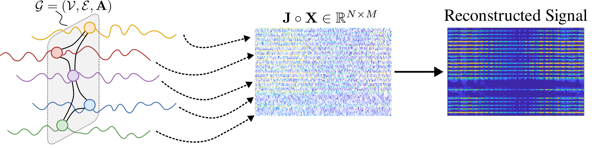{#fig-error-intuition fig-alt="A graph with time series, a heavily subsampled signal matrix, and the reconstructed matrix"}
:::

::: {.figure-panel}
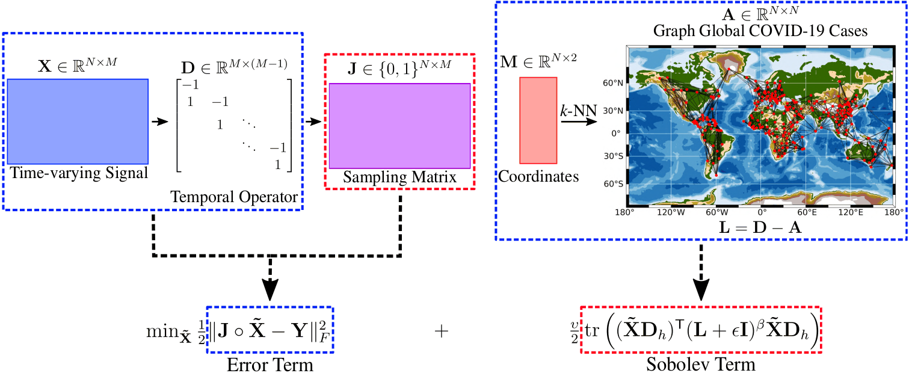{#fig-graphtrss fig-alt="A block diagram from time-varying signal and coordinates through the temporal operator and Laplacian to the two-term objective"}
:::

### Solving it

@eq-tgsr is a convex quadratic, so its stationary condition is a linear system. Solving it directly would mean handling an $MN\times MN$ operator: for $N=1000$ sensors over $M=500$ time steps, $500\,000\times500\,000$. Not a good idea.

::: {.checkpoint}
**Check 5 — Convex does not mean uniquely solvable**

Being convex gives a global minimum; it does not give a *unique* one. Vectorizing, the Hessian is

$$
\mathbf{H}=\operatorname{diag}(\operatorname{vec}\mathbf{J})+\upsilon\,(\mathbf{D}_h\mathbf{D}_h^{\top}\otimes\mathbf{L}),
$$

and the solution is unique exactly when $\mathbf{H}$ is positive definite. Both terms are only positive **semi**-definite, so uniqueness depends on their null spaces intersecting trivially.

Here is the failure case to keep in mind. $\mathbf{D}_h\mathbf{D}_h^{\top}$ annihilates signals constant in time, and $\mathbf{L}$ annihilates signals constant over nodes. So if some sensor $i$ is **unobserved at every time step**, adding any constant offset to that sensor's whole series changes neither the data term (it observes nothing there) nor the temporal-difference penalty (a constant offset has zero difference). That sensor's level is unidentifiable, and no amount of convexity recovers it.

Replacing $\mathbf{L}$ by a positive definite $(\mathbf{L}+\epsilon\mathbf{I})^{\beta}$ fixes the *node* direction but not this one — the null space of $\mathbf{D}_h\mathbf{D}_h^{\top}$ survives. Reconstruction needs a sampling condition: every sensor observed at least once, and enough coverage for the smoothness prior to bridge the gaps.
:::

Use gradient descent instead. Writing $f_u(\tilde{\mathbf{X}})$ for the objective,

$$
\nabla_{\tilde{\mathbf{X}}}f_u(\tilde{\mathbf{X}})
=\mathbf{J}\circ\tilde{\mathbf{X}}-\mathbf{Y}
+\upsilon\,\mathbf{L}\tilde{\mathbf{X}}\mathbf{D}_h\mathbf{D}_h^{\top},
$$

a formula built entirely from sparse products. The original paper uses conjugate gradient.

::: {.figure-panel}
![**An oracle-tuned synthetic illustration**, not a validation protocol. A 220-node random geometric graph, 60 time steps, a synthetic field built from slowly evolving low-frequency modes, entries deleted at random. Doing nothing leaves the error near 1; regularizing $\mathbf{X}$ itself helps; regularizing $\mathbf{X}\mathbf{D}_h$ reaches 20% error at 10% observed where smoothing the signal directly reaches 67%. Read two caveats with it. The weight $\upsilon$ was chosen for each method by minimizing error against the **complete ground truth, including the hidden entries** — an oracle choice no real deployment can make; a validation-mask protocol would give worse absolute numbers for every method. And the field was *constructed* to have slowly evolving low-frequency modes, which is exactly the assumption the temporal-difference prior encodes.](../../assets/figures/reconstruction-smoothness.svg){#fig-reconstruction-smoothness fig-alt="Left, three error curves against observed fraction with the temporal-difference curve far below the others; right, condition number against epsilon on log axes"}
:::

### Sobolev smoothness

Giraldo et al. [@giraldo2022reconstruction] observed that @eq-tgsr is ill-posed in a specific sense, and that this slows convergence.

::: {.checkpoint}
**Check 6 — Why $\mathbf{L}$ conditions the problem badly**

The condition number of a square matrix,

$$
\kappa(\mathbf{L})=\frac{|\lambda_{\max}(\mathbf{L})|}{|\lambda_{\min}(\mathbf{L})|},
$$

measures how well-behaved its inversion is, and small condition numbers are associated with fast convergence of gradient methods. For a graph Laplacian $\lambda_{\min}(\mathbf{L})=0$ always — the constant eigenvector — so

$$
\kappa(\mathbf{L})=\infty .
$$

The regularizer supplies no curvature at all along the constant direction.
:::

The fix is to regularize the regularizer:

$$
\min_{\tilde{\mathbf{X}}}\ \frac{1}{2}\left\|\mathbf{J}\circ\tilde{\mathbf{X}}-\mathbf{Y}\right\|_F^{2}
+\frac{\upsilon}{2}\operatorname{tr}\!\left((\tilde{\mathbf{X}}\mathbf{D}_h)^{\top}(\mathbf{L}+\epsilon\mathbf{I})^{\beta}\,\tilde{\mathbf{X}}\mathbf{D}_h\right),
$$ {#eq-sobolev}

adding a positive definite $\epsilon\mathbf{I}$ so that every eigenvalue is bounded away from zero. This is called **Sobolev smoothness**, after its relationship to the Sobolev norm for static graph signals. The right panel of @fig-reconstruction-smoothness plots $\kappa\big((\mathbf{L}+\epsilon\mathbf{I})^{\beta}\big)$ against $\epsilon$: finite everywhere, and tunable through $\epsilon$ and $\beta$.

The algorithm changes in exactly one place, the gradient:

$$
\nabla_{\tilde{\mathbf{X}}}f_u(\tilde{\mathbf{X}})
=\mathbf{J}\circ\tilde{\mathbf{X}}-\mathbf{Y}
+\upsilon\,(\mathbf{L}+\epsilon\mathbf{I})^{\beta}\tilde{\mathbf{X}}\mathbf{D}_h\mathbf{D}_h^{\top}.
$$

::: {.figure-panel}
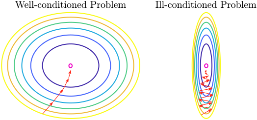{#fig-conditioning fig-alt="Two contour plots, one with circular level sets and a direct path, one with elongated level sets and an oscillating path"}
:::

::: {.checkpoint}
**Check 7 — What is and is not shown here**

@fig-reconstruction-smoothness establishes two things directly: the temporal-difference prior is dramatically better than the static one, and $\kappa(\mathbf{L}+\epsilon\mathbf{I})^{\beta}$ is finite while $\kappa(\mathbf{L})$ is not.

It does **not** show a convergence speed-up from the Sobolev term. On this small synthetic problem the data term already supplies curvature in the directions that matter, so the two objectives descend at nearly the same rate. The empirical advantage reported in [@giraldo2022reconstruction] is measured on real datasets, and you should read the paper rather than take it from a 220-node simulation. Reproducing it — or failing to — is Exercise 6.
:::

::: {.figure-panel}
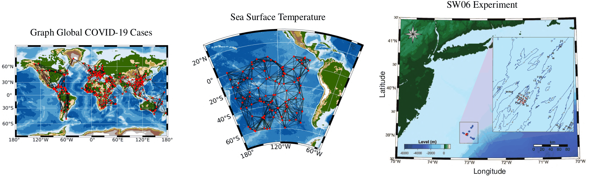{#fig-reconstruction-datasets fig-alt="Three panels: a world map with case data, a sea surface temperature map with a sensor graph, and a coastal experiment map"}
:::

### Reconstruction with a neural network

The same problem can be solved by learning. Feed the Laplacian and the incomplete signal to a GNN with an **autoencoder** shape, and train it with a loss that is the previous objective in disguise.

::: {.figure-panel}
![The learned pipeline, **reproduced from GegenGNN** [@castro2024gegenbauer]: build the $k$-NN graph from sensor coordinates, sample the signal, pass it through an encoder–decoder, and recover the full time-varying signal. Note two differences from the simplified model described below: the published architecture uses **Gegenbauer** polynomials $C_k^{(\alpha)}$ rather than Chebyshev, and it feeds the temporal difference into the loss as shown. We keep the pipeline shape and substitute Chebyshev branches, which are the family introduced in @sec-spectral.](../../assets/figures/gegenbauer-reconstruction-pipeline.png){#fig-gegenbauer fig-alt="A pipeline from an underwater experiment through a k-NN graph and encoder-decoder architecture to a reconstructed signal matrix"}
:::

Each layer is a **cascade of Chebyshev convolutions** of increasing order $\rho=0,\dots,\zeta-1$, combined linearly.

::: {.figure-panel}
![One layer: the signal enters $\zeta$ branches, branch $\rho$ applying a polynomial convolution of order $\rho$, and the outputs are merged by a learned linear combination $\sum_\rho\mu_\rho^{(\ell)}\mathbf{Z}_\rho^{(\ell)}$. This panel is **taken from the GegenGNN paper**, so the symbols inside it are Gegenbauer: $C_k^{(\alpha)}$ and $2\alpha\tilde{\mathbf{L}}$ where the simplified model in the text would have $T_k$ and $2\tilde{\mathbf{L}}$. The cascade-and-combine structure is the same; only the polynomial family differs.](../../assets/figures/chebyshev-cascade-layer.png){#fig-cheb-layer fig-alt="A block diagram with the Laplacian and signal feeding several polynomial convolution branches merged by a linear combination block"}
:::

$$
\mathbf{X}^{(\ell+1)}=\sum_{\rho=0}^{\zeta-1}\mu_{\rho}^{(\ell)}\mathbf{Z}_{\rho}^{(\ell)}\in\mathbb{R}^{N\times F_\ell},
$$

where $\mathbf{Z}_{\rho}^{(\ell)}\in\mathbb{R}^{N\times F_\ell}$ is branch $\rho$'s output and the $\mu_{\rho}^{(\ell)}$ are trainable. The number of branches $\zeta$ is a hyperparameter.

::: {.worked-example}
**Worked example — Shapes through the autoencoder**

The input is the whole time-varying signal, $\mathbf{X}^{(0)}\in\mathbb{R}^{N\times M}$: each node's *feature vector is its time series*, so the feature dimension is $M$.

The first layer's weights are $\mathbf{W}_{\rho}^{(0)}\in\mathbb{R}^{M\times F_0}$ for every branch $\rho$, with $F_0<M$ — the encoder compresses. Widths keep shrinking to the latent layer, then grow back, and the last layer uses $\mathbf{W}_{\rho}^{(\ell)}\in\mathbb{R}^{F_\ell\times M}$ so the output is again $N\times M$.

These networks are **shallow** in practice. The reason is Lecture 2's: over-smoothing. Depth here buys receptive field on the graph, and pays for it in discriminative power.
:::

::: {.figure-panel}
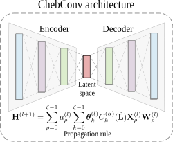{#fig-autoencoder fig-alt="An encoder-decoder diagram narrowing to a latent layer and widening again, with the ChebConv propagation rule underneath"}
:::

The loss is the optimization objective, rewritten for training:

$$
\mathcal{L}=\frac{1}{|\mathcal{T}|}\sum_{(i,j)\in\mathcal{T}}\left(X_{ij}-\tilde{X}_{ij}\right)^{2}
+\lambda\operatorname{tr}\!\left((\tilde{\mathbf{X}}\mathbf{D}_h)^{\top}(\mathbf{L}+\epsilon\mathbf{I})\,\tilde{\mathbf{X}}\mathbf{D}_h\right).
$$

An MSE term on the observed entries plus the Sobolev term from @eq-sobolev. Train it with Adam or SGD.

::: {.checkpoint}
**Check 8 — Optimization or network?**

They solve the same problem with the same prior, and the difference is where the effort goes.

The **optimization** approach has no training data, no training phase, and few hyperparameters ($\upsilon$, $\epsilon$, $\beta$); it needs a bespoke solver, and it starts from scratch on every new signal.

The **network** approach reuses a standard optimizer and can amortize the cost across signals; but hyperparameter tuning is harder, and it needs data to train on.

Be precise about that amortization, because it does not come for free from using a network. Reuse across signals requires a **training protocol** in which the model sees a collection of signals — a set of incomplete matrices with known held-out entries — and is evaluated on signals it did not train on. If instead you fit the network to one incomplete matrix and read off its reconstruction, you have used a neural network as an optimizer for a single instance, and you have amortized nothing. Both setups appear in the literature; they answer different questions. You also have to specify how missing entries enter the input — a fill value, and whether the mask $\mathbf{J}$ is itself given to the network as a channel.
:::

## Forecasting of time-varying graph signals

::: {.definition}
**Definition 9 — Forecasting problem**

Given $\mathcal{G}$, a time-varying graph signal $\mathbf{X}\in\mathbb{R}^{N\times M}$, and a temporal window

$$
\mathbf{X}_K=[\mathbf{x}_{m-K},\ldots,\mathbf{x}_{m-1}]\in\mathbb{R}^{N\times K},
\qquad K<M,
$$

predict $\mathbf{x}_m$. $K$ is the **auto-regressive order**.
:::

::: {.figure-panel}
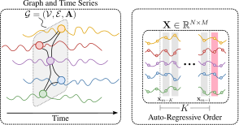{#fig-forecasting fig-alt="A graph with node time series, and the signal matrix with a K-wide window highlighted before the target column"}
:::

### Auto-regressive modeling

The classical AR($K$) model for a scalar time series is

$$
x_m=\sum_{i=1}^{K}\phi_i x_{m-i}+\epsilon_m,
$$

a weighted sum of the last $K$ lags plus white noise. The order $K$ sets how much history is retained, the coefficients $\phi_i$ weight it — typically decaying with distance in time — and $\epsilon_m$ absorbs whatever the model cannot explain.

On a graph, the scalar coefficients become matrices:

$$
\mathbf{x}_m=\sum_{i=1}^{K}\boldsymbol{\Phi}_i\mathbf{x}_{m-i}+\boldsymbol{\epsilon}_m,
\qquad
\boldsymbol{\Phi}_i\in\mathbb{R}^{N\times N}.
$$

Leaving $\boldsymbol{\Phi}_i$ arbitrary would be hopeless — $KN^{2}$ parameters, and no locality. But we know from Lecture 2 what a well-behaved $N\times N$ operator on a graph looks like: **a graph filter**. Take $\boldsymbol{\Phi}_i=\sum_{j=0}^{p}h_{j,i}\mathbf{S}^{j}$ and the model becomes

$$
\mathbf{x}_m=\sum_{i=1}^{K}\sum_{j=0}^{p}h_{j,i}\mathbf{S}^{j}\mathbf{x}_{m-i}+\boldsymbol{\epsilon}_m,
$$ {#eq-graph-ar}

with $(p+1)K$ parameters regardless of $N$. Reading it off: the value at a node at time $m$ depends on its own past $K$ values **and** on the past values of its $p$-hop neighborhood. Setting $p=1$ gives the simplest useful case, $\mathbf{x}_m=\sum_i(h_{0,i}\mathbf{I}+h_{1,i}\mathbf{S})\mathbf{x}_{m-i}+\boldsymbol{\epsilon}_m$ — each node's own history plus its immediate neighbors'.

::: {.checkpoint}
**Check 9 — Two axes, not one**

An ordinary time series has one axis of dependence: the past. A spatiotemporal graph signal has two, and @eq-graph-ar has one index for each — $i$ runs over time lags and $j$ over graph hops. Traffic at an intersection depends on that intersection an hour ago *and* on the upstream intersections a few minutes ago.
:::

### Forecasting with GNNs

Add nonlinearities to @eq-graph-ar and it becomes a network:

$$
\tilde{\mathbf{x}}_m=\sum_{i=1}^{K}\alpha_i\,\sigma\!\left(\sum_{j=0}^{p}h_{j,i}\mathbf{S}^{j}\mathbf{x}_{m-i}\right),
$$ {#eq-forecast-gnn}

where each lag is filtered on the graph, passed through $\sigma$, and the $K$ results are combined with learnable weights $\alpha_i$.

::: {.figure-panel}
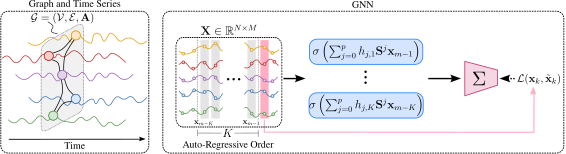{#fig-forecasting-gnn fig-alt="A diagram from a graph and its signal matrix through K parallel filter branches into a summation and an MSE loss"}
:::

The loss is mean squared error over the nodes,

$$
\mathcal{L}_{\mathrm{MSE}}(\mathbf{x}_m,\tilde{\mathbf{x}}_m)
=\frac{1}{N}\sum_{i=1}^{N}\left(x_m(i)-\tilde{x}_m(i)\right)^{2},
$$

and training is ordinary SGD or Adam.

### Multiple horizons

Predicting $H$ steps ahead rather than one admits two designs.

**MLP head.** Produce all $H$ horizons in one forward pass by projecting a shared hidden representation. Let the graph layers produce $\mathbf{Z}_m\in\mathbb{R}^{N\times F}$, with $F$ hidden channels per node, and read out with $\mathbf{W}_h\in\mathbb{R}^{F\times H}$:

$$
\tilde{\mathbf{X}}_m=\sigma\!\left(\mathbf{Z}_m\mathbf{W}_h\right)\in\mathbb{R}^{N\times H},
$$

with MSE taken between $\tilde{\mathbf{X}}_m$ and $\mathbf{X}_m$.

The width $F$ matters. If the hidden representation is a single value per node — $\mathbf{z}_m\in\mathbb{R}^{N\times1}$ and $\mathbf{w}_h\in\mathbb{R}^{1\times H}$ — then the preactivation $\mathbf{z}_m\mathbf{w}_h$ has **rank one**: every node's forecast is the same $H$-step profile scaled by one number. That is a severe restriction, not a general head, and it is worth recognizing when you see it.

**Recursive.** Feed the model's own prediction back in. Writing $\texttt{GNN}_{\mathcal{G},\boldsymbol{\theta}}(\cdot)$ for @eq-forecast-gnn,

$$
\tilde{\mathbf{x}}_m=\texttt{GNN}_{\mathcal{G},\boldsymbol{\theta}}(\mathbf{x}_{m-1},\ldots,\mathbf{x}_{m-K}),
\qquad
\tilde{\mathbf{x}}_{m+1}=\texttt{GNN}_{\mathcal{G},\boldsymbol{\theta}}(\tilde{\mathbf{x}}_m,\mathbf{x}_{m-1},\ldots,\mathbf{x}_{m-K+1}),
$$

and so on for $H-1$ steps, assembling $\tilde{\mathbf{X}}_m\in\mathbb{R}^{N\times H}$.

::: {.checkpoint}
**Check 10 — Two things to notice about the recursion**

1. **The window shifts.** Each step drops the oldest true observation and prepends the newest prediction, so the input stays $K$ wide and grows progressively more synthetic.
2. **The parameters are shared.** The same $\boldsymbol{\theta}$ is used at every horizon — one model, applied $H$ times, not $H$ models.

Which is better is an empirical question, not a settled one. The recursive rollout shares parameters across horizons and matches the one-step training objective, but it is trained on true inputs and run on its own predictions — an exposure mismatch that compounds errors as $H$ grows. The direct head avoids that compounding and can specialize per horizon, at the cost of more parameters and no guarantee of consistency between horizons. Recursive tends to do better at short horizons and on smooth, strongly auto-correlated signals; direct tends to do better at long horizons. Standard practice is to try both.
:::

### GraphCast

The clearest large-scale demonstration is **GraphCast** [@lam2023learning], DeepMind's medium-range weather model.

- It forecasts up to **10 days** ahead, learning from historical reanalysis data instead of integrating the equations of motion numerically.
- The atmosphere is **encoded from** a latitude–longitude grid onto a **global multi-mesh graph** built on hierarchical icosahedral meshes, processed there, then **decoded back** to the grid. The mesh is where the message passing happens, which avoids the pole distortion a regular grid suffers; the grid is still the input and output format.
- Message passing across mesh resolutions propagates information locally and globally in the same forward pass.
- It is **auto-regressive**, exactly as above: each output state is computed from previous states plus multi-resolution message passing.
- It produces a 10-day forecast in **under a minute on one TPU**, against roughly an hour for traditional numerical weather prediction.

GraphCast has a good deal of additional machinery. The part that matters here is that its skeleton is @eq-forecast-gnn.

Traffic forecasting is the other standard benchmark family: **MetrLA** (four months of speeds on 207 Los Angeles County highway sensors at 5-minute resolution) and **PemsBay** (six months at 325 Bay Area stations, also 5-minute).

## Exercises

### Exercise 1 — Reading the GFT

Take the path graph on 6 nodes. Compute $\mathbf{L}$, its eigenvalues and eigenvectors, and verify that the eigenvector for $\lambda_1=0$ is constant and that the number of sign changes grows with $\lambda$.

### Exercise 2 — Quadratic form

For @fig-quadratic-form with $a_{12}=2$, $a_{13}=1$, $a_{14}=1$ and $\mathbf{x}=[1,0,-1,2]^{\top}$, compute $\mathbf{x}^{\top}\mathbf{L}\mathbf{x}$ directly from the edge sum, then again as a matrix product, and confirm they agree.

### Exercise 3 — Why the difference is smoother

Let each node carry $x_s(i)=f(i)+g(s)$: a fixed spatial pattern plus a spatially uniform temporal drift. Show that $\mathbf{x}_s^{\top}\mathbf{L}\mathbf{x}_s$ is generally nonzero while $(\mathbf{x}_s-\mathbf{x}_{s-1})^{\top}\mathbf{L}(\mathbf{x}_s-\mathbf{x}_{s-1})=0$ exactly. Relate this to @fig-temporal-difference.

### Exercise 4 — The gradient

Derive $\nabla_{\tilde{\mathbf{X}}}f_u$ for @eq-tgsr. You will need $\nabla_{\mathbf{Z}}\operatorname{tr}(\mathbf{Z}^{\top}\mathbf{A}\mathbf{Z})=2\mathbf{A}\mathbf{Z}$ for symmetric $\mathbf{A}$, and the chain rule through $\mathbf{Z}=\tilde{\mathbf{X}}\mathbf{D}_h$.

### Exercise 5 — Chebyshev recursion

Verify that $\mathbf{Z}_i=2\tilde{\mathbf{L}}\mathbf{Z}_{i-1}-\mathbf{Z}_{i-2}$ with $\mathbf{Z}_1=\mathbf{H}^{(\ell)}$ implements $T_{i-1}(\tilde{\mathbf{L}})\mathbf{H}^{(\ell)}$ — note the index offset. State the degree and the number of sparse products for a sum over $i=1,\dots,k$. Then explain why $\tilde{\mathbf{L}}=2\mathbf{L}/\lambda_N-\mathbf{I}$ rather than $\mathbf{L}$ itself.

### Exercise 6 — Does the Sobolev term speed things up?

Using `scripts/figures/lecture_04_figures.py`, run gradient descent on @eq-tgsr and on @eq-sobolev from the same start, and plot the error against iteration. Try to find a regime — sparser sampling, larger $\upsilon$, larger $\epsilon$ or $\beta$ — in which the Sobolev version converges measurably faster. If you cannot, say what that tells you about which term controls the conditioning of this particular problem, and read [@giraldo2022reconstruction] for the setting where the effect is visible.

### Exercise 7 — Parameter count

For @eq-graph-ar with $N=10^{4}$ nodes, order $K=12$ and $p=3$ hops, count the parameters. Compare with an unconstrained $\boldsymbol{\Phi}_i\in\mathbb{R}^{N\times N}$, and with an LSTM run independently at each node with hidden size 64.

### Exercise 8 — Horizons

Explain why the recursive rollout compounds errors while the direct head does not. Then set up the comparison rather than assuming its outcome: name two properties of a signal that would favour the recursive strategy and two that would favour the direct one, and describe the experiment — horizons, splits, baselines — that would decide between them for a given dataset. Persistence (predict $\mathbf{x}_{m-1}$ for every horizon) is the baseline both must beat.

## Main takeaways

1. A **time-varying graph signal** $\mathbf{X}\in\mathbb{R}^{N\times M}$ carries a time series at every node; the temporal difference $\mathbf{X}\mathbf{D}_h$ is the object most of the modeling acts on.
2. The **GFT** diagonalizes graph filters and makes "graph frequency" precise: the eigenvalue is the frequency, and smooth signals concentrate their energy at the low end.
3. Working on the spectrum directly costs an $O(N^{3})$ eigendecomposition, and parameterizing per eigenvalue *index* does not transfer between graphs. **ChebConv** learns a function of $\lambda$ instead, buying a polynomial response with sparse products only; GCN is its degree-one, tied-coefficient case.
4. **Reconstruction** is an error term on the observed entries plus a smoothness regularizer, and the regularizer belongs on $\mathbf{X}\mathbf{D}_h$ — worth several factors of accuracy here. The reason is that the temporal difference has far smaller *total variation*, which is what the penalty sees; it is not smoother in the energy-normalized sense, and Check 4 shows why the distinction matters.
5. $\kappa(\mathbf{L})=\infty$ because $\lambda_{\min}(\mathbf{L})=0$. **Sobolev smoothness** replaces $\mathbf{L}$ with $(\mathbf{L}+\epsilon\mathbf{I})^{\beta}$, making that factor's conditioning finite and tunable — but it does not remove the null space of $\mathbf{D}_h\mathbf{D}_h^{\top}$, so uniqueness still needs a sampling condition (Check 5).
6. The same problem solves with a **polynomial-filter autoencoder** and the same loss. Optimization needs no data; the network can amortize across signals, but only under a training protocol that actually trains on a collection of them. Both are shallow, for the usual reason.
7. **Forecasting** is auto-regressive modeling where the AR coefficients become graph filters, giving dependence on both past time steps and nearby nodes with a parameter count independent of $N$.
8. Multiple horizons come from a **direct head** on an $N\times F$ hidden representation or a **recursive** rollout with shared parameters; which wins is an empirical question, and both must beat persistence. **GraphCast** is this recipe at planetary scale, encoding from and decoding to a latitude–longitude grid while processing on a multimesh.

## References and provenance {.unnumbered}

This web note is adapted from the Lecture 4 slides by Jhony H. Giraldo. The graph-filter diagonalization is proved, the shapes of the autoencoder are worked through, the auto-regressive model is derived from the classical AR($K$) model, and the smoothness and conditioning claims are checked numerically.

The diagrams reproduce the original course vectors. @fig-gft, @fig-temporal-difference, @fig-reconstruction-smoothness, and @fig-chebyshev are new and were computed with `numpy` and `networkx`; the script that produces them is `scripts/figures/lecture_04_figures.py` in this repository. @fig-fourier is a redrawn version of the lecture's Fourier recap.

::: {#refs .references-small}
:::
