```{=html}
<header class="lecture-header">
  <div class="eyebrow">APM 5DS30 TP · Machine Learning with Graphs</div>
  <h1>Recommender systems</h1>
  <p>Lecture 5 · Jhony H. Giraldo · Télécom Paris, Institut Polytechnique de Paris</p>
  <div class="lecture-meta"><span>Original lecture: 21 November 2025</span><span>Web note revised: 6 September 2026</span><span>Mathematics rendered with MathJax</span></div>
  <div class="button-row">
    <a class="button-link primary" href="/assets/pdf/Lecture-05-Recommender-Systems.pdf">Download the original slides</a>
    <a class="button-link secondary" href="/teaching/machine-learning-with-graphs/index.qmd">Back to the course</a>
  </div>
</header>
```

Netflix carries more than ten thousand films. Amazon lists twelve million products directly and some 350 million on its marketplace. Spotify holds seventy million tracks, YouTube more than ten billion videos, Pinterest more than two hundred billion images. No user can explore a catalogue of that size, so **personalized recommendation** — surfacing a handful of interesting items for each individual — is what makes such a platform usable at all.

This note treats recommendation as a graph problem. The data is a bipartite user–item graph; the task is link prediction on it; and the two architectures we study, NGCF and LightGCN, are the machinery of Lectures 2 and 3 applied to that graph. But the interesting part is not the architecture. It is that the **metric we care about is not differentiable**, and almost everything in the design follows from what we do about that.

## Learning objectives

After studying this note, you should be able to:

```{=html}
<ol class="learning-objectives">
  <li>model a recommender system as a bipartite graph and cast recommendation as link prediction;</li>
  <li>define Recall@$k$ and explain why it cannot be optimized directly;</li>
  <li>show by counterexample why the binary loss is misaligned with Recall@$k$, and how the BPR loss fixes it;</li>
  <li>explain collaborative filtering and why low-dimensional embeddings capture it;</li>
  <li>describe NGCF's message passing over the user–item graph;</li>
  <li>derive LightGCN from a GCN and explain what its multi-scale average does.</li>
</ol>
```

## Recommendation as a graph problem

::: {.figure-panel}
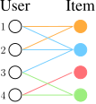{#fig-bipartite fig-alt="Four users on the left connected by colored edges to four items on the right"}
:::

::: {.definition}
**Definition 1 — Notation**

$\mathcal{U}$ is the set of users, $\mathcal{V}$ the set of items, and

$$
\mathcal{E}=\{(u,v)\ \vert\ u\in\mathcal{U},\ v\in\mathcal{V},\ u \text{ interacted with } v\}
$$

the set of observed interactions.
:::

The bipartite view is a good first model, not the whole story: real systems also carry knowledge graphs over the items, user attributes, session structure, and time. But it is enough to state the task.

::: {.figure-panel}
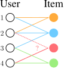{#fig-link-prediction fig-alt="A bipartite graph with existing edges in solid lines and predicted future edges dashed"}
:::

For every pair $u\in\mathcal{U}$, $v\in\mathcal{V}$ we need a real-valued score $f(u,v)$, and we recommend the highest-scoring items the user has not already seen.

### Top-$k$ recommendation

For a recommendation to be useful, $k$ must be far smaller than the catalogue — typically $10$ to $100$ against up to billions of items. The goal is to fit as many **positive items** (items the user will actually interact with in the future) as possible into that short list.

### Recall@$k$

::: {.definition}
**Definition 2 — Recall@$k$**

For each user $u$, let $P_u$ be the set of positive items the user will interact with in the future and $R_u$ the set of items the model recommends, with $|R_u|=k$ and items already interacted with excluded. Then

$$
\text{Recall@}k(u)=\frac{|P_u\cap R_u|}{|P_u|},
$$

and the reported figure is the average over all users.
:::

::: {.two-figures}
::: {.figure-panel}
{#fig-recall-sets fig-alt="Two overlapping ellipses labelled positive items and recommended items"}
:::
::: {.figure-panel}
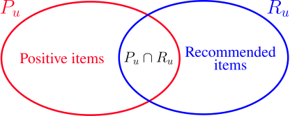{fig-alt="The same two ellipses with the intersection region highlighted"}
:::
:::

::: {.checkpoint}
**Check 1 — Recall@$k$ is personalized**

Read the definition again: it is computed **per user** and only then averaged. Nothing in it compares one user's scores against another's. That sounds like a technicality; @sec-losses shows it is the single most consequential fact in the lecture.
:::

### How a deployed system is actually built

We cannot evaluate $f(u,v)$ for every pair: $|\mathcal{U}|\times|\mathcal{V}|$ is astronomically large. Production systems therefore split the work in two.

::: {.figure-panel}
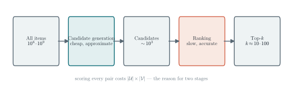{#fig-two-stage fig-alt="Five boxes in a row: all items, candidate generation, candidates, ranking, top-k"}
:::

Everything in this note concerns the embeddings that make the first stage possible.

### A word about what these systems optimize

::: {.checkpoint}
**Check 2 — Societal risk is a consequence of the objective**

How many times have you opened TikTok, Instagram, or YouTube "just for five minutes" and lost half an hour?

That is not an accident. It is a direct consequence of the objective functions in this note. Recommender systems are trained on engagement — clicks, watch time, interactions — and Recall@$k$ rewards giving users exactly what they are most likely to engage with. If a user's history shows a pull toward content that is harmful or addictive, a system optimizing this objective will **amplify** it, because amplifying it is what the metric rewards.

Going further is outside this course, but there are active research communities on fairness, diversity, filter bubbles, and engagement-versus-wellbeing objectives. Know that the metric you optimize is a choice, and that this one has consequences.
:::

## Embedding-based models

::: {.figure-panel}
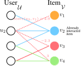{#fig-score-function fig-alt="A bipartite graph with numeric scores annotated on the edges from user u2"}
:::

::: {.definition}
**Definition 3 — Embedding-based model**

Give every user $u$ an embedding $\mathbf{u}\in\mathbb{R}^{D}$ and every item $v$ an embedding $\mathbf{v}\in\mathbb{R}^{D}$, and let $F_{\theta}:\mathbb{R}^{D}\times\mathbb{R}^{D}\to\mathbb{R}$ be a parameterized function. Then

$$
\operatorname{score}(u,v):=F_{\theta}(\mathbf{u},\mathbf{v}).
$$
:::

::: {.figure-panel}
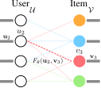{#fig-embedding-model fig-alt="A bipartite graph where each node carries an embedding vector, with the score function annotated between two of them"}
:::

The training objective is to achieve high Recall@$k$ on the observed interactions, in the hope that this transfers to the unseen ones.

## Surrogate losses {#sec-losses}

Here is the problem. **Recall@$k$ is not differentiable.** It depends on the model only through a sort and a set intersection, both piecewise constant, so its gradient is zero wherever it exists. Gradient-based optimization has nothing to work with.

We therefore need a **surrogate**: a differentiable loss that is aligned with the metric we actually want. Two are standard.

### The binary loss

::: {.definition}
**Definition 4 — Binary loss**

Let $\mathcal{E}$ be the observed (positive) edges and

$$
\mathcal{E}_{\text{neg}}=\{(u,v)\ \vert\ (u,v)\notin\mathcal{E},\ u\in\mathcal{U},\ v\in\mathcal{V}\}
$$

the negative ones. The binary loss classifies edges as positive or negative using $\sigma(F_\theta(\mathbf{u},\mathbf{v}))$:

$$
-\frac{1}{|\mathcal{E}|}\sum_{(u,v)\in\mathcal{E}}\log\sigma\!\left(F_\theta(\mathbf{u},\mathbf{v})\right)
-\frac{1}{|\mathcal{E}_{\text{neg}}|}\sum_{(u,v)\in\mathcal{E}_{\text{neg}}}\log\!\left(1-\sigma\!\left(F_\theta(\mathbf{u},\mathbf{v})\right)\right).
$$
:::

This pushes positive-edge scores up and negative-edge scores down, which sounds exactly right — positives are what we want recalled. But look at what "up" and "down" mean here: **all** positives above **all** negatives, across the entire dataset at once.

::: {.figure-panel}
{#fig-binary-counterexample fig-alt="Two users connected to two items, annotated with scores 1.0, -1.0, 2.0, and 4.0, with positive edges solid and negative edges dashed"}
:::

::: {.checkpoint}
**Check 3 — Read the counterexample carefully**

The model in @fig-binary-counterexample is **perfect** by the metric we care about, and the loss punishes it anyway.

The reason is a mismatch of scope. The binary loss compares positives and negatives **across all users at once** — it is *non-personalized*. Recall@$k$ compares items **within one user** — it is *personalized*. Comparing $(u_2,v_1)$ against $(u_1,v_1)$ is a comparison the metric never makes and never rewards, so the loss is strictly stricter than the objective.

Note that this is a proof, not an observation. One counterexample is enough to establish the misalignment.
:::

### The BPR loss

What we want instead: for each user separately, positive scores above that same user's negative scores. Score ordering *across* users is irrelevant.

::: {.figure-panel}
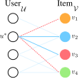{#fig-bpr-rooted fig-alt="A bipartite graph with one user highlighted and its positive and negative edges distinguished"}
:::

::: {.definition}
**Definition 5 — Bayesian Personalized Ranking loss**

For a user $u^*$, with rooted positive edges $\mathcal{E}(u^*)=\{(u^*,v)\in\mathcal{E}\}$ and rooted negative edges $\mathcal{E}_{\text{neg}}(u^*)=\{(u^*,v)\in\mathcal{E}_{\text{neg}}\}$,

$$
\text{Loss}(u^*)=
\frac{1}{|\mathcal{E}(u^*)|\,|\mathcal{E}_{\text{neg}}(u^*)|}
\sum_{(u^*,v_{\text{pos}})\in\mathcal{E}(u^*)}\ \sum_{(u^*,v_{\text{neg}})\in\mathcal{E}_{\text{neg}}(u^*)}
-\log\sigma\!\left(F_\theta(u^*,v_{\text{pos}})-F_\theta(u^*,v_{\text{neg}})\right),
$$ {#eq-bpr}

and the total loss is $\frac{1}{|\mathcal{U}|}\sum_{u^*\in\mathcal{U}}\text{Loss}(u^*)$.
:::

The whole design is in the **difference** $F_\theta(u^*,v_{\text{pos}})-F_\theta(u^*,v_{\text{neg}})$. Only scores belonging to the same user are ever compared, so the loss is invariant to shifting one user's scores up or down — precisely the invariance Recall@$k$ has. Applied to @fig-binary-counterexample, the BPR loss is happy: within $u_1$, $v_1$ outranks $v_2$; within $u_2$, $v_2$ outranks $v_1$; nothing else is checked.

::: {.figure-panel}
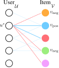{#fig-bpr-minibatch fig-alt="A bipartite graph with a few users highlighted and their sampled positive and negative items marked"}
:::

The double sum in @eq-bpr is far too large to evaluate exactly, so it is estimated:

$$
\frac{1}{|\mathcal{U}_{\text{mini}}|}\sum_{u^*\in\mathcal{U}_{\text{mini}}}
\frac{1}{|\mathcal{V}_{\text{neg}}|}\sum_{v_{\text{neg}}\in\mathcal{V}_{\text{neg}}}
-\log\sigma\!\left(F_\theta(u^*,v_{\text{pos}})-F_\theta(u^*,v_{\text{neg}})\right).
$$

## Why embeddings work at all

::: {.figure-panel}
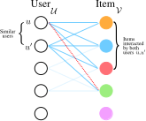{#fig-collaborative-filtering fig-alt="A bipartite graph with two users sharing several common item neighbors highlighted"}
:::

The mechanism is a capacity argument, and it is worth stating precisely.

::: {.checkpoint}
**Check 4 — Low dimension is a feature, not a limitation**

A $D$-dimensional embedding table has $O((|\mathcal{U}|+|\mathcal{V}|)D)$ parameters, whereas the interaction matrix has $|\mathcal{U}|\times|\mathcal{V}|$ entries. When $D$ is small the model **cannot memorize** the interactions.

Being unable to memorize, it is forced to explain the data with structure it can represent — which means placing similar users near each other and similar items near each other. That compression *is* collaborative filtering, and it is what lets the model say anything about a pair it has never observed.
:::

## Neural graph collaborative filtering

::: {.figure-panel}
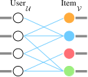{#fig-shallow fig-alt="A bipartite graph where each node carries a learnable embedding vector"}
:::

::: {.checkpoint}
**Check 5 — What shallow encoders miss**

The graph enters a shallow model **only through the training objective** — through which pairs are positive. It never enters the model itself.

And the objective only ever looks at **first-order** structure: individual edges. A $K$-hop path between a user and an item — the very thing that says "people like you, who liked things like this, went on to like that" — is never represented.

This is exactly the limitation Lecture 2 identified for DeepWalk, in a new setting.
:::

We want a model that captures graph structure **explicitly** and at **higher order**. GNNs do both.

::: {.figure-panel}
![NGCF [@wang2019neural]: start from shallow embeddings that are not graph-aware, propagate them with a GNN over the bipartite graph, and obtain final embeddings that are.](../../assets/figures/ngcf-overview.svg){#fig-ngcf-overview fig-alt="Three panels: initial shallow embeddings, GNN propagation with green arrows, and the resulting graph-aware embeddings"}
:::

::: {.definition}
**Definition 6 — NGCF propagation**

With shallow embeddings as the initial features, $\mathbf{h}_u^{(0)}$ and $\mathbf{h}_v^{(0)}$, iterate

$$
\mathbf{h}_v^{(k+1)}=\operatorname{COMBINE}\!\left(\mathbf{h}_v^{(k)},\ \operatorname{AGGR}\!\left(\left\{\mathbf{h}_u^{(k)}\right\}_{u\in\mathcal{N}(v)}\right)\right),
$$
$$
\mathbf{h}_u^{(k+1)}=\operatorname{COMBINE}\!\left(\mathbf{h}_u^{(k)},\ \operatorname{AGGR}\!\left(\left\{\mathbf{h}_v^{(k)}\right\}_{v\in\mathcal{N}(u)}\right)\right).
$$

A typical choice is $\operatorname{AGGR}=\operatorname{MEAN}$ and $\operatorname{COMBINE}(\mathbf{x},\mathbf{y})=\operatorname{ReLU}(\operatorname{Linear}(\operatorname{Concat}(\mathbf{x},\mathbf{y})))$.
:::

::: {.figure-panel}
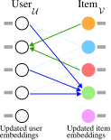{#fig-ngcf-aggregation fig-alt="A bipartite graph with green arrows from items to users and blue arrows from users to items"}
:::

After $K$ rounds we set $\mathbf{u}\leftarrow\mathbf{h}_u^{(K)}$ and $\mathbf{v}\leftarrow\mathbf{h}_v^{(K)}$, and score by inner product.

::: {.figure-panel}
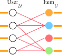{#fig-ngcf-final fig-alt="A bipartite graph whose nodes carry final graph-aware embedding vectors"}
:::

## LightGCN

::: {.checkpoint}
**Check 6 — Count the parameters before adding machinery**

NGCF learns shallow embeddings **and** GNN weights. Compare their sizes:

| | parameters |
|---|---|
| shallow embeddings | $O(ND)$ |
| GNN weights | $O(D^{2})$ |

With $N$ (users plus items) in the millions and $D$ in the tens, $ND \ggg D^{2}$. **Essentially all the capacity is already in the shallow embeddings.** So it is worth asking whether the GNN's own parameters are earning their place.

They are not — and removing them *improves* performance [@he2020lightgcn].
:::

### The bipartite adjacency

::: {.figure-panel}
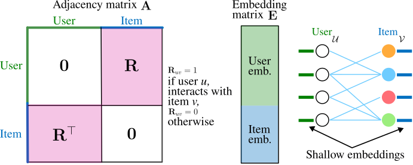{#fig-bipartite-matrices fig-alt="A block matrix with zeros on the diagonal blocks and R and R transpose off-diagonal, beside a stacked embedding matrix"}
:::

### Deriving the model

Take the GCN formulation, but **omit the self-loops** — a bipartite graph has no same-type edges to preserve — and normalize as $\tilde{\mathbf{A}}=\mathbf{D}^{-1/2}\mathbf{A}\mathbf{D}^{-1/2}$. A layer is then

$$
\mathbf{E}^{(k+1)}=\operatorname{ReLU}\!\left(\tilde{\mathbf{A}}\mathbf{E}^{(k)}\mathbf{W}^{(k)}\right).
$$

Now apply Lecture 3's argument verbatim. Remove the nonlinearities and the stack collapses, exactly as it did for SGC:

$$
\mathbf{E}^{(k)}=\tilde{\mathbf{A}}^{k}\mathbf{E}\mathbf{W}.
$$

LightGCN goes one step further and drops the linear projection too:

$$
\mathbf{E}^{(k)}=\tilde{\mathbf{A}}^{k}\mathbf{E}.
$$ {#eq-lightgcn-layer}

::: {.figure-panel}
{#fig-lightgcn-diffusion fig-alt="A sensor network with an impulse spreading over successive diffusion steps"}
:::

### Multi-scale diffusion

Here LightGCN differs from SGC in one important respect. Rather than using the embedding at a single depth, it **averages across all depths**:

$$
\mathbf{E}_{\text{final}}=\alpha_0\mathbf{E}^{(0)}+\alpha_1\mathbf{E}^{(1)}+\cdots+\alpha_k\mathbf{E}^{(k)},
\qquad
\mathbf{E}^{(0)}=\tilde{\mathbf{A}}^{0}\mathbf{E}=\mathbf{E}.
$$ {#eq-lightgcn-multiscale}

The coefficients are hyperparameters; LightGCN simply takes them uniform, $\alpha_i=\frac{1}{k+1}$.

::: {.checkpoint}
**Check 7 — Why average across scales?**

Keeping $\mathbf{E}^{(0)}$ in the sum means the un-diffused embedding always survives with weight $\frac{1}{k+1}$. This is a direct structural defence against the failure mode of Lecture 2: however much the deep terms over-smooth, the model retains a path back to the node's own identity.

It is the same idea as a residual connection, and it is why LightGCN tolerates more propagation steps than a plain GCN would.
:::

### The model end to end

::: {.two-figures}
::: {.figure-panel}
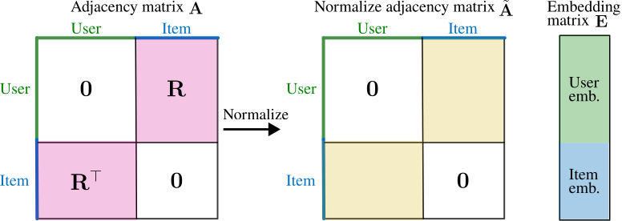{#fig-lightgcn-inputs fig-alt="A bipartite adjacency matrix beside a stacked user-item embedding matrix"}
:::
::: {.figure-panel}
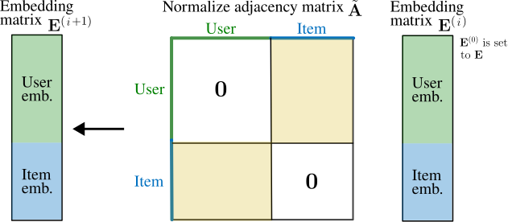{fig-alt="The normalized adjacency matrix multiplying the embedding matrix to produce the next one"}
:::
:::

::: {.figure-panel}
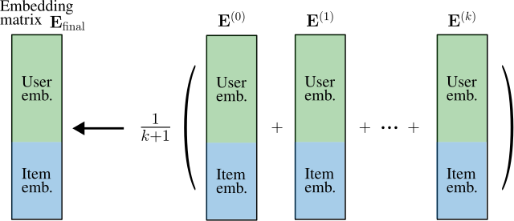{#fig-lightgcn-multiscale fig-alt="Several embedding matrices summed and scaled by one over k plus one into a final embedding matrix"}
:::

::: {.figure-panel}
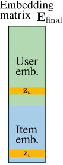{#fig-lightgcn-final fig-alt="The final embedding matrix split into a user block and an item block"}
:::

The **only** learnable parameters are the input embeddings $\mathbf{E}$. Everything else is a fixed sparse matrix product.

::: {.figure-panel}
{#fig-lightgcn-depth fig-alt="Test Recall at 10 rising steadily with the number of diffusion steps"}
:::

::: {.checkpoint}
**Check 8 — What @fig-lightgcn-depth does and does not show**

It shows the central claim: **diffusion is the whole of what LightGCN adds over a shallow encoder**, and it is worth a large factor. The $k=0$ point is a shallow model trained identically, so the gap is attributable to the propagation alone.

It does **not** show a turning point. In this small, clean, strongly homophilous synthetic graph, recall was still improving at the largest depth tested — the multi-scale average of @eq-lightgcn-multiscale is doing its job. On real data, and without that average, more layers eventually hurt for the reasons Lecture 2 measured. Do not read this curve as licence to stack layers indefinitely; read it as evidence that the diffusion is where the value is. Exercise 6 asks you to look for the turnover.
:::

::: {.checkpoint}
**Check 9 — Why the simple thing works**

The diffusion directly pulls together the embeddings of users who share many item neighbors. Two users who interacted with many of the same items get similar final embeddings, and therefore similar recommendations.

That is a mechanical restatement of collaborative filtering — the assumption we started from. LightGCN works because its inductive bias *is* the assumption of the problem, and it needs no parameters to express it.
:::

::: {.checkpoint}
**Check 10 — NGCF, LightGCN, and shallow encoders**

| | learnable parameters | graph in the model | cost |
|---|---|---|---|
| **Shallow encoder** | embeddings | no — only via the loss | cheapest |
| **NGCF** | embeddings **and** GNN weights | yes, high-order | highest |
| **LightGCN** | embeddings only | yes, high-order | embeddings plus $k$ sparse products |

All three learn one embedding per user and item. The difference is that LightGCN scores with the **diffused** embeddings, which costs more than a shallow encoder and consistently performs better — while beating NGCF by having *fewer* moving parts.
:::

## Exercises

### Exercise 1 — Recall@$k$ by hand

A user has $P_u=\{v_3,v_7,v_9,v_{11}\}$ and the model returns $R_u=\{v_2,v_3,v_5,v_9,v_{12}\}$. Compute Recall@5. Then state what Recall@$k$ does when $k>|P_u|$, and why practitioners also report Precision@$k$ and NDCG@$k$.

### Exercise 2 — The counterexample, generalized

@fig-binary-counterexample uses two users and two items. Construct a family of examples with $n$ users in which training Recall@1 is perfect but the binary loss is arbitrarily large. What property of the score matrix are you exploiting?

### Exercise 3 — Invariance

Show that the BPR loss of @eq-bpr is unchanged if every score of one user is shifted by a constant, $F_\theta(u^*,v)\mapsto F_\theta(u^*,v)+c_{u^*}$, and that the binary loss is not. Relate this to Check 1.

### Exercise 4 — Gradient of the BPR loss

With $F_\theta(u,v)=\langle\mathbf{u},\mathbf{v}\rangle$, differentiate a single BPR term with respect to $\mathbf{u}$, $\mathbf{v}_{\text{pos}}$ and $\mathbf{v}_{\text{neg}}$. Show that the update magnitude shrinks as the positive already outranks the negative, and say why that is desirable.

### Exercise 5 — The collapse

Verify @eq-lightgcn-layer for $k=2$: expand $\mathbf{E}^{(2)}$ with the ReLU present and again with it removed, and identify the step that fails when it is present. Compare with the SGC derivation in Lecture 3 — what does LightGCN remove that SGC keeps?

### Exercise 6 — Diffusion depth

Reproduce @fig-lightgcn-depth with `scripts/figures/lecture_05_figures.py`. Then remove the multi-scale average — score with $\mathbf{E}^{(k)}$ alone instead of the average of @eq-lightgcn-multiscale — and re-run the sweep. Does a turning point appear? Explain the result using Check 7.

### Exercise 7 — Parameter counts

A platform has $10^{7}$ users, $10^{6}$ items and $D=64$. Count the parameters of a shallow encoder, of LightGCN, and of NGCF with a 3-layer GNN. Then state which of the three you would deploy first, and why the answer does not follow from the parameter count alone.

## Main takeaways

1. A recommender system is a **bipartite user–item graph**, and recommendation is **link prediction** on it.
2. We recommend $k \ll |\mathcal{V}|$ items and evaluate with **Recall@$k$**, which is defined **per user** and then averaged.
3. Recall@$k$ is not differentiable, so training uses a **surrogate loss** — and the choice of surrogate is where the alignment with the metric is won or lost.
4. The **binary loss** compares positives and negatives across all users. One two-user counterexample shows it penalizes a model with perfect Recall@1.
5. The **BPR loss** compares items only within a user, matching the metric's personalization exactly.
6. Embeddings work because they are **too small to memorize**, which forces them to encode user and item similarity — collaborative filtering.
7. **NGCF** propagates shallow embeddings over the bipartite graph with a GNN, capturing high-order structure the training objective alone cannot.
8. **LightGCN** removes the GNN's parameters entirely, keeping only diffusion plus a multi-scale average. It has fewer parameters than NGCF and performs better — and the multi-scale average is what keeps depth safe.

## References and provenance {.unnumbered}

This web note is adapted from the Lecture 5 slides by Jhony H. Giraldo. The binary-loss counterexample is analyzed as a proof of misalignment rather than an anecdote, the LightGCN derivation is connected explicitly to Lecture 3's SGC collapse, and the role of the multi-scale average is drawn out.

The diagrams reproduce the original course vectors. @fig-two-stage and @fig-lightgcn-depth are new: the first is redrawn, and the second is a measurement produced by `scripts/figures/lecture_05_figures.py` in this repository, which trains a LightGCN end to end with `numpy`.

::: {#refs .references-small}
:::
