```{=html}
<header class="lecture-header">
  <div class="eyebrow">APM 5DS30 TP · Machine Learning with Graphs</div>
  <h1>Graph generation</h1>
  <p>Lecture 6 · Jhony H. Giraldo · Télécom Paris, Institut Polytechnique de Paris</p>
  <div class="lecture-meta"><span>Original lecture: 11 March 2025</span><span>Web note revised: 6 September 2026</span><span>Mathematics rendered with MathJax</span></div>
  <div class="button-row">
    <a class="button-link primary" href="/assets/pdf/Lecture-06-Graph-Generation.pdf">Download the original slides</a>
    <a class="button-link secondary" href="/teaching/machine-learning-with-graphs/index.qmd">Back to the course</a>
  </div>
</header>
```

Every lecture so far has *learned from* graphs. The graph was given, and we predicted something about it — a node label, a missing value, a future edge. This note reverses the arrow and asks where the graphs come from.

::: {.figure-panel}
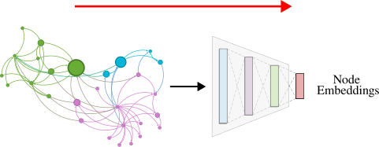{#fig-encoders fig-alt="A graph feeding into an encoder that produces node embeddings"}
:::

::: {.figure-panel}
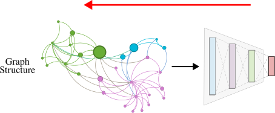{#fig-generation-today fig-alt="A model producing a graph structure as its output"}
:::

The route has three steps: first characterize what real graphs look like, then see how far a classical random-graph model gets, and finally learn the generation process from data.

## Learning objectives

After studying this note, you should be able to:

```{=html}
<ol class="learning-objectives">
  <li>characterize a graph by its degree distribution, clustering coefficient, connectivity, and path length;</li>
  <li>define the Erdős–Rényi models \(G_{np}\) and \(G_{nm}\) and derive their clustering coefficient;</li>
  <li>state which properties of real networks \(G_{np}\) reproduces and which it cannot;</li>
  <li>formulate graph generation as density estimation plus sampling;</li>
  <li>explain how GraphRNN turns a graph into a sequence of sequences, and why that costs \(\mathcal{O}(N^2)\);</li>
  <li>explain how coarsening-based local expansion avoids both the ordering problem and the quadratic cost.</li>
</ol>
```

## Why generate graphs?

::: {.figure-panel}
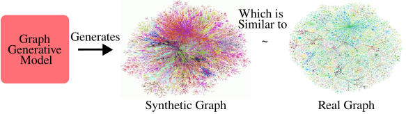{#fig-problem fig-alt="A graph generative model producing a synthetic graph beside a real graph for comparison"}
:::

There are four distinct reasons to want this.

- **Insight.** A model that reproduces a network tells us something about how the network formed.
- **Prediction.** A generative process can be run forward to say how a graph will evolve.
- **Simulation.** Novel instances can be produced for testing, benchmarking, or design.
- **Anomaly detection.** A model of normal graphs is a detector for abnormal ones.

::: {.figure-panel}
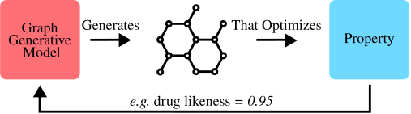{#fig-drug fig-alt="A generative model producing a molecular graph optimizing a property score of 0.95"}
:::

## Properties of real-world graphs

A generative model is only as good as the properties it reproduces, so we need to fix what we measure. The lecture uses four.

### Degree distribution

::: {.definition}
**Definition 1 — Degree distribution**

$P(k)$ is the probability that a randomly chosen node has degree $k$, computed as the normalized histogram

$$
P(k)=\frac{N_k}{N},
$$

where $N_k$ is the number of nodes of degree $k$.
:::

::: {.figure-panel}
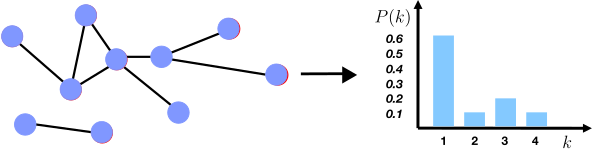{#fig-degree-distribution fig-alt="A small network beside a bar chart of P(k) against k"}
:::

### Clustering coefficient

::: {.definition}
**Definition 2 — Clustering coefficient**

For a node $i$ of degree $k_i$,

$$
C_i=\frac{2e_i}{k_i(k_i-1)},
$$

where $e_i$ is the number of edges among the neighbors of $i$. The graph coefficient is the average $C=\frac{1}{N}\sum_{i=1}^{N}C_i$.
:::

::: {.figure-panel}
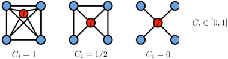{#fig-clustering fig-alt="Three copies of a five-node neighborhood with clustering coefficient 1, one half, and 0"}
:::

This is the same quantity as in Lecture 1 — now used to *judge a generative model* rather than to describe a node.

### Connectivity

::: {.figure-panel}
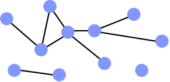{#fig-connectivity fig-alt="A network with several disconnected pieces, the largest highlighted"}
:::

### Path length

::: {.definition}
**Definition 3 — Diameter and average path length**

The **diameter** is the maximum shortest-path distance between any pair of nodes. It is fragile: a single long tail attached anywhere inflates it.

The **average shortest path length** is more robust,

$$
\bar{h}=\frac{1}{E_{\max}}\sum_{i,j\neq i}h_{ij},
\qquad
E_{\max}=N(N-1),
$$

with $h_{ij}$ the distance from $i$ to $j$. In practice the average is taken over connected pairs only, so that infinite distances do not swallow the result.
:::

### A real network to calibrate against

The lecture's reference is the **MSN Messenger** communication graph: one month of activity, 245 million users logged in, 180 million in conversations, more than 30 billion conversations and 255 billion messages. Two people are connected if they exchanged at least one message, giving 180 million nodes and 1.3 billion edges.

Its four measured properties:

```{=html}
<div class="feature-grid">
  <article class="feature-card"><span class="number">Degree distribution</span><h3>Heavily skewed</h3><p>Average degree 14.4, with a long tail of very high-degree nodes.</p></article>
  <article class="feature-card"><span class="number">Clustering</span><h3>C = 0.11</h3><p>Your contacts are substantially likely to know one another.</p></article>
  <article class="feature-card"><span class="number">Connectivity</span><h3>Giant component</h3><p>About 99% of nodes lie in a single component.</p></article>
  <article class="feature-card"><span class="number">Path length</span><h3>h̄ = 6.6</h3><p>The famous "six degrees of separation", measured.</p></article>
</div>
```

## Erdős–Rényi random graphs

::: {.definition}
**Definition 4 — The two Erdős–Rényi models**

$G_{np}$: an undirected graph on $N$ nodes in which each edge $(i,j)$ appears independently with probability $p$.

$G_{nm}$: an undirected graph on $N$ nodes with $m$ edges chosen uniformly at random [@erdos1959random].
:::

::: {.figure-panel}
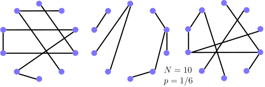{#fig-er-realizations fig-alt="Three different random graphs generated with the same number of nodes and edge probability"}
:::

### Its clustering coefficient

This one is worth deriving, because the answer is what condemns the model.

::: {.worked-example}
**Worked example — $\mathbb{E}[C_i]$ for $G_{np}$**

Node $i$ has degree $k_i$, so its neighbors form $\frac{k_i(k_i-1)}{2}$ distinct pairs. Each such pair is connected independently with probability $p$, so the expected number of edges among the neighbors is

$$
\mathbb{E}[e_i]=p\,\frac{k_i(k_i-1)}{2}.
$$

Substituting into Definition 2,

$$
\mathbb{E}[C_i\mid k_i]=\frac{2}{k_i(k_i-1)}\cdot p\,\frac{k_i(k_i-1)}{2}=p=\frac{\bar{k}}{N-1}\approx\frac{\bar{k}}{N}.
$$

Two conventions to fix, because the result is cleaner than it looks. The cancellation needs $k_i\geq2$ — a node of degree 0 or 1 has no pair of neighbors and its $C_i$ is $0/0$. If we define $C_i=0$ in that case, then averaging over all nodes gives $\mathbb{E}[C]=p\cdot\Pr(k_i\geq2)$, slightly below $p$. And $\bar{k}=p(N-1)$ is the *expected* mean degree; any particular realization has its own.

Read the result: if we hold the average degree $\bar{k}$ fixed and grow the graph, **the clustering coefficient goes to zero**. A large random graph has no local structure at all.
:::

### Its giant component

The other classical result is a phase transition. Writing $p=c/N$, the statement is **asymptotic**: as $N\to\infty$, for $c<1$ the largest component has size $O(\log N)$, while for $c>1$ a component containing a constant fraction of the nodes emerges. The critical case $c=1$ is different again, with a largest component of order $N^{2/3}$.

Two things this is *not*. It is not a sharp event in a finite sample — the transition in a 2000-node graph is a smooth rise, not a step, and it sharpens as $N$ grows. And a giant component is not **full connectivity**: that requires the much higher $p\approx\log N/N$, so a graph well past the giant-component threshold still typically has isolated nodes and infinite distances between some pairs.

::: {.figure-panel}
![Both results, simulated. Left: the largest component against average degree on 2000-node $G_{np}$ graphs; the transition at $\bar{k}=1$ is sharp. Right: $\mathbb{E}[C]=\bar{k}/N$ against $N$ for two fixed average degrees, with MSN's measured $C=0.11$ marked. At MSN's scale, $\bar{k}=14.4$ over $1.8\times10^{8}$ nodes predicts $C\approx8\times10^{-8}$ — six orders of magnitude too small.](../../assets/figures/erdos-renyi-properties.svg){#fig-er-properties fig-alt="Left, a sharp rise in giant component size at average degree one; right, two decreasing lines far below a horizontal line at 0.11"}
:::

### Path length

For $G_{np}$ the diameter scales as $\mathcal{O}\!\left(\log N/\log(pN)\right)$. Random graphs are good expanders, so a BFS reaches everything in a logarithmic number of steps: they can be enormous and still have every node a few hops from every other.

### The verdict

::: {.figure-panel}
![The comparison, measured — and note that the two panels compare different things. **Left**: the complementary CDF $P(K\geq k)$, the readable way to compare tails on a small sample. The real Les Misérables network ($N=77$) and a preferential-attachment model ($N=5000$) both keep mass out to high degree; the $G_{np}$ graph, matched to the model in $N$ and mean degree, falls off a cliff at $k\approx15$. The real graph is here as an anchor, not as a size-matched comparison — it is 65 times smaller. **Right**: two **synthetic** models only, at equal $N$ and equal mean degree, so the comparison is like for like. Ratios rather than raw values, because $C\approx0.001$ and $\bar{h}\approx5$ cannot share a linear axis: clustering differs by $193\times$, while path length ($0.82\times$) and giant-component fraction ($1.00\times$) agree.](../../assets/figures/real-vs-random-graphs.svg){#fig-real-vs-random fig-alt="Left, three complementary CDF curves with the random graph dropping sharply; right, a log-scale ratio bar chart where clustering differs 193-fold and the other two properties agree"}
:::

::: {.checkpoint}
**Check 1 — Are real networks random?**

| property | $G_{np}$ reproduces it? |
|---|---|
| Giant connected component | ✔ |
| Average path length | ✔ |
| Clustering coefficient | ✘ |
| Degree distribution | ✘ |

Two out of four, and the two failures are the interesting ones. The degree distribution is binomial rather than heavily skewed, there is no local structure, and the giant component in most real networks does not emerge through a sharp phase transition at all.

So: **real networks are not $G_{np}$ graphs.** Be careful to draw the conclusion no wider than that. "Real networks are not random graphs" would be far too strong — most useful models of real networks, including preferential attachment and the stochastic block model, *are* random graph models. What fails here is the specific assumption that edges appear **independently with a common probability**, and that assumption is what makes the degree distribution binomial and the clustering vanish.

Note too what a good fit would and would not buy. Classical models have parameters and can be fitted: a preferential-attachment model can be tuned to match an observed degree exponent. But matching a graph's summary statistics is not the same as identifying the **process** that produced it — several mechanisms generate heavy tails, and a distributional fit does not choose between them.

$G_{np}$ nonetheless remains valuable as the reference point — the null model you compare against before claiming that a structure is meaningful, and the standard setting for analyzing the cost and stability of graph algorithms.
:::

Other classical models improve on parts of this. The **small-world model** recovers a realistic clustering coefficient; the **Kronecker graph model** approximates several real properties at once. Both are left for self-study.

::: {.checkpoint}
**Check 2 — Why classical models are not enough**

They rely on **strong assumptions** about how graphs form, which limits their flexibility. They use **predefined rules** rather than learning from data, so they cannot capture patterns nobody thought to encode. And they generalize poorly across domains, requiring manual tuning for each application.

Deep generative models instead **learn** the formation rules from examples, which is what the rest of this note is about.
:::

## Deep generative models

::: {.definition}
**Definition 5 — The generation problem**

Given graphs sampled from an unknown real distribution $p_{\text{data}}(G)$:

1. **Density estimation** — learn a model $p_{\text{model}}(G;\boldsymbol{\theta})$ close to $p_{\text{data}}$;
2. **Sampling** — be able to draw from $p_{\text{model}}$.
:::

::: {.figure-panel}
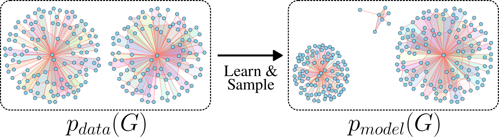{#fig-generative-problem fig-alt="Samples from a data distribution feeding a model distribution which produces new graph samples"}
:::

The lecture treats **realistic** graph generation — produce graphs similar to a given set. The **goal-directed** variant, generating graphs that optimize an objective under constraints, is not covered.

### Density estimation by maximum likelihood

The standard principle: choose

$$
\boldsymbol{\theta}^{*}=\arg\max_{\boldsymbol{\theta}}\ \sum_{i}\log p_{\text{model}}(\mathbf{x}_i;\boldsymbol{\theta}),
$$

the parameters under which the observed data is most probable.

### Sampling

The usual recipe is to transform noise. Draw $\mathbf{z}_i\sim\mathcal{N}(0,\mathbf{I})$ and set $\mathbf{x}_i=f(\mathbf{z}_i;\boldsymbol{\theta})$; if $f$ is expressive enough, $\mathbf{x}_i$ follows a complex distribution. We design $f$ as a deep network and fit it to data.

### Auto-regressive models

::: {.definition}
**Definition 6 — Auto-regressive factorization**

Apply the chain rule to write the joint distribution as a product of conditionals:

$$
p_{\text{model}}(\mathbf{x};\boldsymbol{\theta})=\prod_{t=1}^{n}p_{\text{model}}(x_t\mid x_1,\ldots,x_{t-1};\boldsymbol{\theta}).
$$

For graphs, $x_t$ is the $t$-th **action**: add a node, or add an edge.
:::

Auto-regressive models are attractive here because a single model serves **both** roles — density estimation and sampling — whereas a VAE or a GAN needs two or more components, each playing one part.

::: {.checkpoint}
**Check 3 — Lecture 4 called, it wants its idea back**

This is the same auto-regressive principle as the forecasting model in Lecture 4: factor a complex joint object into a chain of conditionals, and learn one shared model for the conditional. There it was a time series; here it is a construction sequence.
:::

## GraphRNN

The idea [@you2018graphrnn]: **generate a graph by sequentially adding nodes and edges.**

::: {.figure-panel}
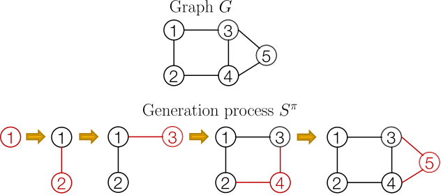{#fig-graphrnn-process fig-alt="A five-node graph built up in five steps, with each newly added node and its edges in red"}
:::

### A graph as a sequence of sequences

::: {.figure-panel}
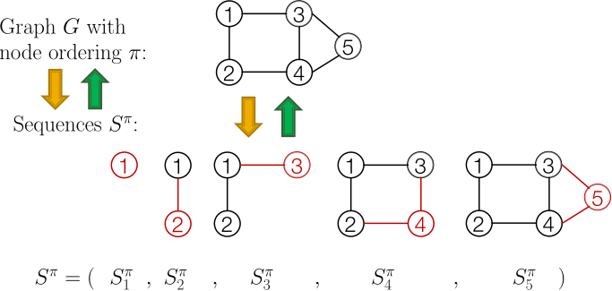{#fig-graphrnn-sequences fig-alt="A graph with node ordering mapped to a sequence of partial graphs and back"}
:::

Each element $S^{\pi}_i$ of that sequence is itself a sequence: the edges the new node forms with the nodes already present. Reading the adjacency matrix makes this concrete.

::: {.figure-panel}
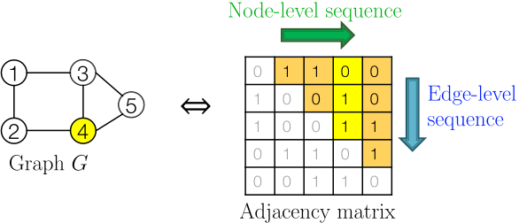{#fig-graphrnn-two-level fig-alt="A graph beside its adjacency matrix with a horizontal node-level arrow and a vertical edge-level arrow"}
:::

::: {.checkpoint}
**Check 4 — What we have achieved, and what it cost**

Graph generation is now **sequence generation**, a problem with well-developed tools. Two processes must be modelled: generate a state for a new node (node level), and generate that node's edges given the state (edge level).

The cost is that we introduced a node ordering that the graph itself does not have. A graph with $N$ nodes has up to $N!$ orderings, all describing the same object. GraphRNN samples one at random; that choice will come back in @sec-limits.
:::

### Recurrent neural networks, briefly

::: {.figure-panel}
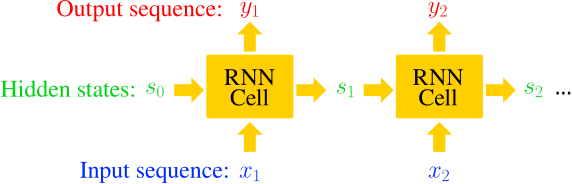{#fig-rnn fig-alt="An unrolled recurrent neural network with input, hidden state, and output at each step"}
:::

With $s_t$ the state, $x_t$ the input and $y_t$ the output at step $t$, and trainable $\mathbf{W},\mathbf{U},\mathbf{V}$:

$$
s_t=\sigma\!\left(x_t\mathbf{W}+s_{t-1}\mathbf{U}\right),
\qquad
y_t=s_t\mathbf{V}.
$$

More expressive cells — GRU, LSTM — slot in unchanged, and so do Transformers.

### Two levels of RNN

GraphRNN uses a **node-level RNN** and an **edge-level RNN**:

- the node-level RNN generates the initial state for the edge-level RNN;
- the edge-level RNN sequentially predicts whether the new node connects to each previous node;
- the node-level RNN advances by consuming the **adjacency vector just generated** — the sequence of edge decisions for the node that was added — not the edge-level RNN's hidden state.

### Making it stochastic

::: {.figure-panel}
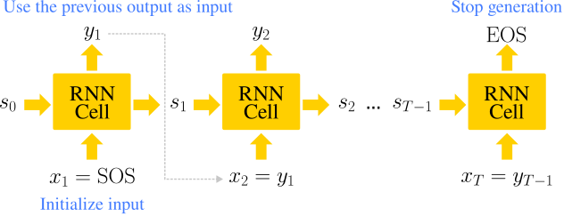{#fig-rnn-generation fig-alt="An unrolled RNN with outputs fed back as inputs, starting from a start-of-sequence token"}
:::

The fix is to treat each output as a **distribution** and sample from it. We want to model $\prod_t p_{\text{model}}(x_t\mid x_1,\ldots,x_{t-1};\boldsymbol{\theta})$; so let $y_t=p_{\text{model}}(x_{t+1}\mid x_1,\ldots,x_t;\boldsymbol{\theta})$ and draw $x_{t+1}\sim y_t$.

::: {.figure-panel}
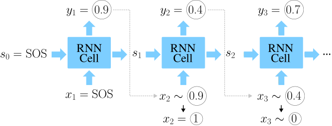{#fig-edge-rnn fig-alt="An unrolled RNN whose outputs 0.9, 0.4 and 0.7 are sampled into binary values fed to the next step"}
:::

### Training

::: {.figure-panel}
![**Teacher forcing.** At training time the observed edge sequence $y^{*}=[0,0,1,\ldots]$ is fed in as the **inputs**, so each step is conditioned on the true prefix rather than on the model's own samples. The **outputs** are not replaced: the model still predicts a probability at every step, and the loss compares those predictions against the same $y^{*}$ as targets. Both appear in the diagram — ground truth entering from below, predictions leaving above.](../../assets/figures/graphrnn-teacher-forcing.svg){#fig-teacher-forcing fig-alt="An unrolled RNN with the ground-truth sequence supplied at every input and predictions compared against targets at every output"}
:::

The loss is binary cross-entropy:

$$
\mathcal{L}=-\sum_{t}\left[y^{*}_t\log y_t+(1-y^{*}_t)\log(1-y_t)\right].
$$

If $y^{*}_1=1$ we minimize $-\log y_1$, pushing $y_1$ up; if $y^{*}_1=0$ we minimize $-\log(1-y_1)$, pushing it down. So $y_1$ fits the data.

::: {.checkpoint}
**Check 5 — The whole algorithm**

1. **Add a node.** Run the node-level RNN one step; use its output to initialize the edge-level RNN.
2. **Add its edges.** Run the edge-level RNN to decide, one at a time, whether the new node connects to each previous node.
3. **Continue.** Feed the edge-level RNN's last hidden state back to advance the node-level RNN.
4. **Stop.** If the edge-level RNN outputs all zeros — an isolated node — generation ends (EOS).

At **training** time, teacher forcing supplies the true sequences. At **test** time, the model's own samples are fed back.
:::

::: {.figure-panel}
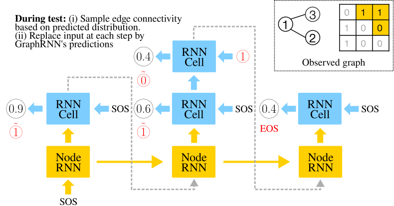{#fig-graphrnn-testing fig-alt="The two-level RNN at test time with sampled values propagated forward"}
:::

## What GraphRNN costs {#sec-limits}

::: {.figure-panel}
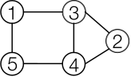{#fig-graphrnn-limitation fig-alt="A graph being built where a newly added node must be checked against every previously added node"}
:::

The authors mitigate this with a **BFS ordering**. Under a BFS order a new node can only connect within a bounded frontier, so the edge-level sequence can be truncated to a fixed maximum length $M$ — which is what makes GraphRNN practical, and turns the cost from quadratic into $O(NM)$ on graphs where a small $M$ suffices.

Without that truncation, adding node $i$ requires $i-1$ binary decisions, so the worst case is

$$
\sum_{i=1}^{N}(i-1)=\frac{N(N-1)}{2},
$$

::: {.figure-panel}
![Sequential edge generation in numbers, as a **worst case**. At $N=100$ an untruncated graph takes about 5000 decisions; at $N=1000$, about half a million. Two caveats on this plot. The quadratic curve is the bound *without* BFS truncation, which GraphRNN does apply. And the dashed line is **not a measurement**: it is $N\log_2 N$, drawn purely as a reference slope for "sub-quadratic". It is neither a runtime nor a derived bound for the cited method, whose actual cost depends on its candidate-set assumptions and its denoising steps. Compare the slopes, not the values.](../../assets/figures/graph-generation-cost.svg){#fig-generation-cost fig-alt="Log-log plot with a steep quadratic line for GraphRNN above a shallower reference slope"}
:::

## Efficient generation by local expansion

A more recent approach [@bergmeister2024efficient] replaces the node ordering with **coarsening**.

::: {.figure-panel}
{#fig-coarsening fig-alt="A graph progressively reduced by merging adjacent nodes down to one node"}
:::

::: {.figure-panel}
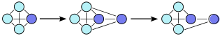{#fig-expansion fig-alt="A single node progressively expanded into a larger graph"}
:::

::: {.checkpoint}
**Check 6 — Why merging preserves the right thing**

Each merge is chosen so that the **spectral properties of the graph Laplacian** are preserved as well as possible [@loukas2019graph].

That criterion is not arbitrary. Lecture 4 established that the Laplacian spectrum is where a graph's structure lives — the eigenvalues are its frequencies, and smooth structure sits at the low end. Preserving the spectrum is the formal version of "keep as much of the graph as possible" while shrinking it.
:::

### The analogy with images

Auto-regressive image generation has moved the same way: rather than emitting pixels in raster order, generate a coarse image and refine it. Graph generation from one side to the other has the same weakness raster order does — the model must commit to fine detail before the global structure exists.

::: {.figure-panel}
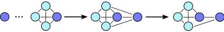{#fig-local-expansion fig-alt="A coarse graph whose nodes are duplicated and then pruned to produce a refined graph"}
:::

::: {.checkpoint}
**Check 7 — What this buys**

- **No node ordering.** Nothing depends on an arbitrary permutation, so the $N!$ problem disappears.
- **Global structure first.** The model establishes the coarse shape and then refines locally, instead of committing to fine detail from step one.
- **Sub-quadratic cost.** A new node's edges are decided only within its local expansion set, not against every previously generated node — so the joint distribution over all node pairs is never modelled.

The denoising within each step is performed by a GNN, so the machinery is the message passing of Lecture 2 applied inside a generative loop.
:::

## Exercises

### Exercise 1 — Clustering by hand

Compute $C_i$ for the centre node of a star $K_{1,5}$, and for a node in a triangle. Then compute the graph coefficient $C$ for a path on 5 nodes, being careful with degree-1 nodes.

### Exercise 2 — The $G_{np}$ clustering derivation

Reproduce the worked example, then evaluate $\mathbb{E}[C]$ for MSN's parameters ($N=1.8\times10^{8}$, $\bar{k}=14.4$) and compare with the measured $0.11$. By what factor is the model wrong?

### Exercise 3 — Degree distribution

Show that the degree distribution of $G_{np}$ is binomial, $P(k)=\binom{N-1}{k}p^{k}(1-p)^{N-1-k}$, and that it approaches a Poisson distribution for large $N$ with $\bar{k}$ fixed. Explain in one sentence why a Poisson tail cannot look like @fig-real-vs-random.

### Exercise 4 — The phase transition

Reproduce the left panel of @fig-er-properties with `scripts/figures/lecture_06_figures.py`. Vary $N$ over $\{500, 2000, 10000\}$ and describe what happens to the sharpness of the transition at $\bar{k}=1$.

### Exercise 5 — Orderings (advanced, optional)

A graph with $N$ nodes admits up to $N!$ node orderings. For $N=10$, how many is that?

Now set the likelihood up properly. GraphRNN models a *sequence*, so it defines $p_\theta(S^{\pi})$ for an ordering $\pi$, whereas we want $p_\theta(\mathcal{G})$. These are related by marginalizing over orderings,

$$
p_\theta(\mathcal{G})=\sum_{\pi}p_\theta(S^{\pi})\,\Pr(\pi),
$$

with $\Pr(\pi)$ the distribution the training procedure samples orderings from. Training maximizes $\mathbb{E}_{\pi\sim\Pr}[\log p_\theta(S^{\pi})]$ — the expectation of the log, not the log of the expectation. Use Jensen's inequality to show this is a **lower bound** on $\log p_\theta(\mathcal{G})$, and state when the bound is tight.

Then make it concrete on a three-node path with just two orderings: write both sequences, assign each probability $\tfrac12$, and compute both sides of the inequality for a model of your choosing. Finally, explain what the BFS restriction does to $\Pr(\pi)$ and why that helps.

### Exercise 6 — Counting decisions

Count the edge-level decisions GraphRNN makes to generate a graph with $N=500$. If each decision costs one RNN step at 10 μs, how long does one graph take? Repeat for $N=5000$ and comment on the practical ceiling.

### Exercise 7 — Comparing the two approaches

For each of GraphRNN and local expansion, state (a) what the generation order is, (b) what the model must decide at each step, and (c) the dominant cost. Then give one scenario where GraphRNN would still be the better choice.

## Main takeaways

1. Many problems — drug discovery, material design, network modelling — require **generating** graphs, not just learning from them.
2. A generative model is judged on whether it reproduces real graphs' **degree distribution, clustering, connectivity, and path length**.
3. **Erdős–Rényi** graphs get connectivity and path length right and clustering and degree distribution badly wrong: $\mathbb{E}[C]=\bar{k}/N\to0$, and the degree distribution is binomial rather than skewed.
4. $G_{np}$ remains the indispensable **null model** and the standard setting for analyzing algorithms — just not a model of how real networks form.
5. Classical models encode **predefined rules**; deep generative models **learn** the formation process from data.
6. **GraphRNN** turns a graph plus an ordering into a sequence of sequences, and models both levels with RNNs trained by teacher forcing under binary cross-entropy.
7. GraphRNN pays $\mathcal{O}(N^2/2)$ edge decisions and inherits an arbitrary node ordering.
8. **Iterative local expansion** inverts a spectrum-preserving coarsening instead: no ordering, global structure first, and sub-quadratic cost.

## References and provenance {.unnumbered}

This web note is adapted from the Lecture 6 slides by Jhony H. Giraldo. The $G_{np}$ clustering result is derived rather than quoted, and the lecture's qualitative comparison between real and random graphs is replaced by measurements.

The diagrams reproduce the original course vectors. @fig-real-vs-random, @fig-er-properties, and @fig-generation-cost are new and were computed with `numpy` and `networkx`; the script that produces them is `scripts/figures/lecture_06_figures.py` in this repository. The MSN Messenger statistics quoted above are taken from the lecture slides, which credit Leskovec's Stanford lectures; the corresponding slide images are not reproduced here.

::: {#refs .references-small}
:::
